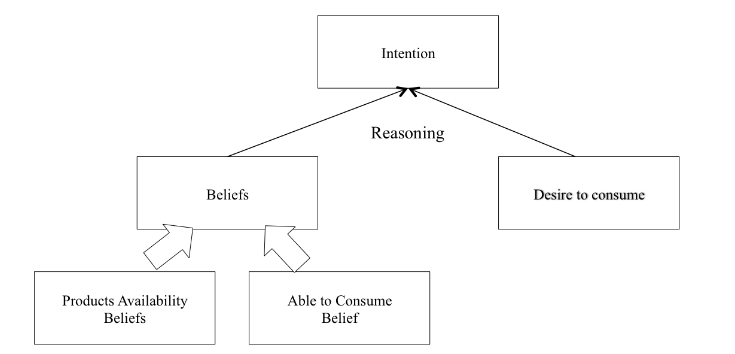

# Find Agent Based Modeling Examples 

|Title| Link |
| ----|	---|
|AN AGENT-BASED MODEL OF CONSUMER BEHAVIOR BASED ON THE BDI ARCHITECTURE AND NEOCLASSICAL THEORY | Link: [Research Paper (Opens to PDF)](https://www.google.com/url?sa=t&rct=j&q=&esrc=s&source=web&cd=&ved=2ahUKEwjc9Lbbm9_8AhXUKlkFHSiUDzQQFnoECBIQAw&url=https%3A%2F%2Fjournals.tdl.org%2Fabsel%2Findex.php%2Fabsel%2Farticle%2Fdownload%2F2109%2F2846%2F0&usg=AOvVaw1XCVjgERF77jaiD-AfYMdr)|

<!-- DUE 1/24/2023 -->

Category: `Consumer Behavior`

This paper and subsequently the question this model aims to answer is "How does demand develop in consumer products?" 

## Environment
1. Other Consumers
2. Product Statistics
	+ Stock Available
	+ Price
	+ Usefulness (Utility)
	+ Product Ranking in its category
		+ Example: "All pens can write on paper but some are better then others"
3. Budget
	+ One part of the study varies budget to study independent goods and elasticity of supply/demand

## Attributes of a Agent

Sample Consumer Agent:

BDI architecture:
+ Beliefs: knowledge the consumer maintains about the world
+ Desires: "What the consumer wants"
+ Intentions: "What a consumer intends to purchase"

---

## Rules of the Model
1. If a consumer has the desire to consume they create a list of items to buy that they can buy. They create multiple lists since the permutation of items they can obtain with $X$ is likely more than one. (Knapsack problem?)
2. This lists is sorted WRT to utility. The consumer aims to maximize utility. 
3. Since this model has multiple consumers their intentions are performed in random order. 
4. In this environment, the stock of items is **not** infinite. So when a consumer sees an item is out of stock they update their lists and their belief about availability. If the consumer still has money left to buy their desire to buy remains until they have no money left. (Unrealistic rule of model)

## Results
During initial list(s) creation no consumer has knowledge about what other consumers will buy. It is when other consumers create a shortage that the consumer to consumer interdependence is formed. 

### Varying Price
Law of demands stands:
+ Price up $\implies$ demand down
+ Price down $\implies$ demand up

### Varying Income
When income increases agents are more likely to buy the best product in a functionality category but, when income is taken away they are more likely to buy inferior products. 

