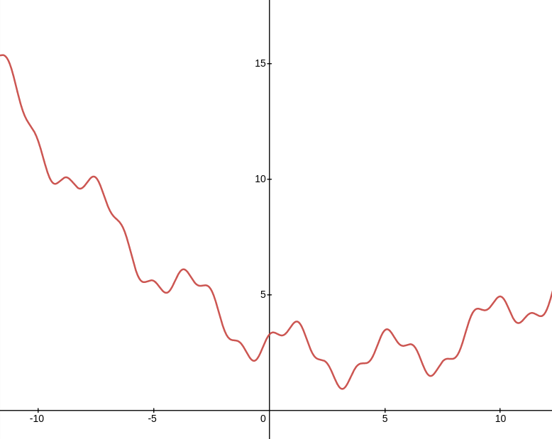

# Week 4 - Simulated Annealing 

> Goal finding a global **min**/max of a function $f(x)$

Suppose the function looks like this:

If we wanted to find the global minimum over the interval $[-10, 10]$ we have a few options:

1. Hill Climbing Algorithm
2. Gradient Descent (*ish*)
3. Simulated Annealing

## Hill Climbing Algorithm
Pick an initial $x_0$ and $\# \text{Iterations}$

Generated a $x_{n+1}$ and update state if the $x_{n+1}$ meets relevant criterion.

Repeat until steps run out. $\circlearrowright$

## Gradient Descent (*ish*)
Pick an initial $x_0$ and $\# \text{Iterations}$

Instead of picking a next random point $x_{n+1}$ the algorithm will select the *best* neighboring point that fits the criterion. 

> Notice this has the flaw of getting stuck in valleys.

## Simulated Annealing
- instead of picking the best move sometimes the algorithm will pick a random move
	+ The temperature, which changes over the lifetime of the algorithm, determines the acceptance of a new random move. 
	+ Otherwise the best neighbor will be picked. 