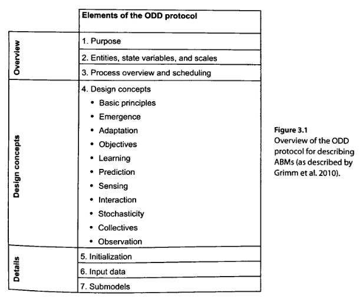

# Butterfly Hilltopping and ODD
## Animal Dispersion 
+ Travel for food/migration/mate
+ The paths can be well known or unintuitive.

A **Virtual Corridor** is a pathway used by many despite not having any beneficial characteristics. 

### Butterfly Hilltopping
> a mate-location behavior seen in many insects 

Male butterflies will gather on hilltops to get the best area of the hill. Female butterflies will often pick the male with the best location. This is an example of a *Virtual Corridor* as butterflies seem to gather on the side of hills. 

### Overview Design Details  Protocol (ODD)

### Butterfly Hilltopping **x** ODD

- Purpose
	+ explore Virtual Corridors
	+ what land typologies and butterfly interactions effect the emergence of corridors
 - Entities and Variables

| Entities	|	Variables	|
| ----------|---------------|
| Butterfly    | $(x, y)$ Coordinates, Center of Current Patch |
| Square Patch | Elevation	                                   |

- scales: generic scales
	- temporal units: unknown <!-- for now -->
	- spatial units: unknown <!-- for now -->

