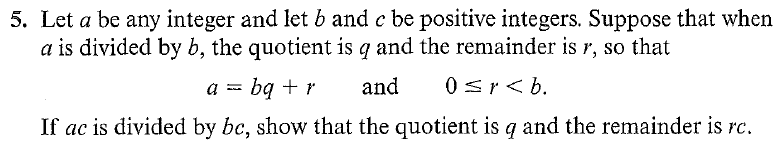
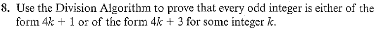

# Set 1

| Assigned | Problems         |
| -------- | ---------------- |
| 8/29/23  | CP1.1 -> 1,2,5,8 |

## 1,2

> Trivial. Division Algo

##  5

Since the division algorithm yielded 

$$
a = bq + r \text{ for some unique } q, r \in \mathbb{Z} \text{ where } 0 \leq r \lt b 
$$

Multiple both sides by $c$:

$$
ca = (bc)q + rc
$$

Via the premise of the division algorithm we found a  $q, r \in \mathbb{Z}$ where $0 \leq rc \lt bc$ . 

Since $r, q$ are unique, $q$ must be the quotient and $r$ must be the remainder. 

## 8

Suppose $a$ is an odd number. Division via 4 using the division algorithm yields unique $(q, r) \in \mathbb{Z}$ s.t

$$
a = 4q + r \text{ where } 0 \leq r \lt 4
$$

Given that $4q$ is always even for any $q\in\mathbb{Z}$ and $a$ is odd. This implies that $r$ is odd. 

Since $0 \leq r \lt 4$, $r$ can only take on values $\{1, 3\}$.

Therefore you can define any odd number using $4k+1$ or $4k+3$ for a $k \in \mathbb{Z}$  