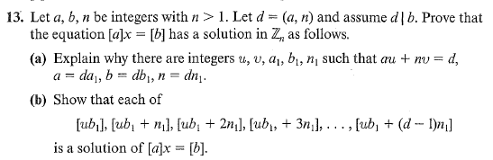

# Set 10
## 2.3.5

> If $a$ is a unit and $b$ a zero divisor in  $\mathbb{Z}_n$ show that $ab$ is a zero divisor. 

Suppose $ab=0$. Given that $a$ is a unit:

$$
0 = a^{-1}(ab) = b 
$$

Yet $b$ is a zero divisor and it cannot be zero. Thus $ab\neq 0$

Since it is given that $b$ is a zero divisor, $\exists c \in \mathbb{Z}_n\setminus\{0\}: bc=0$

Now notice that $ab(c) = a(bc) = a \cdot 0 = 0$ .

Since $\exists c \in \mathbb{Z}_n$ such that $ab \cdot c = 0$ , $ab$ is a zero divisor. 

## 2.3.9

### 2.3.9a

> If $a$ is a unit in $\mathbb{Z}_n$ show it cannot be a zero divisor. 

Suppose $a$ is a unit and subsequently there exists an inverse $a^{-1}$ such that $a^{-1}a=1$ 

Then select a $b$ such that $ab=0$

Then:

$$
0 = ab = a^{-1}ab = b
$$

Thus $b$ is required to be $\mathbf{0}$ . However, this implies that $a$ cannot be a zero divisor and a unit. 

### 2.3.9b

> If $a$ is a zero divisor in $\mathbb{Z}_n$ show it cannot be a unit. Notice this is the contrapositive of *2.3.9b*.

Suppose $a$ is a zero divisor. Then $\exists b\in\mathbb{Z}_n \setminus \{0\}: ab=0$ .

Pick another element , $a^{-1}$ such that $a^{-1}a=1$

Then: 

$$
0 = ab = a^{-1}ab = b
$$

This is a contradiction since $b\neq 0$ .
Thus $a$ cannot be a unit if it has a zero divisor. 

### 2.3.13

#### a)
The linear combo stems from the Bezout's Identity. The rest follows from the definition of divisibility.

#### b)

Notice that $[a][ub_1] = [au][b_1] \stackrel{*}{=} [d][b_1] = b$

Consider the class $[an_1]$ :

$$
[an_1] = [a_1dn_1] = [a_1n] = [0]
$$

Since this class is equivalent to $[0]$ we can consider linear combinations of it to be solutions:

$$
x = [ub_1+tn_1] \text{ for } t\in\mathbb{Z}
$$

\* - Notice that $au+nv=d \implies n | au - d \implies au \equiv d \bmod n$

### 2.17

> Show that the products of two units is also a unit.

Let $a, b$ be units in $\mathbb{Z}_n$

Then 

$$
ab = abb^{-1}a^{-1} = aa^{-1} = 1
$$

Thus $ab$ is a unit. 

The other way to do this proof involves multiplying the linear combos of $a$ and $b$ and getting that there exists integers $s, t$ such that $(ab)s+nt=1$