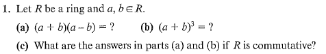
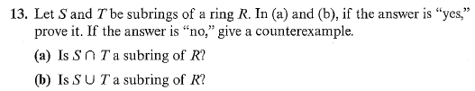

# Set 11
## 3.1.12

> Show that $\mathbb{Z}[i] = \{a+bi|a, b\in\mathbb{Z}\}$ is a sub ring of $\mathbb{C}$ (all complex numbers)

1. Addition is closed.

$$
(a+bi)+(c+di) = (a+b)+(c+d)i \in \mathbb{Z}[i]
$$

2. Multiplication is closed.

$$
(a+bi)\cdot(c+di) = (ac-bd)+(ac+bc)i \in \mathbb{Z}[i]
$$

3. There exists an element $0_R \in \mathbb{Z}[i]$ such that $a+0_R=a$ for $a\in\mathbb{Z}[i]$ . This element is $0+0i$
4. Suppose $a+bi \in \mathbb{Z}[i]$ then $\exists (-a)+(-b)i\in\mathbb{Z}[i]$. See that $a+bi + (-a)+(-b)i = 0+0i$ which is $0_R$ defined in $(3)$ .

## 3.2.1

### a)

$$
\begin{align}
(a+b)(a-b) &= a(a-b)+b(a-b) \\
&= a^2-ab+ba-b^2
\end{align}
$$

If $R$ commutative: then $a^2-b^2$ is the answer

### b)
$$
\begin{align}
(a+b)^3 = (a+b)^2(a+b) &= (a+b)(a+b)\cdot(a+b) \\
&= (a^2+ab+ba+b^2)(a+b) \\
&= a^3 + aba + ba^2 + b^2a + a^2b + ab^2 + bab + b^3 \\
&= a^3 + a^2b + aba + ba^2 + ab^2 + bab + b^2a + b^3 
\end{align}
$$

If $R$ commutative: then $a^3 + 3a^2b + 3ab^2 + b^3$ is the answer

## 3.2.3b

An element $e$ of a ring $R$ is said to be idempotent if $e^2=e$

> Find all idempotents in in $\mathbb{Z}_{12}$

Answer $[0], [1], [4], [9]$ .

## 3.2.13

### 3.2.13a
Let $K = S \cap T$

Since they are subrings $1_R \in K$ . So $K$ is already non-empty.

See that $a, b\in K \implies a, b \in S \text{ and } a, b\in T$

By assumption $a-b \in S, T$ and $ab \in S, T$ this $a-b, ab \in K$

Thus $K$ is a subring of $R$ .

### 3.2.13b
Counter example: $S=2\mathbb{Z}, T=3\mathbb{Z}$ 

$$
2+3=5 \text{ where 5 is not in S or T }
$$

## 3.2.16

> The set of units in a ring $R$ with identity is a subring of $R$

False. Consider the integers. 

In the integers only $1, -1$ are units. Lets call this set $U$ . $U$ is not a subring of $R$ as $1+(-1)=0$ which is not an element of $U$ .

This is trivially false as $0_R$ cannot be unit and all subrings require $0_R$.

## 3.2.17

> If $u$ is a unit in a ring $R$ with identity, prove that $u$ is not a zero divisor.

Suppose $u$ is a zero divisor under $R$ . Then there exists $v\in R$ such that $uv=0$

Then by the assumption:

$$
uv = 0,\ (u^{-1})uv = u^{-1}0 \implies v=0
$$

Thus $u$ cannot be a  zero divisor (***contradiction***).

$\therefore$ If $u$ is a unit, then $u$ cannot be a zero divisor.