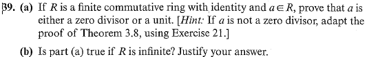

# Set 12

## 3.2.22
### 3.2.22a

> If $ab$ is a zero divisor in $R$ show that either $a$ or $b$ is a zero divisor.

Suppose $a$ and $b$ are both not zero divisors yet $\exists x\in R$ such that $(ab)x=0_R$ . 

Then $a(bx)=0_R$ imply $a$ is a zero divisor.or $bx=0_R$ .

Since $a$ cannot be a zero divisor (assumed) $bx=0_R$ .

SInce $b$ cannot be a zero divisor (assume) $x=0_R$ .

Since 

$$
(ab)x \implies x=0
$$

By the contrapositive, either $a$ or $b$ have to be zero divisors. 

### 3.2.22b
> If $a$ or $b$ is a zero divisor in a commutative ring $R$ and $ab \neq 0_R$ prove that $ab$ is a zero divisor.

Fix[^1] $a$ to be the zero divisor

Then $\exists c \in R : ac=0$ and $c\neq 0$ .

Then $(ab)c\stackrel{*}{=}(ac)b=0_R \cdot b=0_R$ 

Since  $\exists c \in R : (ab)c=0$ with $c\neq 0$ , $ab$ is a zero divisor.

\* - $R$ is a commutative ring.

## 3.2.29
> For $R$ a commutative ring with identity show:
> $a\neq 0_R,\ ab=ac \implies b=c$ iff $R$ is a integral domain[^2]

### Forwards $\Rightarrow$
???

### Backwards $\Leftarrow$
Suppose $R$ is a integral domain. Then:

$$
ab-ac=a(b-c)=0
$$

Since $R$ is a integral domain, $b-c=0$ and subsequently $b=c$ . Cancellation is proved.  

## 3.2.38

>  For $R$ a ring with identity show that if $ab$ is a unit then $a, b$ are units. Assume $a, b$ are not zero divisors.

Suppose $ab$ is a unit. Then there exists $c\in R$ such that:

$$
1_R = (ab)c
$$

See that[^3]:

$$
(ab)c \stackrel{*}{=} a(bc) \stackrel{**}{=} b(ca) = 1_R
$$

See that $a,b$ are both units.

## 3.2.39

### 3.2.39a

$$
R = \{a_1=1_R, \dotso, a_n\}
$$

Suppose $a\in R$ is not a zero divisor. 

Consider the following equation $ax=1_R$ for $x\in R$

Since $R$ is finite consider the elements $aa_1, aa_2, \dotso, aa_n$ . These elements are distinct.

Suppose $aa_i = aa_j$ . Then $a(a_i-a_j)=0$ and subsequently[^4] $a_i = a_j$ since $a$ is a NOT zero divisor.

Since $R$ has $n$ elements and $|\{aa_1, aa_2, \dotso, aa_n\}|=n$ there exists some product that equals $1_R$ .

Thus $a$ is either a unit or a zero divisor. 

[^1]: If b is the zero divisor, swap them.
[^2]: An integral domain has NO zero divisors.
[^3]: At this step "\*" you prove that inverse of 'a' exists. You can from then on use it and thats how we can arrive to "\*\*".
[^4]: Notice the product above 

