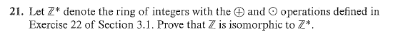

# Set 13
> **Exercises**: 3.3 #9, 15, 21, 27, 29, 31

## 3.3.15

> Let $f:R\to S$ be a homomorphism of rings. If $r$ is a zero divisor in $R$, is $f(r)$ a zero divisor in $S$?

<!--

Let $r\in R$ be a zero divisor.

Then $\exists r^{\prime} \in R: r\cdot r^{\prime}=0$

Then, 

$$f(r)f(r^{\prime}) = f(rr^{\prime}) \stackrel{*}{=} f(0_R)=0_S$$

\* - $f$ is a homomorphism implying $f(0_R)=0_S$

$f(r)$ is a zero divisor in $S$ .

-->

The answer is no. See $f(x, y)=x$ with $y$ inputs being 0.

## 3.3.21

Let $f(x)=1-x$

Then:

$$
\begin{align}
f(a \oplus b)&=f((a+b-1))=-a-b-2=(1-a)+(1-b)=f(a)+f(b) \\
f(a \odot b) &= f(a+b-ab) = 1-a-b-ab = (1-a)-b(1-a) = (1-a)(1-b) = f(a)(b)
\end{align}
$$

Since $\exists g: \mathbb{Z}^* \to \mathbb{Z}$ with $g(y)=1-y$ as the inverse of $f$ , $f$ is a isomorphism.

I would just have to prove

## 3.3.27

### 3.3.27a

See that

$$
\begin{align}
g(1_R) &= 1_S\\
f(1_S) &= 1_T\\ \\

\implies 

(f \circ g)(1_R) &= f(g(1_R)) = f(1_S) = 1_T
\end{align}
$$

Then also for $a, b \in R$

$$
(f \circ g)(a+b) = f(g(a+b)) = f(g(a)+g(b)) = f(g(a)) + f(g(b))
$$

A similar pattern is applied to $'\cdot'$ (multiplication).

Thus the function composition is also a homomorphism.

### 3.3.27b

It is required now to show the above homomorphism is both injective and surjective.

#### *Injective*

For $a, b \in R$

Suppose $f(g(a)) = f(g(b))$

Since $f$ is known to be injective it implies that $g(a)=g(b)$ .
Since $g$ is known to be injective it implies that $a=b$ .

Since $a=b$ if $f(g(a)) = f(g(b))$ , $(f\circ g)$ is injective

#### *Surjective*

Let $c \in T$

Then since $f$ is surjective, $\exists b \in S$ such that $f(b)=c$
Then since $g$ is surjective, $\exists a \in R$ such that $g(a)=b$

Since there exists a $a \in R$ such that $f(g(a))=c\in T$, $(f \circ g)$ is surjective.

Thus, $(f \circ g)$ is isomorphic. 

## 3.3.29

> Let $f:R \to S$ be an isomorphism of rings and let $g:S \to R$ be the inverse function of $f$. Show that $g$ is also an isomorphism.

???

## 3.3.31

> Let $f:R\to S$ be a homomorphism and let $T$ be a subring of $S$. 
> $$P = \{r\in R | f(r) \in T\}$$
> Show $P$ is subring of $R$ .

