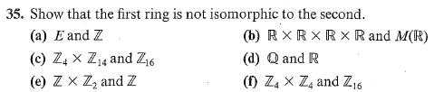
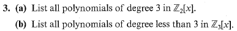

# Set 14

> **Exercises**: 3.3 # 13, 35b-f, 42 and 4.1 #3

## 3.3.13
### 3.3.13a,b

> Both proofs are the same but mirrored.
> **13.a**: Prove $f: R\times S \to R$ defined by $f((r, s)) = r$ is a surjective homomorphism. 

Let $r \in R$ . Then fix $s=0_S$ . Then $\exists (r, s) \in R\times S: f((r, s))=r$ 

### 3.3.13c
> If both $R$ and $S$ are nonzero rings, prove that the homomorphisms $f$ and $g$ are not injective. I will only show this for $f$

Suppose $f((r, s))=r$

Let $s_a, s_b \in S$ . Since $S$ is a non-zero ring it contains at least two elements (including $0_S$ ). 

Then $f((r, s_a)) = r = f((r, s_b))$ .

Since $f((r, s_a)) = f((r, s_b))$ where $(r, s_a) \neq (r, s_b)$ , $f$ is not injective. 

## 3.3.35

### 3.3.35.a

Suppose Begin your proof with "Suppose $ϕ:R→Z$ is an isomorphism.

Then for some $r\in R$, $\phi(1) = 1_Z$

Notice that $1_Z = \phi(2 \cdot r / 2)$ implying $\phi(1/2)=1/2\not\in \mathbb{Z}$

Thus there cannot be a isomorphism from $\mathbb{R} \to \mathbb{Z}$

### 3.3.35.b

Let $\phi: \mathbb{R}^4 \to M(\mathbb{R})$

$\phi$ cannot be isomorphic since $M(\mathbb{R})$ is a non-commutative ring yet $\mathbb{R}^4$ is.

### 3.3.35.c

$f: \mathbb{Z}_{4} \times \mathbb{Z}_{14}\to\mathbb{Z}_{16}$ cannot be isomorphic because $|\mathbb{Z}_{4} \times \mathbb{Z}_{14}| \gt |\mathbb{Z}_{16}|$

### 3.3.35.d

Let $\phi: \mathbb{Q} \to \mathbb{R}$

Notice that $1_\mathbb{Q} = 1_\mathbb{R}$ . With this we can see that $f(2)=2$ . Let $t \in \mathbb{R}$ such that $t^2=2$ . Notice that $t\in \mathbb{R}$ yet $t\not\in \mathbb{Q}$ . Since this element does not have a mapping in $\mathbb{Q}$ . $\phi$ cannot be isomorphic. 

### 3.3.35.e

Set on the left is contains more elements.

### 3.3.35.f

Let $f:\mathbb{Z}_4 \times \mathbb{Z}_4 \to \mathbb{Z}_{16}$

???

## 3.3.42
### Helper Theorem: Chinese Remainder Theorem

For $0 \lt m, n \in \mathbb{Z}$ with $\gcd(m, n)=1$

There exists an isomorphism $f: \mathbb{Z}_{mn} \to \mathbb{Z}_m \times \mathbb{Z}_n$

Also Recall from class:

+ Let $f:T\to R$ and $g:T\to S$ be ring homomorphisms. Then $w: T\to R\times S$ is also a homomorphism.
+ $\phi: \mathbb{Z}_n \to \mathbb{Z}_m$ is a homomorphisms if $m|n$

> If $(m, n) \neq  1$, prove that $\mathbb{Z}_{mn}$ is not isomorphic to $\mathbb{Z}_m \times \mathbb{Z}_n$

???

## 3.3.31

> Let $f:R\to S$ be a homomorphism and let $T$ be a subring of $S$. 
> $$P = \{r\in R | f(r) \in T\}$$
> Show $P$ is subring of $R$ .

## 4.1.3

### 4.1.3a
There would be $8$ of them. Im not listing them

### 4.1.3b

There would be $27 = 3^3$ of these.