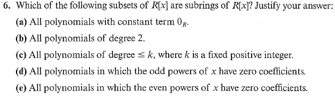
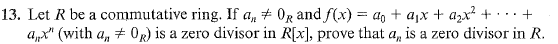

# Set 15
> **Exercises**: 4.1 #1, 4, 6, 10, 11, 13

## 4.1.6

**a)**

Notice if the constant term is $0_R$ $f(x) = xg(x)$ for some $g(x)\in R[x]$
It is easy to show subtraction and mult is closed. In class this is not a subring since $1_R$ is not in this ring.

**b)**
Not closed under multiplication.

**c)**
Not closed under multiplication.

**d)**
Subring in the book yet not in class. Notice only even powers have coefficients then $f(x)-g(x)$ and $f(x)g(x)$ will behave the same way.

**e)**

Not a subring. Not closed under multiplication.

## 4.1.10

Field: Each element has a inverse and thus is a unit.

> If $F$ is a field, show that $F[x]$ is not a field.

Suppose $x$ is a unit and there exists $f(x)$ such that $xf(x)=1_F$ 

Notice $\deg 1 = 0$ and $\deg x = 1$

Then $\deg x + \deg f(x) \gt 0$ so no $f(x)$ can exist.

## 4.1.11

Show that $1 + 3x$ is a unit in $\mathbb{Z}_9[x]$.

See that $1-3x \in \mathbb{Z}_9[x]$ and $(1+3x)(1-3x)=1$

Not we could have also used $1+6x$

## 4.1.13

Since $f(x)$ is a zero divisor, $\exists g(x)\in R[x]: f(x)g(x)=0_R+0_Rx+0_Rx^2+\dotso$ 

Suppose the leading term of $g$ is $b^mx^m$ then it is given that $a^nx^nb^nx^m=a^nb^mx^{n+m}=0$ since $f$ is a zero divisor implying $a^nb^m=0_R$ . Since $b^m$ was the leading term it cannot be $0_R$ and thus it shows $a^n$ is a zero divisor.