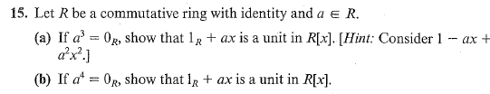
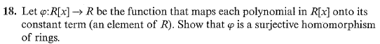
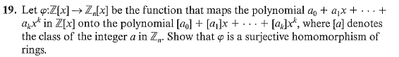
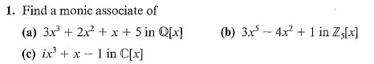

# Set 16
> **Exercises**: 4.1 #15, 18, 19 and 4.2 #1

## 4.1.15

### 4.1.15a

Consider $(1_R+ax)\cdot(1-ax+a^2x^2)$

$$
\begin{align}
&= 1 - ax + a^2x^2 + ax - a^2x^2 + \overbrace{a^3}^{0}x^3
&= 1
\end{align}
$$

### 4.1.15b

Use $g=1_R-ax+a^2x^2-a^3x^3$

## 4.1.18

Consider the constant polynomial: $1_R$ .

Notice that $1_{R[x]}=1_R$ . Thus $\phi$ preserves the identity element.

Let $f, g \in R[x]$ . Let $f$ have the constant term $a \in R$ and $g$ have the constant term $b\in R$ . Since addition in $R[x]$ is term wise $f+g$ has the constant term $a+b \in R$ meaning $\phi$  respects addition.

Let $f, g \in R[x]$. Then: 

$$
\begin{align}
f &= a_0+a_1x+a_2x^2+\dotso+a^nx^n \\
g &= b_0+b_1x+b_2x^2+\dotso+b^mx^m \\ \\
f \cdot g &= (a_0b_0) + (a_0b_1)x + \dotso + (a_nb_m)x^{n+m}
\end{align}
$$

Notice the constant term is $a_0b_0$ implying multiplication is preserved.

## 4.1.19

Let $f, g \in Z[x]$. Then: 

$$
\begin{align}
f &= a_0+a_1x+a_2x^2+\dotso+a^nx^n \\
g &= b_0+b_1x+b_2x^2+\dotso+b^mx^m \\ \\
f \cdot g &= (a_0b_0) + (a_0b_1)x + \dotso + (a_nb_m)x^{n+m}
\end{align}
$$

for $a_i, b_i \in \mathbb{Z}$

The identity element of $\mathbb{Z}[x]$ is $1_{\mathbb{Z}[x]} = 1_\mathbb{Z}$ . Then the mapped polynomial is $[1]_{\mathbb{Z}}$ which is the identity element in $\mathbb{Z}_n[x]$ for any $n$ .

Consider addition:

$$
f + g = (a_0+b_0) + (a_1+b_1)x +\dotso
$$

Notice that 

$$
\begin{align}
\phi(f+g)=[a_0+b_0] + [a_1+b_1]x + \dotso &= [a_0] + [b_0] + [a_1]x + [b_1]x + \dotso \\
&= ([a_0]+[a_1]x+\dotso)+([b_0]+[b_1]x+\dotso) \\
&= \phi(f) + \phi(g)
\end{align}
$$

Consider multiplication

$$
fg = (a_0b_0) + (a_0b_1+a_1b_0)x +\dotso
$$

Then,

$$
\begin{align}
\phi(fg)=[a_0b_0] + [a_0b_1+a_1b_0]x + \dotso &= [a_0][b_0] + [a_1][b_1]x + [a_1][b_0]x + \dotso \\
&= ([a_0]+[a_1]x+\dotso)\cdot([b_0]+[b_1]x+\dotso) \\
&= \phi(f) \cdot \phi(g)
\end{align}
$$

## 4.2.1

$$
\begin{align}
(a) &\ 1x^3 + \frac{2}{3}x^2 + \frac{1}{3}x + \frac{5}{3} \\
(b) &\ 1x^5 + 2x^2 + 2 \\
^*(c) &\ x^3 - xi + i
\end{align}
$$

\* $i^2 = -1$ , $i^3 * i =-i * i = - (-1) = 1$