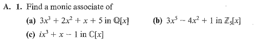

# Set 17
> **Exercises**: 4.2 #2, 4, 5ac, 7 and 4.3 #1, 3, 5

## 4.2.2

> $\gcd(f = c_nx^n +\cdot+ c_0, 0_F) =\ ?$ with $c_n \neq 0$

The answer is $c_n^{-1}f$ since it is the largest polynomial that divides both which is also monic.

## 4.2.4

### 4.2.4a

Since $f|g$ and $g|f$ there exists $u, v \in F[x]$ where $f=gv$ and $g=fu$ . Then by substitution $g=gvu$ and $f=fuv$ . If either $f, g$ are non-zero we can use properties of $F[x]$ to obtain $uv=1_F$ implying $v$ is a unit. Since $v$ is a unit it is required $v$ is a **non-zero constant polynomial**.

In the other case: $f=0_F=g$ it is evident that for any non-zero constant $c$ ,  $f=gc$  .

### 4.2.4b

Suppose both are monic. 

Using $4.2.4a$ we note that $f=gc$ for a non-zero constant polynomial $c$ .

Consider $g=x^n + \dotso + a_1x + a_0$ , then $f=cx^n + \dotso + ca_1x + ca_0$

Since it is known $f$ is monic ( $\text{LC}(f)=1$ ), $c=1$ and subsequently $f=g$ .

## 4.2.5

I did these on paper. 

### 4.2.5a

$$
\begin{align}
x^4-x^3-x^2+1 &= (x-1)(x^3-1)+(-x^2+x) \\
x^3-1 &= (-x+1)(-x^2+x) + \boxed{x-1} \\
-x^2+x &= (-x)(x-1) + 0_\mathbb{Q}
\end{align}
$$

### 4.2.5c
$$
\begin{align}
x^4 + 3x^3 + 2x + 4 = (x^2+3x+1)(x^2-1)+5 = (x^2+3x+1)(x^2-1)+\boxed{0}
\end{align}
$$

Answer: $(x^2-1)$

## 4.2.7

$f$ then divides $x$ and $x+1$ then $\deg f \leq 1$ . Suppose the degree is of $1$ . Then the monic form of $f$ is required to be $x+c$ . Since $f|x$ $c=0$ and since $f|x+1$ , $c=1$ . Since $1\neq 0$ it is not possible $\deg f = 1$ and therefore $f$ is the constant polynomial. 

> Alternate proof required $f|x, f|x+1 \implies f|(x+1)-x=1$

## 4.3

> $f(x)$ is an associate of $g(x)$ in $F[x]$ if and only if $f(x) = cg(x)$ for some nonzero $c\in F$. (FIELDS ONLY)

> Two elements $a$ and $b$ of a commutative ring with unity are associates if there exists a unit $u$ such that $a=ub$. 

### 4.3.1

+ a) $3^{-1} = 1/3$ , $x^3+\frac{2}{3}x^2+\frac{1}{3}x++\frac{5}{3}$
+ b) $3^{-1} = 2$ , $x^5+2x^2+2$

### 4.3.3

> List all associates

#### 4.3.3a

$$
x^2+x+1
$$

Multiply by each of the units in $\mathbb{Z}_5$ which are $\{1, 2, 3, 4\}$ .

### 4.3.5

Since $f$ and $g$ are associates we know that $f=cg$ and under $F[x]$ , $g = c^{-1}g$ . 

Evidently $f|g$ and $g|f$ .

---

Notice from P $4.2.4a$ 

$$
g|f,\ f|g \implies f=cg
$$

Since $c$ and $c^{-1}$ are both units under $F[x]$ $f$ and $g$ are associates since $f=cg$ and $g=c^{-1}f$ .