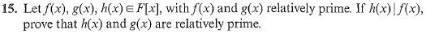
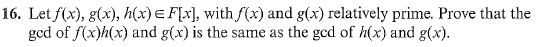

# Set 18

> 4.1 #18, 20 and 4.2 #16 and 4.3 #2, 4

## 4.1.18

> Let $\phi:R[x] \to R$ be the function that maps each polynomial in $R[x]$ onto its constant term (an element of $R$. Show that $\phi$ is a surjective homomorphism of rings.

Firstly, $\phi(1_R)=1_R$

Then addition and multiplication is trivially preserved.

This homomorphism is onto. Consider an element $r \in  R$ . Then $\phi(r) = r$ .

## 4.1.20

> Is derivative map $D: \mathbb{R}[x] \to \mathbb{R}[x]$ a homomorphism of rings?

No, $D(1_\mathbb{R}) \neq 1_\mathbb{R}$

## 4.1.15

Consider $(f, g)=1$ and $h|f$

Let $d=(g, h)$ then since $d|h$ it follows $d|f$ since $h|f$. 

Since $d|g$ and $d|f$ it implies $d|1_F$ meaning $d=1_F$ .

## 4.2.16

???

## 4.3.2

> Prove each non zero polynomial in $F[x]$ has a unique monic associate.

Let $0 \neq f \in F[x]$

Let $g$ and $h$ be monic associates of $f$ 

Recall that $g=ch$ for some $c \in F$

Since $\text{LC}(g) = \text{LC}(h) = 1_F: c=1_F$ and $g=h$

## 4.3.4

> Show that a nonzero polynomial in $\mathbb{Z}_p[x]$ has exactly $p - 1$ associates for $p$ a prime.

Recall that $|\mathbb{Z}_p^{\times}|=p-1$

Then for any $f \in \mathbb{Z}_p[x]$ the associates are formed via $c\cdot f$ for $c \in \mathbb{Z}_p^{\times}$  which are $p-1$ associates.

Suppose two associates were equal. Then $af = bf$ for $a, b \in \mathbb{Z}_p^{\times}$

Since $\mathbb{Z}_p$ is an integral domain $a \not f = b \not f$ and $a=b$.

Therefore each of the $p-1$ associates are unique. 