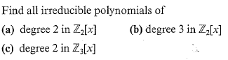

# Set 19
> 4.3 #6, 7, 9, 23(a)

## 4.3.6

> Show $x^2+1$ is irreducible in $\mathbb{Q}[x]$

Suppose it is: $\exists a,b,c,d \in \mathbb{Q}: (ax+b)(cx+d)=acx^2+adx + cbx +db = x^2+1$

Notice $ac = 1 = bd$ and $ad+cb=0$

Consider $(ad)^2 = ad\cdot ad = ad * (-cb) = -(ac)(bd)=-1$

No square of a real number can be negative and thus no factorization exists.

## 4.3.7

> Prove that $f(x)$ is irreducible in $F[x]$ if and only if each of its associates is irreducible.

Suppose $f$ is irreducible. Then any of its associates are in the form $cf$ for $c \in F$ . Now $c \in F^{\times}$ and thus  $cf$ is also irreducible.

Suppose each of its associates is irreducible. Recall that $f$ is an associate of $f$. Then $f$ is irreducible.

## 4.3.9

### 4.3.9a

