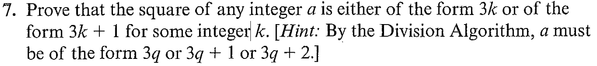
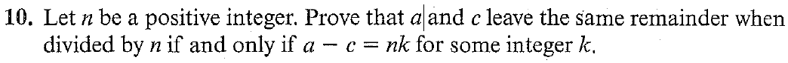

# Set

## 1.1.7

Let $a \in \mathbb{Z}$

Via the division algorithm with 3 as a divisor, 

$$
a = 3q + r \text{ where } 0 \leq r \lt 3
$$

for a unique pair on integers $q, r$ .

Therefore $a$ can be the following:

1. $3q$
2. $3q+1$
3. $3q+2$

This mean that $a^2$ can be one of the following:

1. $9q^2 = 3(3q^2)$ which is in the form $3k$ for some integer $k$
2. $9q^2 + 6q + 1 = 3(3q^2 + 2q) + 1$ which is in the form $3k+1$ for some integer $k$
3. $3q^2 + 12q + 4 = 3(3q^2 + 4q + 1)+1$ which is in the form $3k+1$ for some integer $k$

Therefore any square can be represented in the form $3k$ for $3k+1$ for some integer $k$ .

## 1.1.10

### Forwards

Lets suppose $a$ and $c$ have the same remainder when divided by $n$ .

Thus:

$$
\begin{align}
a &= k_1n + r \text{ for } 0 \leq r \lt n \\
c &= k_2n + r \text{ for } 0 \leq r \lt n
\end{align}
$$

Then $a - c = n(k_1-k_2)$ which is in the form $n*k$ for some $k = k_1-k_2$

### Converse