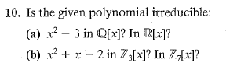
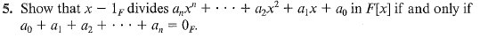
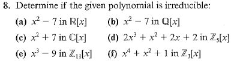

# Set 20
> 4.3 #10, 12 and 4.4 #2, 4, 5, 6, 8

## 4.3.10

+ (a) - No; has no roots in $\mathbb{Q}$ but $\sqrt{3} \in \mathbb{R}$
+ (b) - $(x-1)(x+2)$

## 4.3.12

> Show $x^4 - 4$ as a product of irreducibles in reals, rationals and complex

$$
x^4 - 4 = (x^2 - 2)(x^2+2)=(x - \sqrt{2})(x + \sqrt{2})(x - i\sqrt{2})(x + i\sqrt{2})
$$

## 4.4.2

> Find the remainder of $x^{10} + x^8$ divided by $x-1$ in $\mathbb{Q}[x]$

Notice that for any $f\in F[x]$ we can write 

$$
f = (x-a)q+r(x)
$$

Since we are dividing by $x-a$ we know that either $\deg{r} = 0$ or $r = 0_F$ . In any case $r(x)= r \in F$ .

Notice then that 

$$
f(a) = \underbrace{(a-a)}_{0}q(a) + \overbrace{r(a)}^{r} = r
$$

Thus, $(1)^{10}+(1)^8 = 2$ which is also the remainder. 

## 4.4.4
> For which $k\in \mathbb{Q}$ is $x-2$ a root of $f=x^4+5x^3+5x^2+3x+k$

For $x-2$ to be a root of $f$ , by the remainder theorem $f(2)=0$

$$
f(2) = 16 - 40 + 20 + 6 + k = k + 2 \implies k=-2
$$

## 4.4.5

---
Let $f=a_nx^n + a_{n-1}x^{n-1} + \ \dotso \ + a_0$

Suppose $x-1 | f$ . Then by the remainder theorem the remainder is $\sum^n_{i=0} a_i$

Since $x-1|f$ the remainder is zero and subsequently  $\sum^n_{i=0} a_i=0$ .

---

Suppose $\sum^n_{i=0} a_i = 0$ .

Construct a polynomial such that:

$$
f=a_nx^n + a_{n-1}x^{n-1} + \ \dotso \ + a_0
$$

Notice that $f(1_F) = \sum^n_{i=0} a_i = 0$

This implies that $x-1_F|f$

## 4.4.6

> Make a conjecture about the roots of $x^p-x$ over $\mathbb{Z}_p$ for $p$ a prime.

Assumed that $x^p - x=0$ for any $a \in \mathbb{Z}_p$ 

Notice that $p|x^p-x$ which implies that $x^p \equiv x \bmod 9$

## 4.4.8

+ a) - has roots in the reals: $\pm \sqrt{7}$
+ b) - Since $\sqrt{7} \not \in \mathbb{Q}$ it is irreducible 
+ c) -  has roots in the complex field: $\pm \sqrt{-7}$
+ d) - None of the 5 elements is a root (see degree is 2)
+ e) - Since $f(4)=0$ we know that $x-4$ is a factor of $x^3-9$ and thus not irreducible
+ f) - Has root of $1$ .
	+ Used contrapositive of $4.18$