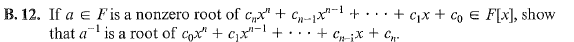
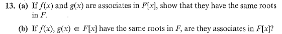

# 21
> **Exercises**: 4.4 #9, 10 (see also #15), 11, 12, 13, 15, 19

## 4.4.9

> List all monic irreducible polynomials of degree 2 in $\mathbb{Z}_3[x]$. Do the same in $\mathbb{Z}_5[x]$ .

### $\mathbb{Z}_3[x]$

+ $x^2$ (reducible)
	+  $x^2+x$ (reducible)
		+  $x^2+x+1$
		+  $x^2+x+2$
	+  $x^2+2x$ (reducible)
		+  $x^2+2x+1$ (reducible)
		+  $x^2+2x+2$

## 4.4.10

> Find a prime $p > 5$ such that $x^2 + 1$ is reducible in $\mathbb{Z}_p[x]$.

$x^2+1$ is reducible in $\mathbb{Z}_p[x]$ if $x^2 = -1$ this is true when $-1$ is a square in $\mathbb{Z}_p[x]$ .

Consider a prime $p$ where its in the form $a^2+1$ then $[a]$ is a root.

One of these primes is 17 as $17=4^2+1$

## 4.4.11
>Find an odd prime $p$ for which $x - 2$ is a divisor of $f=x^4 + x^3 + 3x^2 + x + 1$ in $\mathbb{Z}_p[x]$ .

Via the remainder theorem the remainder of $x-2$ dividing $f$ is the same as $f(2)$ which is $39$

Notice that $39=13*3$ implying $x - 2 | f$ under $\mathbb{Z}_{13}$

## 4.4.12

Let $f$ be the first function and $g$ be the second function.

We know that $f(a)=0_F$ . 

...

## 4.4.13

 
Given the equivalence class of associates. If $f, g$ are associates then $f R g$ , pick $h$ a monic representative of the equivalence class of $f$ and $g$ .

Since $h, f$ and $g$ only differ by a constant (as per the definition of associates) it is evident that they contain the same roots. 