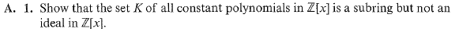
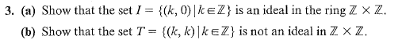
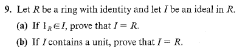
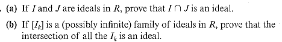

# Set 24

> **Exercise**s: 6.1 #1, 2, 3, 6, 9, 10, 17

## 6.1.1

Notice that $K$ is $\mathbb{Z}$ thus it is trivial that $\mathbb{Z}$ is a subring of $\mathbb{Z}[x]$ .

Consider the polynomial $x \in \mathbb{Z}[x]$ where then for any $n\in \mathbb{Z}$ , $nx\not\in\mathbb{Z}$ and thus $\mathbb{Z}$ is not an ideal.

## 6.1.3

### 6.1.3a
Assuming component-wise operations, 

It is trivial to see that $I$ is non-empty and closed under subtraction.

Consider an $(k, 0) \in I$ and a $(a, b) \in \mathbb{Z} \times \mathbb{Z}$ .

$$
(k, 0) \cdot \overbrace{(a, b)}^{\in \mathbb{Z} \times \mathbb{Z}} = \underbrace{(c, 0)}_{c=k\cdot a} \in I
$$

$$
\therefore I \text { is an Ideal}
$$

### 6.1.3b

Consider $i=(4, 4) \in I$ and $n=(0, 1) \in \mathbb{Z} \times \mathbb{Z}$

Notice that $ni \not \in I$ , thus $I$ is not an ideal.

## 6.1.6

> Show that the set of non-units $\mathbb{Z}_8$ is an ideal

Non-units are $0, 2, 4, 6$ . 

Brute force will show this set above is an ideal with $2$ as a principal ideal.

## 6.1.9
###  6.1.9a 

Suppose $1_R \in I$

Since $I$ is an Ideal for any $a \in I$ and $r \in R$, $ar \in I$

Since $1_R \in I$ , $r \in I$ for any $r \in R$ implying $R \subseteq I$ . 

By the properties of ideals $I \subseteq R$

$$
\therefore I = R
$$

###  6.1.9b

Let a unit $u \in I$ 

Then $\exists u^{-1} \in R: uu^{-1}=1_R$ meaning $1_R \in I$ 

Since $1_R \in I$ , $I = R$ by $(a)$ above. 

## 6.1.10

If $I$ is an ideal on a field $F$ show that either $I=\{0_F\}$ or $I=F$

Since $F$ is a field all elements $r$ have an inverse except zero. 

$I$ must contain $0_F$ to be closed under subtraction to remain an ideal. Therefore either $I$ only contains $0_F$ or it contains other elements. 

Suppose it contains other elements. Then a $0 \neq a \in I$ . Then $a^{-1}\in F$ implying $I=F$ 

Therefore $I = \{0_F\}$ or $I=F$

## 6.1.17

> Assume all rings below are commutative.

Suppose $I, J$ are ideals. 
Consider $K = I \cap J$

Since both $I, J$ are closed under subtraction, $0_R \in K$

Consider $a, b \in K$ , then $a, b \in I$ and $a, b \in J$ .
Since $I, J$ ideals, $a- b\in I$ and $a- b \in J$ implying $a - b \in K$ .

Next consider $a \in K$ , then $a \in I$ and $a \in J$ . 
Then for any $r\in R$ , $ar \in I$ and $ar \in J$ implying $ar \in K$

$$
\therefore I \cap J \text{ a ideal.}
$$

This logic can be trivially extended to $(b)$ .