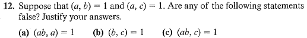

# Set 3

| Assigned | Problems   |
| -------- | ---------- |
| 9/05/23  | CP1.2 -> 8 |

## 1.2.8

> Prove that $(n, n + 1) = 1$ for every integer $n$.

Assume $d=\gcd(n, n+1)$ thus, $d|n$ and $d|n+1$ .

Since $d|n$ and $d|n+1$ it implies that $d|1$. 

Since $d$ divides $1$ it means that $d$ is either $\pm 1$ .

Since $d\gt0$ , $d=1$

Therefore, $\gcd(n, n+1) = 1$ for any $n \in \mathbb{Z}$

## 1.2.12

1. False it has to be at least $a$
2. False take $a=4, b=7, c=49$
3. False see (2)