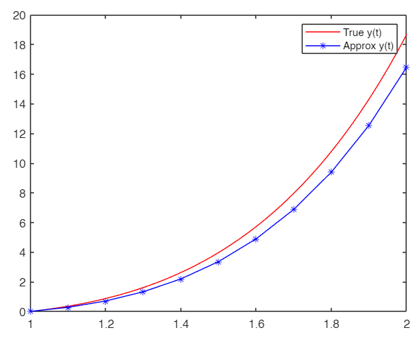

# Homework 8
## 9

$$
\begin{align}
\text{ODE: }\ y' &= \frac{2}{t}y+t^2e^t \\
\text{Solution: }\ y(t) &= t^2(e^t - e)
\end{align}
$$

### Verification

$$
\begin{align}
\dfrac{dy}{dt} &= 2t(e^t - e) + t^2\cdot e^t \\ \\
\frac{2}{t}y+t^2e^t &\stackrel{\text{USE ODE}}{\to} \frac{2}{t}t^2(e^t - e)+t^2e^t \\ \\
&= 2\cdot t(e^t-e) + t^2e^t = \boxed{\dfrac{dy}{dt}}
\end{align}
$$

*Indeed* this is *a* solution to this ODE. 

## 9A
This code is all part of the lab. 
```py
>> format long e
>> e = exp(1);
>> y_true = @(t) (t.^2)*(e.^t - e);
>> dydt = @(t) (2./t)*(y_true(t)) + (t.^2 * (e.^t));
>> initial_value = y_true(1)

>> h = 0.1000
>> t = 1:h:2

>> FWD_Euler(dydt, t, h, initial_value)
```

**RESULT**
```py
Approx:

0 # initial    
2.718281828459045e-01     6.982267947506484e-01     1.320764054251312e+00     2.188139049260616e+00     3.357295321510148e+00     4.894697534899919e+00     6.877794026244611e+00     9.396691113964943e+00     1.255606852137814e+01     1.647736920829264e+01

Actual Values:

0     
3.459198765397394e-01     8.666425357596030e-01     1.607215078180736e+00     2.620359551235832e+00     3.967666294227794e+00     5.720961525596340e+00     7.963873477844964e+00     1.079362466049064e+01     1.432308153589101e+01     1.868309708188642e+01
``` 

### Comparison



The absolute error is max at $t=2.0$ which is approximately $2.21$

## 9 B (ii)
We want to approximate $y(1.55)$ therefore $t=1.5, 1.6$ will be used for the linear Lagrange polynomial. 

$$
\begin{align}

L_{0}(x) &= \frac{x - 1.6}{1.5-1.6} \\ \\

L_{1}(x) &= \frac{x - 1.5}{1.6-1.5} \\ \\

P(x) &= y(1.5)L_0(x) + y(1.6)L_1(x)\\ \\
&= 3.35729L_0(x) + 4.89469L_1(x) \\ \\

&\implies P(1.55) = \boxed{4.12599}
\end{align}
$$

The True Value is at $4.7886350$ :(

Absolute Error: $0.662645$