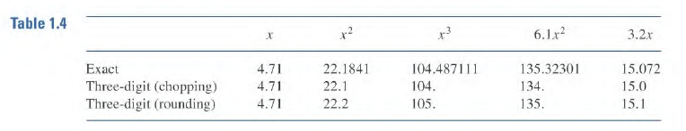

# Round-off Errors and Computer Arithmetic

Due to the way decimals are represented, $\sqrt{3}^2 \neq 3$ on some machines. This is because we cannot store the infinite expansion of $\sqrt{3}$ on *any* memory. The decimal expansion is cut off at some point, this is called **round-off error**.

## Decimal Representation in Binary
A real number takes up 8 bytes (64 bits). The first bit is the sign bit ($s$). The next 11 bits are for the exponent known as the characteristic ($c$). The final 52 bits are for the mantissa, the binary fraction.  

The characteristic has 11 bits and thus has values ranging from $0 - 2047$. However we also wish to represent negative numbers. So we subtract $1023$ from $c$ to obtain negative numbers. 

Using this system we notice that floating point numbers are represented by: 
$$(-1)^s 2^{c - 1023} (1+f)$$

If we take a floating point number $k$ and $\pm 1$ from the mantissa we notice the amount of numbers floating point numbers cannot cover. 

I want to note that the binary value stored in $f$ is normalized. 
For example suppose we wish to store this number (binary):
$$1101.101$$
We move the decimal point over to $1.101101$ and set the exponent to $3$. This is why the $1$ is omitted from the mantissa since every number has a one at the start as we only need to store the "$.101101$". This explains the $\mathbf{1+}f$ .

## Decimal Machine Numbers
**Normalized** Decimal Floating point form:
$$
\pm 0.d_1d_2d_3\dotso d_k \times 10^n
$$
for $1\leq d_1 \leq 9$ and $0\leq d_i \leq 9$ ( for $i\gt 1$)

Any member of $\mathbb{R}^+$ can be normalized to the form:
$$
y = 0.d_1d_2d_3\dotso d_kd_{k+1}d_{k_2}\dotso \times 10^n 
$$
The floating point of $y$ denoted at $fl(y)$ is obtained by terminating $y$ at $k$ digits. 

One of the ways to do this is:
$$
fl(y) = 0.d_1d_2d_3\dotso d_k \times 10^n
$$

Alternately we can round then chop it off at $k$ digits.

$$
fl(y) = 0.\delta_1\delta_2\delta_3\dotso \delta_k \times 10^n
$$

For rounding, if $d_{k+1} \geq 5$ then we add $1$ to $d_k$. Rounding down leaves the number unchanged. 

### Example

> Determine the five digit chopping of $\pi$ with both methods. 

$$
\pi = 0.314159265\dotso \times 10^1
$$

#### a) Chopping
$$fl(\pi) = 0.31415 \times 10^1$$

#### b) Rounding
Notice that we need five decimal digits. We look at the 6th digit ($9$) and decide to round up to $0.31416 \times 10^1$

### Error
Suppose $p^*$ is an approx for $p$.
The actual error is $p - p^*$, the absolute error is $|p - p^*|$, and the relative error is $\frac{|p - p^*|}{|p|}$ for $p\neq0$ .

#### Example
$$
\begin{align}
	p   &= 0.3000 \times 10^4 \\
	p^* &= 0.3100 \times 10^4 \\
	
	p - p^* &= -0.1 \times 10^3 \\
	|p - p^*| &= 0.1 \times 10^3 \\
	\\ \\
	\frac{|p - p^*|}{|p|} &= \frac{0.1 \times 10^3}{0.3000 \times 10^4} = \frac{1}{10}\frac{1}{3} = 0.33\overline{3} \times 10^{-1}
\end{align}
$$

Note that relative error is the most important when looking at error. 

### Significant digits
The number $p^*$ is said to approximate $p$ to $t$ **significant** digits if $t$ is the largest integer for which:
$$
\frac{|p - p^*|}{|p|} \leq 5 \times 10^{-t}
$$

We note that floating point number $y$ has the following error:
$$
\biggr|\frac{y - fl(y)}{y} \biggr|
$$

for $y$ defined above. 

This results in this:
$$
\biggr|\frac{0.d_{k+1}d_{k+2}\dotso\times10^{n-k}}{0.d_1d_2\dotso d_k\times10^n} \biggr| = \biggr|\frac{0.d_{k+1}d_{k+2}\dotso}{0.d_1d_2\dotso d_k} \biggr| \times10^{-k}
$$

See that the numerator is bounded above by 1 and the denominator by 0.1. thus the maximum error here is $10^{-k+1}$

## Finite Digit Arithmetic
We use chopping to perform operations:

This example for addition applies to **each** elementary operation 
$$
x \oplus y = fl(fl(x) + fl(y))
$$

Example. 
Find $+, -, *, /$ for $x=\frac{5}{7}$ and $y = \frac{1}{3}$ with 5 digit chopping.

$$
\begin{align}
fl(x) = 0.71428\\
fl(y) = 0.33333
\end{align}
$$

$$
x \oplus y = 0.10476 \times 10^1
$$

### Errors
#### Subtraction of nearly equal numbers
Consider $x, y$ where $x \gt y$
$$
\begin{align}
	x &= 0.d_1d_2d_3\dotso d_p\alpha_p\alpha_{p+1}\dotso\alpha_k\times10^n  \\
	y &= 0.d_1d_2d_3\dotso d_p\beta_p\beta_{p+1}\dotso\beta_k\times10^n 
	
	\\
	
	\\
	
	x \ominus y &= \sigma_p\sigma_{p+1}\dotso\sigma_k\times10^{n-p} 
	\\
	\\
	\sigma_p\sigma_{p+1}\dotso\sigma_k &= 0.\alpha_p\alpha_{p+1}\dotso\alpha_k - 0.\beta_p\beta_{p+1}\dotso\beta_k
\end{align}
$$

The number $x-y$ has at most $k-p$ sigfigs now. However in most devices $x-y$ will have $k$ digits where the last $p$ digits are random or 0. This makes any further calculations useless.

##### Error Example
Let
$$
\begin{align}
p   &= 0.54617\\
q   &= 0.54601\\
p-q &= 0.00016 
\end{align}
$$
 

###### Chopping to 4 digits

$$
\begin{align}
fl(p) &= 0.5461\\
fl(q) &= 0.5460 \\

\end{align}
$$

$$
p \ominus q = 0.0001
$$

| Absolute Error | Relative Error |
| -------------- | -------------- |
| $0.00006$      | $0.375$        | 

###### Rounding to 4 digits

$$
\begin{align}
fl(p) &= 0.5462\\
fl(q) &= 0.5460 \\

\end{align}
$$

$$
p \ominus q = 0.0002
$$

| Absolute Error | Relative Error |
| -------------- | -------------- |
| $0.00004$      | $0.25$         | 

### Nested Arithmetic
#### Example
Evaluate $f(x) = x^3 - 6.1x^2 + 3.2x + 1.5\ \ @x=4.71$ with 3 digits.

$$
\begin{align}
	\text{chopping} &\to -13.5\\
	\text{rounding} &\to -13.4\\
	\text{real} &\to -14.263899
\end{align}
$$

### How to deal with this
We can rewrite $f$ as:
$$
x^3 - 6.1x^2 + 3.2x + 1.5 = ((x-6.1)x + 3.2)x + 1.5
$$

Now, 
$$
\begin{align}
	\text{chopping} &\to -14.2\\
	\text{rounding} &\to -14.3\\
	\text{real} &\to -14.263899
\end{align}
$$

The error is reduced due to the number of operations being reduced. 

**Operations Count Table**

|              | Add/Sub | Mult |
| ------------ | ------- | ---- |
| **Un**nested | 3       | 6    |
| Nested       | 3       | 2     |
