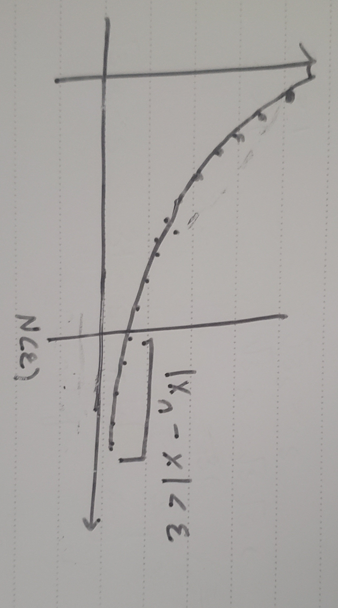

# Algorithms and Convergence
The book contains an intro to algorithms with pseudo-code. I wont be taking notes on this *intro*. 

## Example A
The $N$th Taylor Polynomial for $f(x) = \ln{x}$ expanded about $x_0 = 1$ is:
$$
P_{N}(x) = \sum_{i = 0}^{N}\frac{(-1)^{i+1}}{i}(x-1)^i
$$

Up to 8 places,  $\ln{1.5} = 0.40546511$
Write an algorithm to find the smallest $N$ where
$$
\biggr| \ln{1.5} - P_N \biggr| \lt 10^{-5}
$$

## Characterizing Algorithms
Due to the various methods of approximation and there exist a large variety of conditions to categorize their accuracy. 

**Stable** - If a small change into the input of a algorithm corresponds to a small change in the output

**Unstable** - Small change in input $\to$ large change in output

**Conditionally Stable** - Stable for only subsets of the data

***Definition***:
Let $E_0 \gt 0$ denotes an error at some step in the calculation. Then let $E_n$ represent the magnitude of error after $n$ subsequent operations. 

If $E_n \approx Cn E_0$ then the growth of error is *linear*
If $E_n \approx C^n E_0$ then the growth is said to be *exponential* ($C\gt1$)

It is hard to avoid linear error growth and thus this type of error is said to be stable whereas a algorithm displaying exponential error growth is unstable. 

## Convergence - Lecture 09 01 22
### Sequences
Let $\{x_n\}_{n=1}^{\infty}$ be a sequence of real numbers

We say the sequence converges to some value $x$ if $\forall\epsilon\exists N(\epsilon)$ s.t $|x_n - x|\lt\epsilon$ for all $n \gt N(\epsilon)$

This badly drawn image should get the point across that after a certain value $N(\epsilon)$, $x_i$ should be with $\epsilon$ units of $\mathbf{x}$.

> The question that remains is that how well does $\{x_n\}$ approximate $\mathbf{x}$? Also, how **fast** is this approximation getting better. (How fast does the error decrease?)

### Rates of Convergence
Suppose $\{\beta_n\}^{\infty}$ is known to converge to **0**.
Suppose $\{\alpha_n\}^{\infty}$ converges to $\alpha$

***Theorem***:
If $\exists k\in\mathbb{R}^{+}$ s.t $\biggr| \alpha_n - \alpha \biggr| \leq k\biggr|\beta_n\biggr|$ for a large n, then $\{\alpha_n\}^{\infty}$ converges to $\alpha$ with a rate/order of $O(\beta_n)$. 

> Usually, $\beta_n = \frac{1}{n^p}$ for some $p \gt 0$. Our goal is usually to find the largest $p$. 

***Theorem***
Suppose $\lim_{h\to0}G(h)=0$ and $\lim_{h\to0}F(h) = L$ If $\exists K\in\mathbb{R}^+$ s.t 
$$
\biggr| F(h) - L \biggr| \leq K\cdot|G(h)|
$$
for small $h$, we say that $F(h) = L + O(G(h))$ where usually, $G(h) = h^p$ for $p\gt0$. 

#### Examples
##### Example A
$$
\alpha_n = \frac{n+1}{n^2}
$$

Notice that $\{\alpha_n\} \to 0$ as $n \to \infty$

$$
\biggr|\ \alpha_n - \alpha \ \biggr| = \frac{n+1}{n^2} - 0\leq \frac{n+n}{n^2} \leq \frac{2n}{n^2} = 2\biggr(\frac{1}{n}\biggr)
$$

##### Homework 6c
Find the rate of convergence of $$\lim_{n\to\infty}\biggr[\sin{\biggr( \frac{1}{n}\biggr)}\biggr]^2 = 0$$

**Work**:
$$
\biggr|\ \alpha_n - \alpha\ \biggr| = \biggr| \biggr[\sin{\biggr( \frac{1}{n}\biggr)}\biggr]^2 - 0 \ \biggr| \leq \biggr(\frac{1}{n}\biggr)^2 \stackrel{*}{\leq} \frac{1}{n^2}
$$

Therefore, $\alpha_n = 0+ O(\frac{1}{n^2})$

\* - This approximation is derived from the fact that for small $n$, $\sin n \approx n$. Therefore for large $n$, $\sin{\frac{1}{n}} \approx \frac{1}{n}$. Since they are close, $\exists k\gt0$ s.t $\sin{\frac{1}{n}} \leq k\cdot \frac{1}{n}$ for large $n$.   

