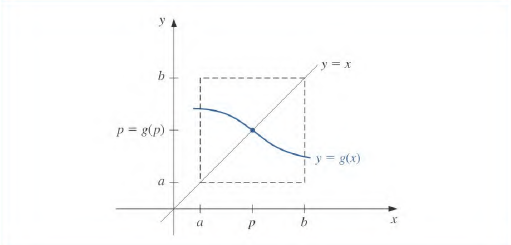

# Fixed Pointer Iteration
The number $p$ is a **fixed point** for a given function $g$ if $g(p) = p$

This section considers finding solutions to fixed point problems where we wish to recover $p$. There is a connection between root finding and fixed point problems. 

Given a root finding problem $f(p) = 0$ we can define functions $g$ with a fixed point in many ways:
1. $g(x) = x - f(x)$, ($f(x)$ will be zero for $x=p$)
2. $g(x) = x - n\cdot f(x)$ for $n\neq0$

If the function $g$ has a fixed point at $p$, then the function defined by $f(x) = x - g(x)$ has a zero at $p$. 

Certain problems are easier if reformed into fixed point problems. 

## Finding Fixed Points 
> Find the fixed points of $f(x) = x^2 - 2$

Well that is the same as $x=x^2-1$ which has solutions at $x=-1, 2$

***Theorem 2.3.1***
If $g\in C([a, b])$ and $\forall x\in[a, b]\ g(x)\in[a, b]$ then $\exists p\in[a, b]$ s.t $g(p)=p$

This is kind of trivial. See that if $g$ is continuous on am interval $[x, y]$ and only takes on values from $[x, y]$ there is going to be a point $g(p)=p$. The mapping where $g:[a, b]\to[a, b]$ is also relevant since it is only in this interval the line $y=x$ will exist.  

***Theorem 2.3.2***
**IF THE 2.3.1 condition is met**

If $g^\prime(x)$ exists on $(a, b)$ and $\exists k\in(0, 1)$ s.t $$\forall x\in(a, b)\ \ |g^\prime(x)|\lt k$$
then there is exactly one fixed point in $[a, b]$



This image shows how 2.3.2 works. 

> Why is the upper limit on $k$ one?

Think of what it means to be a fixed point. The point lies on the line $y=x$. If the graph of $g$ happens to already have crossed this line it will not be able to cross again if the derivative is less than 1. If it crosses from above it cannot grow fast enough to cross again. See that it cannot cross from below since $y=x$ grows faster than $g$ if $g^\prime \lt 1$

### Example
> Show $g(x) = \frac{x^2 - 1}{3}$ has a unique fixed point in $[-1, 1]$

$$
g^\prime(x) = \frac{2x}{3}
$$

The max/min of this function occurs at the points: $-1, 1$ or anytime $g^\prime(x)=0$ which happens to be at $0$. With this we determine that $g(x)\in[-1, 0]\subset[-1, 1]$

With this we know that at least *one* fixed point exists. 
Then, we notice that in the interval $[-1, 1]$,
$$
|\ g^\prime(x)\ |=\ \biggr|\frac{2x}{3}\biggr|\leq \frac{2}{3}
$$

Since it satisfies 2.3.2 it has a unique fixed point. 

### Theorem Fails (not $\iff$)
Consider $h(x) = 3^{-x}$ on the interval $[0, 1]$. It contains a unique fixed point in this interval yet it $h^\prime(0) = 1 \not\leq 1$. However, theorem 2.3.1 does imply that there exists at least one fixed point. 

## FIXED POINT ALGORITHM
Notice for $g(x) = 3^{-x}$ we cannot determine the fixed point regularly. That is we cannot find any solutions for:
$$
p = g(p) = 3^{-p}
$$
However we can get approximations that get closer to the actual value. 

To approximate a fixed point we choose an initial approximation $p_0$ and the generate a sequence $\{p_n\}_{n=0}^{\infty}$ by letting $p_n = g(p_{n-1})$ for $n\geq1$. If the sequence converges to $p$ and $g$ is continuous then, 
$$
p=\lim_{n\to\infty}p_n=\lim_{n\to\infty}g(p_{n-1}) = g\biggr(\lim_{n\to\infty}p_{n-1}\biggr) = g(p)
$$

This technique is called fixed-point, or functional iteration.

### Fixed Point Iteration ALGORITHM
**Initial Variables**:
$$
\begin{align}
	g &- \text{function} \\
	p_0 &- \text{initial approx} \\
	TOL &- \text{How close we need to be} \\
	N_0 &- \text{max iterations}
\end{align}
$$

**ALGORITHM**
```js
Let i = 1
while i < N0: //max iter
	set p = g(p0) 
	if |p - p0| < TOL:
		END_LOOP
	i++
	p0 = p

OUTPUT FAILURE -> "METHOD FAILED AFTER N0 iterations"
```

## Fixed Point Reliability
When we perform fixed point iterations, different forms of the same function may converge and diverge at different rates.
###  Fixed Point Theorem
***THEOREM 2.4.1***
Let $g\in C([a, b])$ such that $\forall x\in[a, b],\ g(x) \in [a, b]$.
If $g^\prime$ exists on $(a, b)$ and $\exists0\lt k\lt 1$ s.t:
$$
\forall x\in(a, b)\ \ |g^{\prime}(x)|\leq k
$$
**Then**, for any $p_0\in[a, b]$, the sequence defined by:
$$
p_n = g(p_{n_1}) \text{ for } n\geq1
$$
converges to a unique fixed point in $[a, b]$. 

<!--
### Proof
In this theorem we note that $g: [a, b]\to[a, b]$. We conclude that because of this $p_n$ is defined **for all** $n\geq0$ where $p_n\in[a, b]$

We can use the fact that $|g^{\prime}(x)|\leq k$ and the mean value theorem to prove the fixed point theorem. 
-->

### Bound for Error
If $g$ satisfies Theorem $2.4.1$ the error bound is:
$$
|p_n - p| \leq k^n \max\{p_0-a, b-p_0\}
$$
and 
$$
|p_n - p| \leq \frac{k^n}{1-k}|p_1 - p_0|
$$