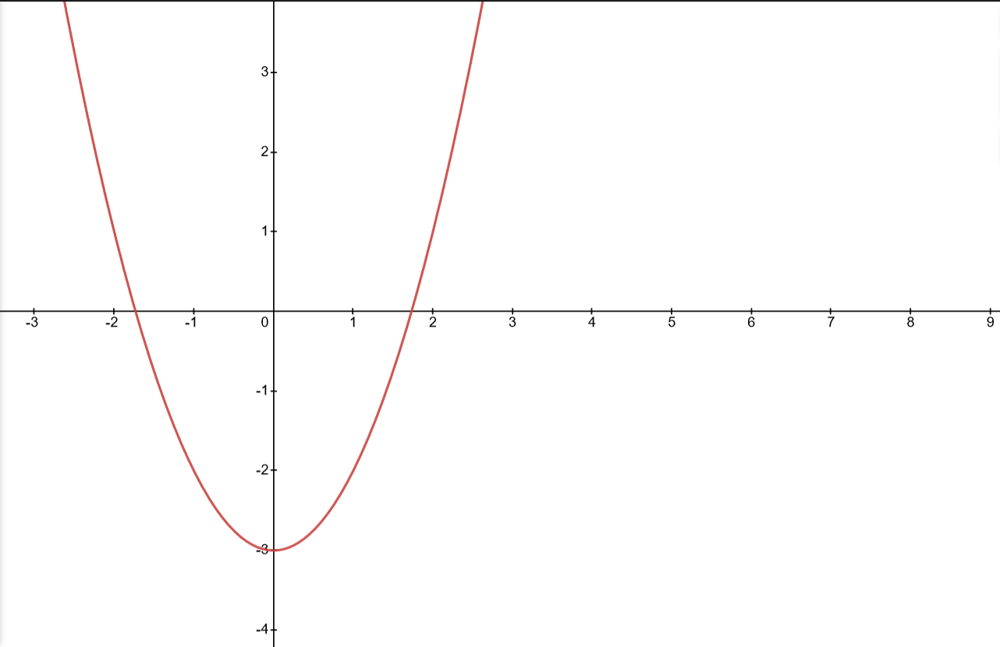
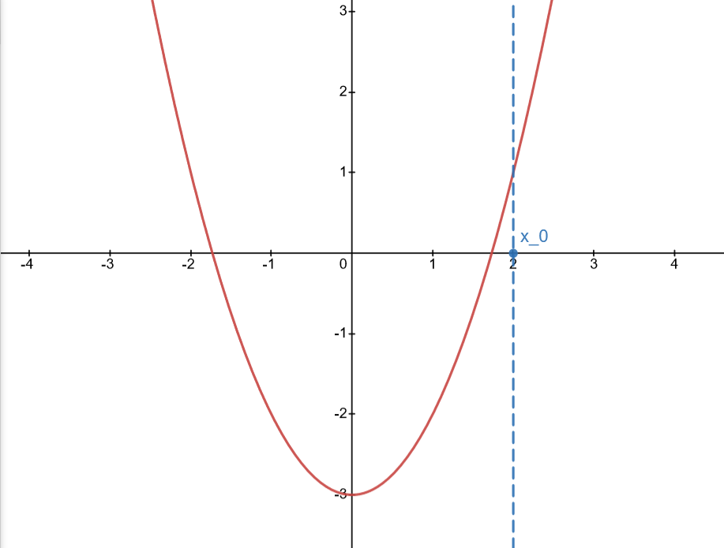
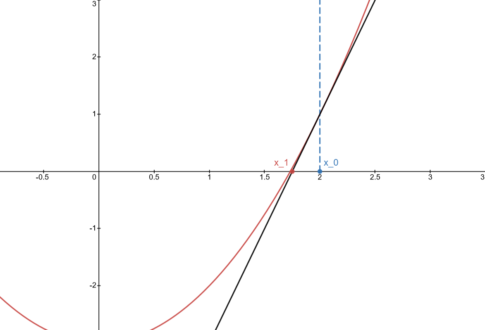
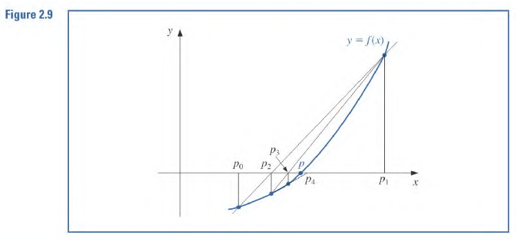

#  Newton-Raphson Method
+ Newton's (or the Newton-Raphson) method is an *answer* to the root finding problem

## Taylor Polynomial Derivation
Suppose $f\in C^2([a, b])$. Let $p_0\in[a, b]$ where $p_0$ is an approximation for $p$ where $f^{\prime}(p_0) \neq 0$ and $|p-p_0|$ is *small*

The first Taylor Polynomial:
$$
f(p) = f(p_0) + (p-p_0)f^{\prime}(p_0) + \frac{(p-p_0)^2}{2}f^{\prime\prime}(\xi{(p)})
$$

Since $f(p) = 0$:
$$
0 \approx f(p_0) + (p-p_0)f^{\prime}(p_0)
$$

Since $|p-p_0|$ is small the squared term goes away (negligible).

Solving for $p$ yields:
$$
p \approx p_0 - \frac{f(p_0)}{f'(p_0)} = p_1
$$

This is how this works:

A sequence is generated:
$$
p_n = p_{n-1} - \frac{f(p_{n-1})}{f^{\prime}(p_{n-1})}, \text{ for } n\geq 1
$$
## How this works:
Lets try to find $\sqrt{3}$

Here is the graph of $y=x^2-3$ which has a zero at that point. 

We will pick an approximation of $x=2$

Consider the tangent line at $x=2$

Notice that $x_1$ is the new approximation. How can we obtain $x_1$?

See that $f'(x_0) = \frac{f(x_0)}{x_0 - x_1}$. Think rise over run, $f(x_1) \approx 0$

We then isolate $x_1$:
$$
x_1 = x_0 - \frac{f(x_0)}{f'(x_0)}
$$

We can do this again to find a better approx:
$$
x_2 = \underbrace{x_0 - \frac{f(x_0)}{f'(x_0)}}_{x_1} - \frac{f(x_1)}{f'(x_1)}
$$

### Example
Approximate a root for $f(x) = \cos{x}-x$, use $p_0 = \pi/4$

Derivative: $f'(x) = -\sin{x} - 1$

$$
\begin{align}

p_1 &= p_0 - \frac{f(p_0)}{f'(p_0)} \\
\\
&= \frac{\pi}{4} - \frac{f(\pi/4)}{f'(\pi/4)} \\
\\
&= \frac{\pi}{4} - \frac{\frac{\sqrt{2}}{2}-\pi/4}{-\frac{\sqrt{2}}{2}-1} \\
\\
&= 0.7395361337
\end{align}
$$

We can do the same process with $p_1 = 0.7395361337$ to find a better root approximation. 

Generally:
$$
p_n = p_{n-1} - \frac{f(p_{n-1})}{f'(p_{n-1})} = p_{n-1} = \frac{\cos{p_{n-1}} - p_{n-1}}{-\sin{p_{n-1}}-1}
$$
## Convergence Theorem
Let $f \in C^2([a, b])$, if $p\in[a, b]$ such that $f(p)=0$ and $f'(p)\neq0$. Then there exists a $\delta\gt0$ s.t Newton's method generates a sequence converging to $p$ for any initial approximation $p_0\in[p-\delta, p+\delta]$. 

There is no way to determine $\delta$ and the proof of this tells us the the rate of convergence drops to 0 after long iteration. 

## Secant Method
The main issue of Newton's Method is that we must find $f'(x)$.

To by pass the derivative:

$$
f'(p_{n-1}) \approx \frac{f(p_{n-1}) - f(p_{n-2})}{p_{n-1} - p_{n-2}}
$$

With this approximation in mind:
$$
\begin{align}
p_n &= p_{n-1} - \frac{f(p_{n-1})}{f'(p_{n-1})}
\\ \\
&= p_{n-1} - \frac{f(p_{n-1})}{\frac{f(p_{n-1}) - f(p_{n-2})}{p_{n-1} - p_{n-2}}}
\\ \\

&= p_{n-1} - \frac{f(p_{n-1})(p_{n-1} - p_{n-2})}{f(p_{n-1}) - f(p_{n-2})}
\end{align}
$$

The secant method requires two initial approximations: $p_0, p_1$. 

This method is less costly since the derivative ins't calculated and after $p_2$ only one function input needs to be calculated **once**.

### Example
Find a solution to $x=\cos{x}$ where $(p_0, p_1) = (0.5, \pi/4)$

$$
\begin{align}

p_2 &= p_{1} - \frac{f(p_{1})(p_{1} - p_{0})}{f(p_{1}) - f(p_{0})} 
\\ \\

&= \frac{\pi}{4} - \frac{(\frac{\pi}{4} - 0.5)[\cos{(\pi/4)} - (\pi/4)]}{[\cos{(\pi/4)} - (\pi/4)]-[\cos{(0.5)} - (0.5)]}
\\ \\

&= 0.736384138837
\end{align}
$$

The convergence of the secant is much faster than function iteration (bisection or fixed point) but **is** slower than Newton's method. This is true *generally*. 

## False Position
Recall the upper bound for error for the bisection method:
$$
|p-p_0| \lt \frac{1}{2}|a_n - b_n|
$$

> **Root Bracketing**:
> Bracketing methods **determine successively smaller intervals (brackets) that contain a root**. When the interval is small enough, then a root has been found. -[Wikipedia](https://en.wikipedia.org/wiki/Root-finding_algorithms)

Root bracketing is not guaranteed for either Newton's method or the Secant method. However the false position method is a way to use it.

Steps: 
1. Choose $p_0, p_1$ s.t $f(p_0) \cdot f(p_1)\lt0$
2. Compute $p_2$ regularly (secant method)
3. If $f(p_1)\cdot f(p_2) \lt 0$ we use that line as the secant line otherwise we use $p_0$ and $p_2$.

## Example
Use false position to find a root for $f(x) = \cos{x} - x$
We can still use $x = 0.5$ and $x = \pi/4$

| $x$     | $f(x)$               | Sign |
| ------- | -------------------- | ---- |
| $0.5$   | $\cos{0.5} - 0.5$    | +    | 
| $\pi/4$ | $\sqrt{2}/2 - \pi/4$ | -    |

We can obtain $p_2$: 

$$
\begin{align}
	p_2 &= p_1 - \frac{f(p_1)(p_1 - p_0)}{f(p_1) - f(p_0)}  \\ 
	&\stackrel{*}{=} 0.7363841388
\end{align}
$$

\* - This same example was done in the **Secant Method** Example

Now we note that $f(.7363841388) \gt 0$. This means we will chose $p_1$ instead of $p_0$ to continue the secant line approximation:

$$
p_{3}=p_{2}-\ \frac{f\left(p_{2}\right)\left(p_{2}-p_{1}\right)}{f\left(p_{2}\right)-f\left(p_{1}\right)}=0.739058139214
$$