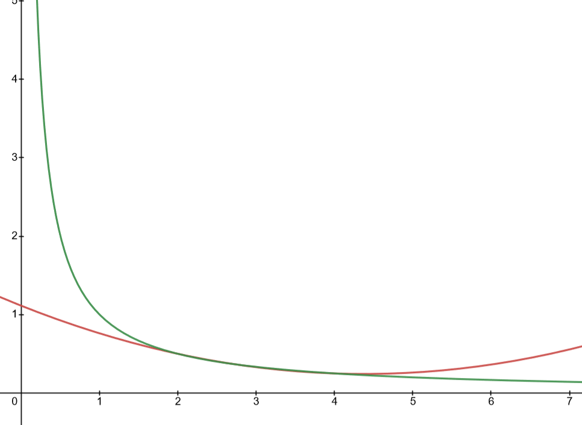

# Interpolation and the Lagrange Polynomial
Recall what a polynomial is:
$$
P_n(x) = \sum_{k=0}^n a_kx^k
$$
Where $n\in\mathbb{Z}^+$ and $\forall k,\ a_k\in\mathbb{R}$

Their importance stems from being able to approximate continuous functions. Moreover the derivatives and integrals are easy to compute.

***Weierstrass Approximation Theorem***
If $f\in C^0$ on $[a, b]$, $\forall\epsilon\exists P(x)$ s.t:
$$
\forall x\in[a, b],\ \biggr\lvert f(x) - P(x) \biggr\rvert \lt \epsilon
$$

## The Flaw with Taylor Polynomials
Taylor Polynomials do not fit the *Weierstrass Approximation Theorem* since they **do not** provide an accurate approximation over the entire $[a, b]$. Their accuracy is concentrated over some point $x_0$.

## Lagrange Interpolating Polynomials
We can instead try to create a function that *agrees* with the points we need. For example we can generate a polynomial of degree one that passes through the points, $(x_0, y_0)$ and $(x_1, y_2)$ by first-degree polynomial interpolating. 

Define functions:
$$
\begin{align}
	L_0(x) &= \frac{x-x_1}{x_0 - x_1}\\ \\
	L_1(x) &= \frac{x-x_0}{x_0 - x_1}\\
\end{align}
$$

The linear Lagrange interpolating polynomial is:
$$
\begin{align}
	P(x) &= L_0(x)f(x_0) + L_1(x)f(x_1)
	\\ \\
	     &= \frac{x-x_1}{x_0 - x_1}f(x_0) + \frac{x-x_0}{x_0 - x_1}f(x_1)
\end{align}
$$

Notice the following:
$$
\begin{align}
	P(x = x_0) &= f(x_0) \\
	P(x = x_1) &= f(x_1)
\end{align}
$$

### Example
> Interpolate $(2, 4),\ (5, 1)$

$$
\begin{align}
	L_0(x) &= \frac{x-5}{2-5} \\\\
	L_1(x) &= \frac{x-2}{2-5} \\\\\\
	
	P(x) &= \frac{x-5}{2-5}(4) + \frac{x-2}{2-5}(1) \\\\
	&= 6-x
\end{align}
$$

## Lagrange Interpolating Polynomials Cont.

To generalize this we need to interpolate the follow comprehension
```python
( (x_k, f(x_k)) for k in [0, 1, ..., N] )
```

For each $k = 0, 1, ..., n$, a function $L_{n, k}$ must satisfy:
1. $L_{n, k}(x_i) = 0$ for $i\neq k$
2. $L_{n, k}(x_k) = 1$

To satisfy $(1)$, for all $i\neq k$, the numerator of $L_{n, k}$ requires this term:
$$
(x-x_0)(x-x_1)\dotso(x-x_{k-1})(x-x_{k+1})\dotso(x-x_n)
$$

Notice that $(x-x_k)$ is missing. This means that for all input not equal to $x_k$ the output will be nonzero.

To satisfy $(2)$, the denominator must be:
$$
(x_k-x_0)(x_k-x_1)\dotso(x_k-x_{k-1})(x_k-x_{k+1})\dotso(x_k-x_n)
$$

Notice now when $L_{n, k}(x)$ is evaluated at $x=x_k$, the 'top' and 'bottom' are equal.   

***Theorem 3.2***
If $x_0, x_1, \dotso, x_n$ are $n+1$ distinct numbers and $f$ is a function whose values are given at those numbers, then a unique polynomial $P(x)$ of degree $n$ exists with:
$$
\forall{k\in\{0, 1, \dotso, n\}},\ \ f(x_k) = P(x_k)
$$

This $P(x)$ is defined as:
$$
P(x) = f(x_0)L_{n, 0}(x) + f(x_1)L_{n, 1}(x) +\dotso+ f(x_n)L_{n, n}(x) = \sum_{k=0}^nf(x_k)L_{n_k}(x)
$$

Where
$$
L_{n, k}(x) = \frac{(x-x_0)\dotso(x-x_{k-1})(x-x_{k+1})\dotso(x-x_n)}{(x_k-x_0)\dotso(x_k-x_{k-1})(x_k-x_{k+1})\dotso(x_k-x_n)} = \prod_{i=0, i\neq k}^n \frac{(x-x_i)}{(x_k-x_i)}
$$

### Example
Use $x_0 = 2$, $x_1 = 2.75$ and $x_2=4$ to find the second Lagrange interpolating polynomial for $f(x) = x^{-1}$, then find $f(1/3)$

#### Lagrange Coefficient Polynomials
$$
\begin{align}
	L_0 &= \frac{(x-2.75)(x-4)}{(2-2.75)(2-4)}
	
	\\ \\
	
	L_1 &= \frac{(x-2)(x-4)}{(2.75-2)(2.75-4)}
	
	\\ \\
	
	L_2 &= \frac{(x-2)(x-2.75)}{(4-2)(4-2.75)}
	
	\\ \\ \\
	
	P(x) &= f(2)L_0(x) + f(2.75)L_1(x) + f(4)L_2(x)\\ \\
	&= \frac{1}{22}x^2 - \frac{35}{88}x + \frac{49}{44} \\ \\
	
	\\ 
	
	f(3) \approx P(3) &= \frac{1}{22}3^2 - \frac{35}{88}3 + \frac{49}{44} = 0.3295\overline{45}
\end{align}
$$


<span style="color:#4c9859; display:inline">Green: </span> $\to 1/x$
<span style="color:#cd5754; display:inline">Red: </span> $\to P(x)$

## Error
Suppose $x_0, \dotso, x_n$ are distinct numbers in the interval $[a, b]$ and $f\in C^{n+1}[a, b]$. Then $\forall x\in[a, b]$, a number $\xi(x)$ (generally unknown) between the min and the max in $x_0, \dotso, x_n$, exists with:
$$
f(x) = P(x) + \underbrace{\frac{f^{n+1}(\xi(x))}{(n+1)!}(x-x_0)\dotso(x-x_n)}_{h(x)}
$$

where $P(x)$ is the Lagrange Interpolating Polynomial.

I have called the additional part $h(x)$. First notice that $\xi(x)\in(a, b)$. Then notice that the $h(x)$ determines the error part. 

If we are able to find the critical points of $h(x)$ we can find where $h(x)$ is at a maximum which will be the upper bound for error. 

### Example
> Find the error on the second degree interpolating polynomial for $f(x) = 1/x$ on the same *node* as the above example. 

$$
f(x) = P(x) = \frac{1}{22}x^2 - \frac{35}{88}x + \frac{49}{44} + \underbrace{\biggr[\frac{f^{(3)}(\xi(x))}{3!}(x-2)(x-2.75)(x-4)\biggr]}_{\text{error portion}}
$$