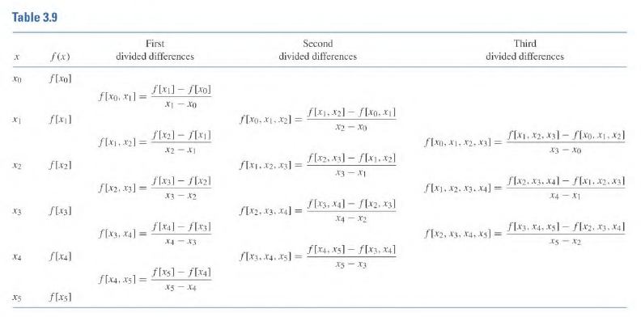

| Date    |
| ------- |
| 9 27 22 |

# 3.1, 3.3 Lecture Supplement
## Error Example
Find the error of the Lagrange Interpolating Polynomial for

$$
\begin{align}
	f(x) &= 1/x,\ x\in[2,4]\\
	\text{nodes} &= \{(x_0 = 2), (x_1 = 2.75), (x_2 = 4)\}
\end{align}
$$

From the last note we know that $f(x)$ generates a $P_2(x)$. Since we know that

$$
|f(x) - P_2(x)| \leq \biggr| \frac{f^{(3)}(\xi(x))}{(n+1)!} \prod_{i=0}^{2}(x-x_i) \biggr| = \xi(x)^{-4}g(x) 
$$

Where $g(x) = (x-2)(x-2.75)(x-4)$

Note: $f^{(3)}(\xi(x)) = 6\xi(x)^{-4}$

### Work

$$
\max_{x\in[2,4]}\{\xi(x)^{-4}\} = \frac{1}{16}
$$

This is because $\xi(x)^{-4}$ is decreasing on $(0, \infty)$ and the max value would be at the start of the interval.

$$
\max_{x\in[2, 4]}\{g(x)\} = \max_{x\in[2, 4]}\{x^3-\frac{35}{4}x^2+\frac{49}{2}-22\}
$$

$$
\begin{align}
g'(x) &= \frac{1}{2}(6x^2 - 35x + 49) = \frac{1}{2}(6x^2 - 14x - 21x + 49) \\ \\
&= \frac{1}{2}\biggr[2x(3x-7)-7(3x-7) \biggr] = \frac{1}{2}(2x-7)(3x-7)
\end{align}
$$

When we utilize critical points the max is found at $f(x=7/2) = \frac{9}{16}$

Therefore

$$
\max_{x\in[2,4]}\{\xi(x)^{-4} \cdot g(x)\} \leq \biggr| \frac{9}{16}\cdot\frac{1}{16} \biggr| = \frac{9}{256} \leftarrow \text{Error Bound}
$$

## Newton's Divided Differences
+ Alternative represent to the unique $P_n(x)$ derived by the Lagrange interpolation. 
+ Goes though the $n+1$ distinct nodes $\{\biggr(x_k, f(x_k)\biggr)\}_{k=0}^{n}$

$P_n(x)$ in this method is represented by

$$
\begin{align}
P_n(x) &= a_0 + a_1(x-x_0) + \dotso + a_n(x-x_0)\times\dotso\times(x-x_{n-1}) \\\\
&= \sum_{k=0}^n\biggr( a_k\prod_{i=0}^{k-1}(x-x_i) \biggr)
\end{align}
$$

Notice that $a_0$ is trivial to find as $f(x_0) = a_0$.

Finding $a_k$ for $k\gt0$ is a lot more work. 

*Luckily*, $a_k = f[x_0, \dotso, x_k]$

### Divided Differences Notation: $[\dotso]$
$$
\begin{align}
\\
f[x_0] &= f(x_0) \\ \\
f[x_0, x_1] &= \frac{f[x_1] - f[x_0]}{x_1 - x_0} \\ \\ 
f[x_0, x_1, x_2] &= \frac{f[x_1, x_2] - f[x_0, x_1]}{x_2 - x_0}\\ \\
f[x_0, x_1, x_2, x_3] &= \frac{f[x_1, x_2, x_3] - f[x_0, x_1, x_2]}{x_3 - x_0}\\ \\
&\ \ \vdots \\
\implies P_n(x) &= f[x_0] + \biggr[\sum_{k=1}^n f[x_0, \dotso, x_k] \prod_{i=0}^{k-1}(x-x_i)\biggr]
\end{align}
$$

Tabular Method of finding divided differences.

## Example
Find $P(x)$ using nodes $(0, 1), (2, 2), (3, 4)$

| $x$ | Num                            | Diff1                                              | Diff2                                                        |
| --- | ------------------------------ | -------------------------------------------------- | ------------------------------------------------------------ |
| 0   | $\underbrace{\boxed{1}}_{a_0}$ |                                                    |                                                              | 
| 2   | 2                              | $\frac{2-1}{2-0} = \underbrace{\boxed{1/2}}_{a_0}$ |                                                              |
| 3   | 4                              | $\frac{4-2}{3-2} = 2$                              | $\frac{2-\frac{1}{2}}{3-0} = \underbrace{\boxed{1/2}}_{a_2}$ |

This produces:

$$
P_2(x) = 1 + \frac{1}{2}(x - 0) + \frac{1}{2}(x - 0)(x - 2)
$$

Suppose we add a node: $(1, 0)$

| $x$ | Num                            | Diff1                                              | Diff2                                                        | Diff3                                                                     |
| --- | ------------------------------ | -------------------------------------------------- | ------------------------------------------------------------ | ------------------------------------------------------------------------- |
| 0   | $\underbrace{\boxed{1}}_{a_0}$ |                                                    |                                                              |                                                                           |
| 2   | 2                              | $\frac{2-1}{2-0} = \underbrace{\boxed{1/2}}_{a_0}$ |                                                              |                                                                           |
| 3   | 4                              | $\frac{4-2}{3-2} = 2$                              | $\frac{2-\frac{1}{2}}{3-0} = \underbrace{\boxed{1/2}}_{a_2}$ |                                                                           |
| 1   | 0                              | $\frac{0-4}{1-3} = 2$                              | $\frac{2-2}{1-2}=0$                                          | $\frac{{0-\frac{1}{2}}}{1-0} = \underbrace{\boxed{-1/2}}_{a_3}$ | 

All we needed were 3 more calculations and we got a new polynomial:

$$
\begin{align}
	P_3(x) &= 1 + \frac{1}{2}(x - 0) + \frac{1}{2}(x - 0)(x - 2) - \frac{1}{2}(x - 0)(x - 2)(x-3) \\
	&= P_2(x) - \frac{1}{2}(x - 0)(x - 2)(x-3)
\end{align}
$$
