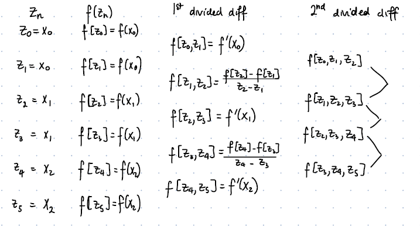

# Hermite Interpolation (HI)
For the last two interpolation methods we had had the following condition:

Given a collection of distinct $n+1$ points a polynomial $P(x)$ is generated such that $P(x_k) = f(x_k)$ . That is $P(x_k)$ is exact WRT the function $f$ at the points $x_k$ .

Hermite Interpolation requires the following two conditions for the interpolating polynomial $H_{2n+1}(x)$ given the following $2n+2$ points: $\biggr( (x_k, f(x_k), (x_k, f'(x)) \biggr)_{k=0}^{n}$

Conditions:

$$
\begin{align}
H(x_k) &= f(x_k) \\
H'(x_k) &= f'(x_k)
\end{align}
$$

> $H_{2n+1}(x)$ is unique. 

## Hermite Formulas
### Lagrange Definition

$$
\begin{align}
H_{2n+1}(x) &= \sum_{j=0}^{n} f(x_j) H_{n, j}(x) + f'(x_j)\hat{H}_{n, j}(x) 
\\ \\ \\
H_{n, j} &= \biggr[ 1 - 2(x-x_j)L'_{n,j}(x) \biggr]L^2_{n, j}(x)
\\ \\
\hat{H}_{n, j} &= (x - x_j)L^2_{n, j}(x)
\\ \\
\text{where } L_{n, j}(x_k) &= \prod_{i=0, i\neq j}^{n} \frac{(x-x_i)}{(x_j - x_i)} = 
\begin{cases}
1 &\text{if}& j = k \\
0 &\text{if}& j \neq k \\
\end{cases}
\end{align}
$$

#### Lagrange Example
Data points:

$$
\begin{align}
f(0) &= 0\\
f(1) &= 1\\
\\
f'(0) &= 1\\
f'(1) &= 0\\
\end{align}
$$

Given 4 data points we know that we need to construct a $H_3(x)$

$$
H_3(x) = \sum_{j=0}^{n=1} f(x_j)H_{1, j}(x) + f'(x_j)\hat{H}_{1, j}(x)
$$

Since we have 4 data points $n=1$

Here is all the data we need for this problem. 

$$
\begin{align}
H_{1, 0}(x) \\
H_{1, 1}(x) \\
\\
\hat{H}_{1,0}(x) \\
\hat{H}_{1,1}(x) \\
\\
L_{10} \to L'_{10}\\
L_{11} \to L'_{11}\\
\end{align}
$$

##### Lagrange

$$
\begin{align}
L_{1, 0}(x) &= \frac{x-x_1}{x_0-x_1} = 1-x \\ \\
L_{1, 1}(x) &= \frac{x-x_0}{x_1-x_0} = x
\end{align}
$$

##### $H(x)$ and $\hat{H}(x)$
###### $H(x)$

$$
\begin{align}
H_{1, 0} &= \biggr[1-2(x-x_0)L'_{1, 0}(x)\biggr]L^2_{1, 0}(x)  
\\ \\
&= [1\mathbf{+}2x](1-x)^2 = (1+2x)(1-2x+x^2)\\
&= 1 - 2x + x^2 + 2x - 4x^2 + 2x^3 \\
&= 1 - 3x^2 + 2x^3
\\ \\ \\
H_{1, 1} &= \biggr[1-2(x-x_1)L'_{1, 1}(x)\biggr]L^2_{1, 1}(x)  
\\ \\
&= [3-2x](x)^2 \\
&= 3x^2 - 2x^3
\end{align}
$$

###### $\hat{H}(x)$

$$
\begin{align}
\hat{H}_{1, 0} &= (x-x_0)L^2_{1, 0}(x) = x(1-x^2) = x^3 - 2x^2 + x \\ \\
\hat{H}_{1, 1} &= (x-x_1)L^2_{1, 1}(x) = x^3-x^2 \\ \\
\end{align}
$$

##### Answer

$$
\begin{align}
H_1(x) &= f(x_0)H_{1, 0}(x) + f'(x_0)\hat{H}_{1,0} + f(x_1)H_{1, 1}(x) + f'(x_1)\hat{H}_{1,1} \\
&= \hat{H}_{1,0} + H_{1, 1}(x) \\
&= (x^3 - 2x^2 + x) + (3x^2 - 2x^3) \\
&= -x^3 + x^2 + x
\end{align}
$$

### Divided Differences
We can generate the same polynomial with divided differences. 

First we construct a sequence $z_0,\dotso, z_{2n+1}$ [^1]

However, 

$$
z_{2i} = z_{2i+1} = x_i\ \forall i\in\{0,\dotso, n\}
$$

Then finally, we generate a divided differences using the $z$ sequence as the starting values. However an issue arises when we attempt to find $f[z_{2k}, z_{2k+1}]$ since they might correspond to the same value, $x_k$ . For this we assume their divided difference is equal to $f^\prime(x_k)$

The image above is taken from published notes my professor uploads. 

The construction of the final polynomial[^2] is the same as the one presented in the last set of notes[^3] :

$$
\begin{align}
H_{2n+1} &= f[z_0] + \sum_{k=1}^{2n+1}f[z_0, \dotso, z_{k}](x-z_0)(x-z_1)\dotso(x-z_{k-1}) \\ \\
&= f[z_0] + \sum_{k=1}^{2n+1}f[z_0, \dotso, z_{k}]\prod_{i = 0}^{k-1}(x-z_i)
\end{align}
$$

[^1]: thats $2n+2$ values
[^2]: Yes the equation below is correct, the values for some $z_i$ and $z_{i+1}$ might be the same
[^3]: Note Name: `3.1 _ 3.3 Lecture Supplement`
