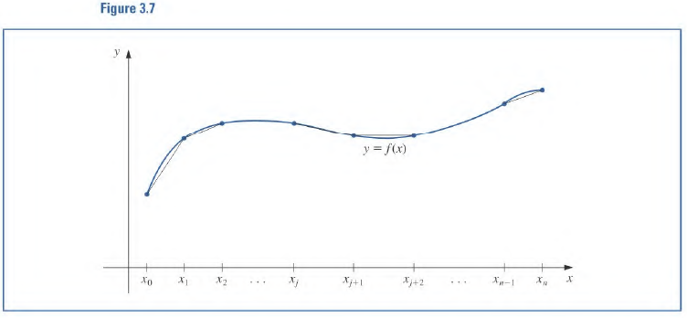
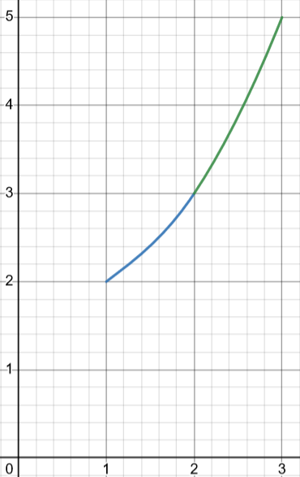

# 3.5 Cubic Spline Interpolation 🥭
The last few sections dealt with approximating functions over **closed** intervals using a single $P(x)$. However high degree polynomials can oscillate erratically. 

The way to deal with this is to divide up the intervals and construct many polynomials to approximate each interval. This is called piecewise-polynomial approximation.

## Piecewise Linear interpolation 
Consider $n+1$ sorted data points:

$$
\{(x_k, f(x_k))\}_{k=0}^n
$$

We can join the using a straight line. 

The issue here is differentiability, the overall function is not *smooth*[^1].

The solution here is to use piecewise polynomials of the Hermite type. If we know $f'$ at each point we can use cubic to join together data-points. 

### Example

> Find the linear spline through $(1, 2), (2, 1), (4, 4), (5, 3)$

Consider the first two points

$$
\begin{align}
\text{slope} &= \frac{2-1}{1-2} = -1 \\
\implies S_0(x) &= -x + 3
\end{align}
$$

Just like that we can find $S_1, S_2$

Slope intercept forms:
$$
\begin{align}
S_0(x) &= 2-(x-1) \\
S_1(x) &= 1+\frac{3}{2}(x-2) \\
S_2(x) &= 4-(x-4)
\end{align}
$$

Linear splines **are unique**.

***Motivation For Cubic Splines***

Generate a cubic polynomial such that between each pair of points $S_j$ and $S_{j+1}$ agree on the zeroth, first and second derivative at the joining point. 

## Cubic Spline
$f$ defined on $[a, b]$ where $a=x_0 \lt \dotso \lt x_n=b$

A Cubic spline $S$ for approximating $f$ is a set of cubic polynomials in the form $S_0(x)=a_0 + b_0(x-x_0) + c_0(x-x_0)^2 + d_0(x-x_0)^3$

The piecewise function is defined by:
$$
S(x) =
\begin{cases}
S_0(x)=a_0 + b_0(x-x_0) + c_0(x-x_0)^2 + d_0(x-x_0)^3\\
S_1(x)=a_1 + b_1(x-x_0) + c_1(x-x_0)^2 + d_1(x-x_0)^3\\
\vdots \\
S_{n-1}(x)=a_{n-1} + b_{n-1}(x-x_0) + c_{n-1}(x-x_0)^2 + d_{n-1}(x-x_0)^3
\end{cases}
$$

### Properties
1. $\forall j\in\{0, 1, \dotso, n-1\},$ $S_j(x_j) = f(x_j)$ , $S_j(x_{j+1}) = f(x_{j+1})$ 
2. $\forall j\in\{0, 1, \dotso, n-2\},$ , $S_{j+1}(x_{j+1}) = S_j(x_{j+1})$ 
3. $\forall j\in\{0, 1, \dotso, n-2\}$ , $S_{j+1}'(x_{j+1})=S_{j}'(x_{j+1})$ and $S_{j+1}''(x_{j+1})=S_{j}''(x_{j+1})$

**Boundaries**:

$$S''(x_0) = 0 = S''(x_n)$$

**Clamped Boundary**:

$$
\begin{align}
S'(x_0) &= f'(x_0) \\
S'(x_n) &= f'(x_n)
\end{align}
$$

### Example

> Construct a cubic spine with the following data

| $j$ | $x_j$ | $f(x_j)$ |
| --- | ----- | -------- |
| 0   | 1     | 2        |
| 1   | 2     | 3        |
| 2   | 3     | 5        | 

Since there are $3$ nodes there will be $2$ polynomials.

$$
\begin{align}
S_0(x)&=a_0 + b_0(x-1) + c_0(x-1)^2 + d_0(x-1)^3\\
S_1(x)&=a_1 + b_1(x-2) + c_1(x-2)^2 + d_1(x-2)^3\\
\end{align}
$$

There are eight constants to be determined.

(1) - Nodes must agree at endpoints
Therefore we can note that 

$$
\begin{align}
2 &= f(1) = a_0 \\
3 &= f(2) = S_0(2) = a_0 + b_0 + c_0 + d_0 \\
3 &= f(2) = S_1(2) = a_1 \\
5 &= f(3) = S_1(3) = a_1 + b_1 + c_1 + d_1
\end{align}
$$

(2) - Derivatives must agree

$$
\begin{align}
S'_0(2) &= S'_1(2) \implies b_0 + 2c_0 + 3d_0 = b_1\\
S''_0(2) &= S''_1(2) \implies 2c_0 + 6d_0 = 2c_1\\
\end{align}
$$

(3) - Boundary 

$$
\begin{align}
S''_0(1) &= 0 \implies 2c_0 = 0\\
S''_1(3) &= 0 \implies 2c_1 + 6d_1 = 0\\
\end{align}
$$

We know the values of some constants from the work we did above:

$$
\begin{align}
a_0 &= 2 \\
a_1 &= 3 \\\\
c_0 &= 0
\end{align}
$$

With this we can update our know equations:

$$
\begin{align}
3 = a_0 + b_0 + c_0 + d_0 &\to b_0 + d_0 = 1 \\
5 = a_1 + b_1 + c_1 + d_1 &\to b_1 + c_1 + d_1 = 2\\\\

b_0 + 2c_0 + 3d_0 = b_1 &\to b_0 + 3d_0 - b_1 = 0 \\
2c_0 + 6d_0 = 2c_1 &\to 6d_0 - 2c_1 = 0
\end{align}
$$

We can solve this system of equations using a matrix

$$
\begin{bmatrix}
1 & 1 & 0 & 0 & 0 \\
0 & 0 & 1 & 1 & 1 \\
1 & 3 & -1 & 0 & 0 \\
0 & 6 & 0 & -2 & 0 \\
0 & 0 & 0 & 2 & 6 
\end{bmatrix}
\begin{bmatrix}
b_0 \\
d_0 \\
b_1 \\
c_1 \\
d_1 
\end{bmatrix}
=
\begin{bmatrix}
1 \\
2 \\
0 \\
0 \\
0 
\end{bmatrix}
\implies
\begin{bmatrix}
b_0=3/4 \\
d_0=1/4 \\
b_1=3/2 \\
c_1=3/4 \\
d_1=-\frac{1}{4} 
\end{bmatrix}
$$

Finally, 

$$
S(x) = 
\begin{cases}
2 + \frac{3}{4}(x-1) + \frac{1}{4}(x-1)^3  &\text{if}& x\in[1, 2] \\
3 + \frac{3}{2}(x-2) + \frac{3}{4}(x-2)^2 - \frac{1}{4}(x-2)^2 &\text{if}& x\in[2, 3] \\
\end{cases}
$$

Output:

[^1]: End points of sub interval are not differentiable.