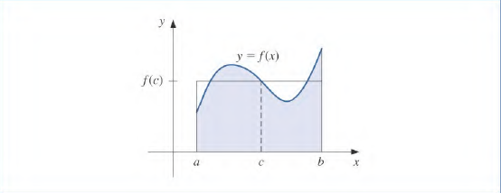
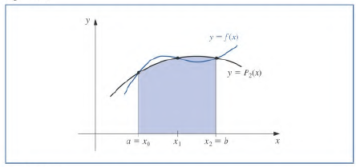

# 4.3 Numerical Integration Lecture 10 13 22
## Trapezoidal Rule
Recall the Trapezoidal Rule:

$$
\int_{a}^{b} f(x) \mathop{dx} = 
\int_{a}^{b} \underbrace{\sum_{i=0}^nf(x_i)L_i(x)}_{P_1(x)} \mathop{dx} 
+ 
\int_{a}^{b} \frac{f^{(n+1)})(\xi(x))}{(n+1)!}\prod_{i=0}^n(x-x_i) \mathop{dx} 
$$

Each $L_i$ is of degree 1. 

## Weighted Mean Value Theorem for Integrals
> This is used later to prove another result. 

Suppose $f\in C[a, b]$ the Riemann integral of $g$ exists on $[a, b]$, and $g(x)$ **does not change sign** on $[a, b]$. Then $\exists c\in(a, b)$ s.t 

$$
\int_a^b f(x)g(x)\mathop{dx} = f(c)\int_a^b g(x)\mathop{dx}
$$

If $g(x) = 1$, this is the mean value theorem for integrals. 

### How this works

Consider a function $\hat{g}(x) = \frac{g(x)}{\int_a^b g(x) \mathop{dx}}$

Evidently, $\int_a^b \hat{g}(x) \mathop{dx} = 1$

Then, 

$$
\int_{a}^{b} f(x)\hat{g}(x) \mathop{dx} = \int_{a}^{b} f(x)\frac{g(x)}{\int_a^b g(x) \mathop{dx}} \mathop{dx} \implies \int_a^b f(x)g(x) \mathop{dx} = f(c)\int_{a}^{b} g(x)\mathop{dx}
$$

for some $c\in(a,b)$

## Trapazodial Error Term

$$
\int_{a}^{b} \frac{f^{(n+1)})(\xi(x))}{(n+1)!}\prod_{i=0}^n(x-x_i) \mathop{dx} \to \int_{x_0}^{x_1} \frac{f''(\xi(x))}{2!}(x-x_0)(x-x_1) \mathop{dx} 
$$

Employ WMVT since $(x-x_0)(x-x_1)$ will not chance signs over $x\in(x_0, x_1)$ as the endpoints are roots and this is a quadratic. 

$$
\begin{align}
E(f) &= \int_{x_0}^{x_1} \frac{f''(\xi(x))}{2!}(x-x_0)(x-x_1) \mathop{dx} \\ \\
\text{(WMVT shown above)}&= \frac{f''(\mu)}{2} \int_{x_0}^{x_1} (x-x_0)(x-x_1) \mathop{dx}
\\ \\
\text{(SCARY ALGEBRA)}&= \dotso \\ \\
&= -\frac{f''(\mu)}{2}\frac{(\overbrace{x_1-x_0}^{h})^3}{6} = -\frac{h^3}{12}f''(\mu)
\end{align}
$$

For $\mu\in(x_0, x_1)$

## Degree and Accuracy and Precision
The *Degree and Accuracy and Precision* of a quadrature is the largest $n\in\mathbb{Z}^+$ s.t the quadrature formula is exact for all polynomials in the form $x^k$ for $k\in\{0, 1, \dotso, n\}$ .

For the Trapezoidal Rule, the degree of accuracy is $1$. This means for approximating integrals in the form below, it is **exact**.

$$
\int_{x_0}^{x_1} p+qx \mathop{dx} \text{ for }\ p,q\in\mathbb{R}
$$

To find the degree of a quadrature formula we can try increasing values of $x^k$ for $k$ until $\int_a^bf(x)\mathop{dx} \neq \text{Quadrature Formula}$

## Simpson's Rule

Simpsons rule is like the *Trapezoidal Rule* however it contains Lagrange interpolating polynomials of degree 2. 

It will employ **three nodes** that are equi-distant with each other. 

Nodes:

$$
\begin{align}
	\text{(used for midpoint) } h &= \frac{b-a}{2} \\ \\
	
	x_0 &= a \\
	x_1 &= a + h \\
	x_2 &= b
\end{align}
$$