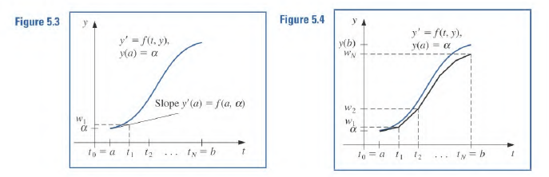

# What is a Differential Equation
Often when quantities are modeled we know more about how it is changing than its explicit relationship.

Consider a bank account with an interest rate of $3\%$

Therefore:

$$
\frac{dy}{dt} = 0.03y
$$

Lets say that $y(t)=e^{0.03t}$

This function makes the differential equation true:

$$
\frac{d}{dt}y(t) = 0.03e^{0.03t}
$$

However the family of functions that solve this DE are 

$$
y(t) = Ce^{0.03t}
$$

To determine $C$ we need an initial condition which is usually in the form of 

$$
y(t_0) = y_0
$$

## Example of a ODE Problem
An ODE is in the form:

$$
y^{(n)} = f(t, y, y', \dotso, y^{(n-1)})
$$

where a solution is a function $y=\phi(t)$ where

$$\phi^{(n)} = f(t, \phi, \phi', \dotso, \phi^{(n-1)})$$

Here is an example of a question:

$$
y''' + ty'\sin(y'') = 0
$$

---

# Lecture
We will focus on problems on the following form:

$$
\dfrac{dy}{dt} = f(t, y)
$$

for $t\in[a, b]$

In short we just want a function $y(t)$ that makes the derivative relation true.

## Approximations
For non analytical solutions we require a approximations 

Suppose we have a $y'=f(t, y)$ we need information about $y$ to obtain a approximation

We pick intervals on the x-axis and approximate the true solution:

For $i\in\{0, 1, \dotso, \frac{b-a}{n}\}$ , $t_i = a + ih$ for $h=(b-a)/n$

### Eular's Method
#### Forward
The image shows the forward method. It does seem natural:

$$
y_{i+1} = y_i + hf(t_i, y_i)
$$

Once we find all of the $y_i$ we can interpolate. 

#### Backwards

$$
y_{i+1} = y_i + hf(t_{i+1}, y_{i+1})
$$

#### Error
##### Per Step
$$
\underbrace{y(t_{i+1})}_{\text{True}} - \underbrace{y_{i+1}}_{\text{Approx}} = \frac{h^2}{2}y''(\xi_i)
$$

For $t_i \lt \xi_i \lt t + h$

##### Total Error
Per-step: $O(h^2)$
Steps: $O(n = \frac{b-a}{h}) = O(1/h)$

Error: $O(h^2)\cdot O(\frac{1}{h}) = O(h)$