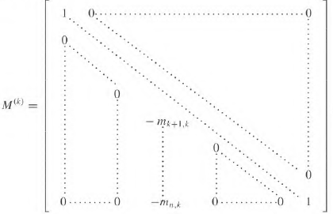
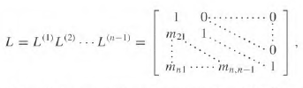

# 6.2, 6.5 LA Lecture 11-3-22
Gaussian Elim costs $O(\frac{2}{3}n^3)$ operations however with LU factorization will allow us to use this one to solve any system $A\bar{x}=\bar{b}$ for $\bar{x}$ . Since we will only need back sub and fwd sub the subsequent searches will take $O(2n^2)$ operations

## Find $L$
### Step **1**
Set $A^1 = A$
Then we need a matrix to zero out the entire first column except the pivot entry. 

Notice that it will be this matrix:

$$
M^1 = 
\begin{bmatrix}
1 & 0 & \dotso & 0 \\
-m_{21}&  1 & \dotso & 0 \\
\vdots & & \ddots & \vdots \\
-m_{n1} & 0 & \dots & 1
\end{bmatrix}
$$

Where $m_{ji} = \frac{a^1_{ji}}{a^1_{ii}}$

Then $A^2 = M^1A^1$

### Step $k$
We will generate $A^k$ where we want to zero out the k-th column.

With this we zero out the k-th column and obtain $A^{k+1} = M^kA^k$

Notice that 

$$
\begin{align}
A^{k+1} &= M^kA^k \\
&= M^kM^{k-1}A^{k-1} \\
&= M^kM^{k-1} \dotsi M^{1}A^1
\end{align}
$$

The inverse of $M^k$, $(M^k)^{-1} = L^k$

The inverse of any $M^k$ is the same matrix but the $k$-th column altered

instead of being negative. 

THRM: 
Note the product for any Lower matrices results in a lower matrix.

**Final Step** ($n-1$)

$$
\begin{align}
A^n &= M^{n-1}A^{n-1} &= U \\
&= M^{n-1}M^{n-2}\dotsi M^{1}A &= U \\
A &= (M^{1})^{-1}\dotsi(M^{n-1})^{-1}U &= LU \\ \\
&\implies L = L^1 \dotsi L^{n-1}
\end{align}
$$

### Class/Book Example

Find the LU factorization for matrix $A$ and find $\bar{x}$ such that $A\bar{x} = \begin{bmatrix} 4 \\ 1 \\ -3 \\ 4 \end{bmatrix} = \bar{b}$

$$
A = 
\begin{bmatrix}
1 & 1 & 0 & 3 \\
2 & 1 & -1 & 1 \\
3 & -1 & -1 & 2 \\
-1 & 2 & 3 & 1 \\
\end{bmatrix}
$$

#### $LU$

$$
A
\stackrel{1}{\to}
\begin{bmatrix}
1 & 1 & 0 & 3 \\
0 & -1 & -1 & -5 \\
0 & -4 & -1 & -7 \\
0 & 3 & 3 & 2 \\
\end{bmatrix}
\stackrel{2}{\to}
\begin{bmatrix}
1 & 1 & 0 & 3 \\
0 & -1 & -1 & -5 \\
0 & 0 & 3 & 13 \\
0 & 0 & 0 & -13 \\
\end{bmatrix}
= U
$$

Resolving Column 1:
1. $E_2-2E_1 \to E_2$
2. $E_3-3E_1 \to E_3$
3. $E_4+1E_1 \to E_4$

Resolving Column 2:
1. $E_3-4E_2 \to E_3$
2. $E_4+3E_2 \to E_4$

At this point we are in REF. 

To obtain $L$ we just reverse the operations:

$$
L = 
\begin{bmatrix}
1 & 0 & 0 & 0 \\
2 & 1 & 0 & 0 \\
3 & 4 & 1 & 0 \\
-1 & -3 & 0 & 1 \\
\end{bmatrix}
$$

We have found $L$ and $U$

#### Finding $\bar{x}$

$$
\begin{align}
A\bar{x} &= \bar{b} \\
LU\bar{x} &= \bar{b} \\

\text{Ux=b, call it}&\ \bar{y} \\
\text{Solve Ly=b} \\
\text{Solve Ux=y}
\end{align}
$$

Thinking about it logically, we require $LU\bar{x} = \bar{b}$

We can find a vector $\bar{y}$ s.t $L\bar{y} = \bar{b}$

Then the vector $\bar{y}$ is what $U\bar{x}$ must be to equal $\bar{b}$ when multiplied by $L$ .

$$
L\bar{y} = 
\begin{bmatrix}
1 & 0 & 0 & 0 \\
2 & 1 & 0 & 0 \\
3 & 4 & 1 & 0 \\
-1 & -3 & 0 & 1 \\
\end{bmatrix}
\begin{bmatrix} 
y_1 \\ y_2 \\ y_3 \\ y_4
\end{bmatrix}
= \bar{b}
$$

Using forward substitution we find that $\bar{y}=\begin{bmatrix} 8 \\ 7 \\ 14 \\ -7 \end{bmatrix}$

Now we require that

$$
U\bar{x} = 
\begin{bmatrix}
1 & 1 & 0 & 3 \\
0 & -1 & -1 & -5 \\
0 & 0 & 3 & 13 \\
0 & 0 & 0 & -13 \\
\end{bmatrix}
\begin{bmatrix} 
x_1 \\ x_2 \\ x_3 \\ x_4
\end{bmatrix}
= \vec{y}
$$

This is true for $\bar{x} = \begin{bmatrix} 3 \\ -1 \\ 0 \\ 2 \end{bmatrix}$