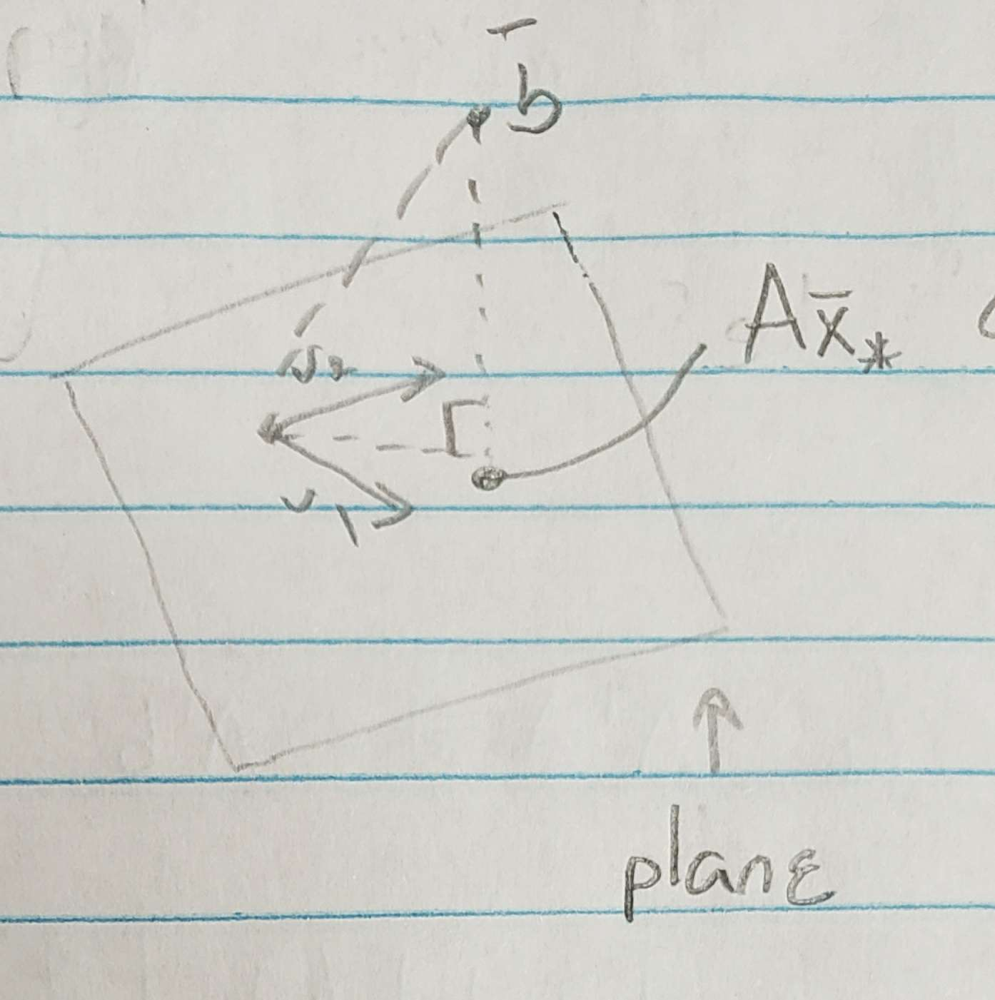

# Least Squares Approximations
## Motivations
1. Solve for $A\bar{z}=\bar{b}$ for **rectangular **$A$ .
2. fit data to a model

## Lecture 
Consider the system:

$$
\begin{align}
x_1 + x_2 &= 2 \\
x_1 - x_2 &= 1 \\
x_1 + x_2 &= 3
\end{align}
$$

Due to $(1)$ and $(3)$ the system is **inconsistent**. However we want a $\bar{x}^{*}$ that gets us close to $\bar{b}$ .

$$
A = 
\begin{bmatrix}
1 & 1 \\
1 & -1 \\
1 & 1 
\end{bmatrix}
= [\vec{v_1}\ \vec{v_2}]
$$

Notice in this example that we need a 3d vector in two dimensions. So we have a plane spanned by $\vec{v_1}$ and $\vec{v_2}$ . 

Therefore the vector that gets us closest to $\bar{b}$ is going to be on the plane. Since we need the closest vector the vector $\bar{x}^*$ is going to be perpendicular to $\bar{b}$ .

$\bar{x}^*$ is the last squares solution s.t the residual vector 

$$
\bar{r} = \bar{b} - A\bar{x}^*
$$

is perpendicular to the hyperplane $\{A\bar{x}\ |\ \bar{x}\in\mathbb{R}^n\}$

This means $\forall \bar{x}\in\mathbb{R}^n,\ \bar{r}\perp A\bar{x} \to (\bar{b}-A\bar{x}^*)\perp(A\bar{x})$

This means that (dot product)

$$
\begin{align}
(A\bar{x})^T(\bar{b}-A\bar{x}^*) &= 0 \\
\bar{x}^T\underbrace{A^T(\bar{b}-A\bar{x}^*)}_{\text{want all vectors to be perp even itself}} &= 0 \\
&\implies A^T(b-A\bar{x}^*) = 0
\end{align}
$$

Then:

$$
A^T\bar{b} - A^TA\bar{x}^* = 0 \implies A^T\bar{b} = A^TA\bar{x}^* 
$$

> $$(A\bar{x})^T=\bar{x}^TA^T$$

## Example Cont. 

$$
A = 
\begin{bmatrix}
1 & 1 \\
1 & -1 \\
1 & 1 
\end{bmatrix}
\ \ \ \ \ \ \
A^T = 
\begin{bmatrix}
1 & 1 & 1\\
1 & -1 & -1
\end{bmatrix}
\ \ \ \ \ \ \
A^TA = 
\begin{bmatrix}
3 & 1\\
1 & 3
\end{bmatrix}
$$

Now lets find $A^T\bar{b}$

$$
A^T\bar{b} = \begin{bmatrix} 6 \\ 4 \end{bmatrix}
$$

Now we must solve for the system:

$$
A^T\bar{b} = A^TA\bar{x}^*
$$

$$
\begin{bmatrix}
3 & 1\\
1 & 3
\end{bmatrix}
\begin{bmatrix} x^*_1 \\ x^*_2 \end{bmatrix}
=
\begin{bmatrix} 6 \\ 4 \end{bmatrix}
\to 
\bar{x}^* = 
\begin{bmatrix} \frac{7}{4} \\ \frac{3}{4} \end{bmatrix}
$$

## Errors
See that there is no meaning of "forward error" as the $\bar{x}$ in 

$$
\|\bar{x}-\bar{x}^*\|
$$

does not exist.

There is the backwards error however:

$$
\|r\|=\|\bar{b}-A\bar{x}^*\|
$$

In this context, the Euclidean norm is used ( $\ell_2$ ). 

### Measures of Error
- $\|r\|_2$
- $\|r\|^2_2$ (squared error)
- $\sqrt{\frac{\|r\|^2_2}{m}} = \frac{\|r\|_2}{\sqrt{m}}$ 
	+ (RSM) - Root mean squared

### How does $\|r\|=\|\bar{b}-A\bar{x}^*\|$ get the error?!

Prereq: [[Least Squares Lecture 12 01 22]]

It is the same as:

$$
\sum_{i=0}^{n} (y_i - y_i^*)^2
$$

Lets look at firstly $A$ WRT a degree $n$ model. ($P_n(x)=a_0 + a_1x + \cdots a_nx^n$)

For each data point, that is for each $x_i$ there exists a $P(x_i)$ and those are the constants represented by $A$ . 

Row $i$ of $A$:

$$
[\underbrace{1}_{a_0}\ x_i\ x_i^2\ \dotso\ x_i^n ]
$$

After solving the normal equations $\bar{x}^*$ will contain the constants to build the polynomial:

$$
\bar{x}^* = \begin{bmatrix}a_0 \\ \vdots \\ a_n\end{bmatrix} \implies P_n(x) = \sum_{k=0}^n a_kx^k
$$

$P_n(x_i)$ is represented by the $i$-th entry of $A\bar{x}^*$:

$$
\begin{bmatrix}1\ x_i\ x_i^2\ \dotso\ x_i^n \end{bmatrix}\begin{bmatrix}a_0 \\ \vdots \\ a_n\end{bmatrix} = \sum_{k=0}^n a_k(x_i)^k = \boxed{P(x_i)} 
$$

Therefore $b_i - A\bar{x}^* = f(x_i) - P(x_i)$ represents the error. The $\|\cdot\|_2$ just does the squaring to remove the effect of negative error. 
