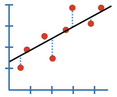
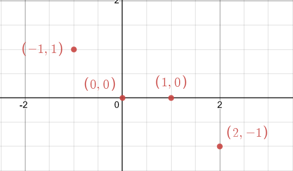
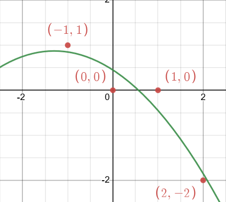

# Least Squares Lecture

> Final Num1 Lecture 

## Warm Up
Find $\bar{x}^*$ for 

$$
A = 
\begin{bmatrix}
1 & -4 \\
2 &  3 \\
2 &  2
\end{bmatrix}
\ \ \
\bar{b} = 
\begin{bmatrix}
-3  \\
15 \\
9 
\end{bmatrix}
$$

Using the normal equation:

$$
A^TA\bar{x}^* = A^T\bar{b}
$$

We need to find $A^TA$ and $A^T\bar{b}$ and solve the generated system $\bar{x}^*$

Answer: $[3.8 \ 1.8]^T$

To find the error we must compute the backwards error: $\|\bar{b}-A\bar{x}^*\|$

## Curve Fitting

We will start by trying to fit a linear model ( $y=a_0+a_1x$ ) given points $m$ points $\{(x_i, y_i)\}_{i=1}^{m}$ .

The dotted blue represents the error 

$$
e_i = y_i - (a_0 + a_1x_i)
$$

The expression we need to minimize is:

$$
\sum_i e_i^2 = \sum_i \biggr[ y_i - (a_0 + a_1x_i) \biggr] = E(a_0, a_1)
$$

with respect to $a_0$ and $a_1$ .

We (not me) can derive what $a_0$ and $a_1$ have to be using ***calculus*** and critical points. The minimum will occur for:

$$
\frac{\partial{E}}{\partial{a_0}} = \frac{\partial{E}}{\partial{a_1}} = \mathbf{0}
$$

This derivation results in the following values for $a_0, a_1:$

$$
\begin{align}
a_0 &= 
\frac{
(\sum x_i^2)(\sum y_i^2) - (\sum x_iy_i)(\sum x_i)
}
{
m(\sum x_i^2)-(\sum x_i)^2
} \\ \\
a_1 &= 
\frac{
m(\sum x_iy_i)-(\sum x_i)(\sum y_i)
}
{
m(\sum x_i^2)-(\sum x_i)^2
}
\end{align}
$$

However this is really the same as the normal equations but in summation notation. 

## General Strategy for Curve Fitting
1. Choose a model of degree $n$
	+ Example, $n=2 \implies a_0+a_1x+a_2x^2$
2. Force Model to fit data by subbing in points
3. Get a linear system of $m$ equations with $n+1$ unknowns
	+ Usually $m\leq n$
	+ See why its $n+1$ from the $n=1$ above

At this point we have the following

$$
\begin{align}
A &\in \mathbb{R}^{m\times (n+1)} \\
\bar{b} &\in \mathbb{R}^{m} \\
\bar{a} &\in \mathbb{R}^{n+1} \\ \\ 
\text{where } a &= 
\begin{bmatrix}a_0 \\ a_1 \\ \vdots \\ a_n \end{bmatrix}
\end{align}
$$

### FULL Example

Use a model where $n=2$ .

---

$$
\begin{align}
y&=a_{0}+a_{1}(x)+a_{2}(x)^2 \\
&\Downarrow \\
y&=a_{0}+a_{1}(-1)+a_{2}(-1)^2 = 1\\ 
&\ \ \vdots \\
y&=a_{0}+a_{1}(2)+a_{2}(2)^2 = -2
\end{align}
$$

With this we can configure $A\in\mathbb{R}^{4\times3}$

$$
A = \begin{pmatrix}
1&-1&1\\ 
1&0&0\\ 
1&1&1\\ 
1&2&4\end{pmatrix} \implies
\begin{pmatrix}
1&-1&1\\ 
1&0&0\\ 
1&1&1\\ 
1&2&4\end{pmatrix} \bar{x}^* = 
\begin{pmatrix}
1\\
0\\ 
0\\ 
-2\end{pmatrix}
$$

Then we find $A^T$ and use that to find $A^TA$ and $A^T\bar{b}$

$$
\begin{align}
\begin{pmatrix}
1&1&1&1\\ 
-1&0&1&2\\ 
1&0&1&4
\end{pmatrix} &\implies \\ \\ 
A^TA &= 
\begin{pmatrix}
4&2&6\\ 
2&6&8\\ 
6&8&18
\end{pmatrix} \\ \\
A^T\bar{b} &= 
\begin{pmatrix}
-1\\ 
-5\\ 
-7\end{pmatrix}
\end{align}
$$

$$
\begin{align}
[\ A^TA \ |\ A^T\bar{b }\ ] &= 
\begin{pmatrix}
4&2&6&-1\\ 
2&6&8&-5\\ 
6&8&18&-7
\end{pmatrix}
\to \cdots \to 
\begin{pmatrix}
1&0&0&\frac{9}{20}\\ 
0&1&0&-\frac{13}{20}\\ 
0&0&1&-\frac{1}{4}
\end{pmatrix} \\ \\
\bar{a} = \bar{x}^* =
\begin{pmatrix}
\frac{9}{20} \\
-\frac{13}{20} \\
-\frac{1}{4}
\end{pmatrix}
\end{align}
$$

> Verified the solution via [adrianstoll's online Least Squares Calculator](https://adrianstoll.com/post/least-squares-calculator/)

Graph:

## Conditioning Waring

$$
\kappa(A^TA) \approx [\kappa(A)]^2
$$

The error doubles when computing with $A^TA$ :(

This is why other methods like:
1. $QR$ reduction
2. SVD

do not use $A^T$ and work on just $A$ .

--- 

> 🥳🥳🥳
