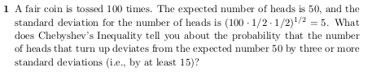
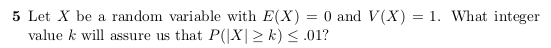
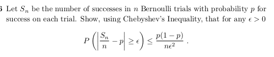
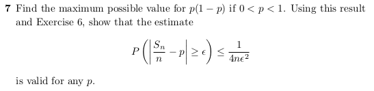
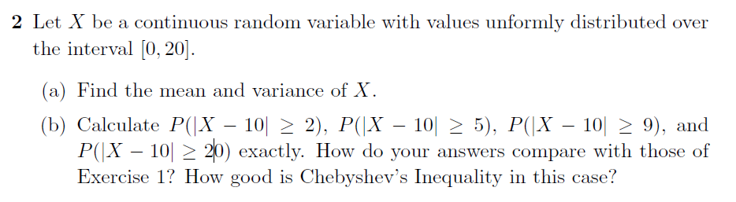
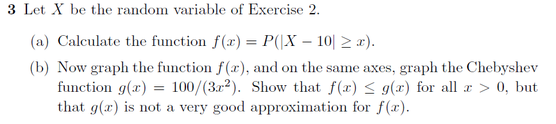
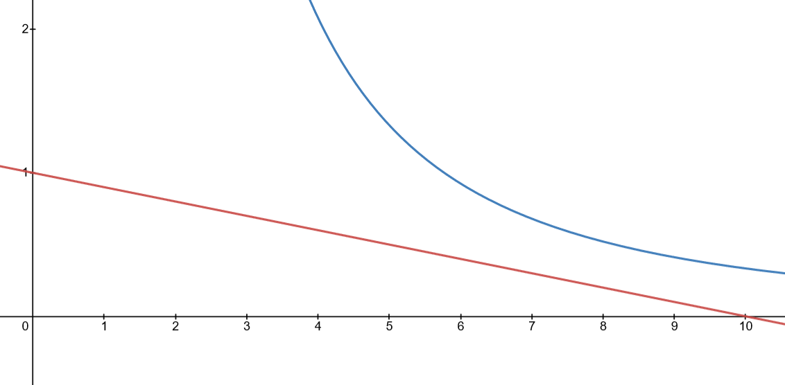

# Law of Large Numbers & The Chebyshev Inequality
## 1

$$X \sim \text{Binom}(n = 100, p = 1/2)$$
$$X = \sum_{i = 1}^{100} X_i$$

We see that $3$ deviations means that we need
$$
P(\biggr|X - 50\biggr| \geq 15) 
$$

This value is always less than $\frac{V(X)}{15^2}$

Given that each coin flip is independent we see that 
$$V(X) = V\biggr(\sum_{i = 1}^{100} X_i\biggr) = \sum_{i = 1}^{100}V(X_i)$$

See that 
$$X_i = 
\begin{pmatrix} 
	0 & 1\\  
	q & p
\end{pmatrix}$$

Then 
$$
\begin{align}
	E(X_i)   &= \frac{1}{2} \\
	E(X_i^2) &= \frac{1}{2} \\
	V(X_i)   &= \frac{1}{4} \\
\end{align}
$$

Thus 
$$
V(X) = \sum_{i = 1}^{100}V(X_i) = 25
$$

Finally, 

$$
P(\biggr|X - 50\biggr| \geq 15) \leq \boxed{\frac{25}{15^2}} = \frac{1}{11}
$$
### 1 - More Efficient method 
Here is the Chebyshev Inequality
$$P(|X - \mu| \geq \epsilon) \leq \frac{V(X)}{\epsilon^2}$$

Since the problem gives is the deviation: $D(X) = 5$, then $V(X) = 25$ 

## 5

The upper bound will be $\frac{1}{k^2} = 0.01$, thus $k = 10$

## 6

$$\frac{S_n}{n} = A_n$$
$$
A_n = \frac{1}{n}\sum_{i = 0}^n X_i \text{ for } X_i = 
\begin{cases}
	1 & \text{ if Success} \\
	0 & \text{ if Failure} \\
\end{cases}
$$

$$V(A_n) = \frac{1}{n^2}V(S_n) = npq\frac{1}{n^2} = \frac{p(1-p)}{n}$$

Since 
$$P(|\frac{S_n}{n} - p| \geq \epsilon) \leq \frac{V(X)}{\epsilon^2}$$

$$
\implies P(|\frac{S_n}{n} - p| \geq \epsilon) \leq \frac{\frac{p(1-p)}{n}}{\epsilon^2}
$$

$$
\implies P(|\frac{S_n}{n} - p| \geq \epsilon) \leq \frac{p(1-p)}{n\epsilon^2}
$$

## 7

Let $f(p) = p(1-p) = p - p^2$
Then
$$
\begin{align}
	\dfrac{df}{dp} &= 1 - 2p 
	\\ \\
	\dfrac{df}{dp} &= 0 \text{ when } p = \frac{1}{2}
\end{align}
$$

We can watch the sign of $\dfrac{df}{dp}$ on interval $[0, 1]$
If $p \in [0, \frac{1}{2})$, $\dfrac{df}{dp} \gt 0$
If $p \in (\frac{1}{2}, 1]$, $\dfrac{df}{dp} \lt 0$

This implies that $p = \frac{1}{4}$ is a local max on the interval $[0, 1]$

Furthermore, this means that
$$
\forall (p\in[0, 1]),\: p - p^2 \leq f(\frac{1}{2}) = \frac{1}{4}
$$
Actually, $1/4$ is the max for that Function. *

Thus, the E6 has the property that
$$
P\biggr(\biggr|\frac{S_n}{n} - p\biggr|\geq \epsilon\biggr) \leq \frac{1}{4n\epsilon^2}
$$

\* - After using Calculus I saw that we do not need it, we already know that the vertex of a quadratic occurs at $\frac{-b}{2a}$ and this would be a formal global max given $a \leq 0$ .

# Continuous Case
## 1
Let X be a continuous random variable with mean $\mu = 10$ and $\sigma^2 = 100/3$. Using Chebyshev’s Inequality, find an upper bound for the following probabilities.

$$P(|X − 10| \geq k)$$
for $k = 2, 5, 9, 20$
See that 
$$
P(|X − 10| \geq k) \leq \frac{100/3}{k^2}
$$

| $k$ | Chebyshev Upper Bound |
| --- | --------------------- |
| 2   | $25/3 \implies 1$                | 
| 5   | $4/3 \implies 1$                 |
| 9   | $100/243$             |
| 20  | $1/12$                |

## 2

### a)
Since $X$ is uniform:
$$
f_X(x) =  \frac{1}{20}
$$

$$
\begin{align}
	&E(X) = \int_0^{20} xf_X(x)\:dx \\
	&E(X) = \frac{1}{20}\int_0^{20} x\:dx = \frac{1}{40}x^2\biggr|_{x=0}^{x=20} = 10
	\\
	&E(X^2) = \frac{1}{20}\int_0^{20} x^2\:dx = \frac{1}{60}x^3\biggr|_{x=0}^{x=20} = \frac{400}{3}
	\\
	&V(X) = E(X^2) - E(X)^2 \\
	&V(X) = 400/3 - 100 = \boxed{\frac{100}{3}}
\end{align}
$$

### b)
#### Part 1
$$
\begin{align}
P(|X - 10| \geq 2) &= 1 - P(-2\leq X-10 \leq 2)\\
				   &= 1- \frac{4}{20} \\
				   &= \boxed{\frac{4}{5}}
\end{align}
$$
Chebyshev upper bounds given current $E(X), V(X)$ was greater than 1.

#### Part 2
$$
\begin{align}
P(|X - 10| \geq 5) &= 1 - P(-5\leq X-10 \leq 5)\\
				   &= 1- \frac{10}{20} \\
				   &= \boxed{\frac{1}{2}}
\end{align}
$$
Chebyshev upper bounds given current $E(X), V(X)$ was greater than 1.

#### Part 3
$$
\begin{align}
P(|X - 10| \geq 9) &= 1 - P(-9\leq X-10 \leq 9)\\
				   &= 1- \frac{18}{20} \\
				   &= \boxed{\frac{1}{10}}
\end{align}
$$
Chebyshev upper bounds given current $E(X), V(X)$ was  $\frac{100}{243}$

#### Part 4
$$
\begin{align}
P(|X - 10| \geq 20) &= \boxed{\mathbf{0}}
\end{align}
$$

Think about what $|X - 10| \geq 20$ means:
$$
\begin{align}
	X - 10 \geq 20 &\implies X \geq 30
	\\
	10 - X \geq 20 &\implies X \leq -10
\end{align}
$$

Chebyshev upper bounds given current $E(X), V(X)$ was  $\frac{1}{12}$
## 3

$$
	f(\mathbf{x}) = P(|X - 10|\geq \mathbf{x}) 
$$
$$
\begin{align}
f(\mathbf{x})&= 1 - P(-\mathbf{x}\leq X-10\leq \mathbf{x}) \\
	&= 1 - P(10 - \mathbf{x} \leq X \leq 10 + \mathbf{x}) \\
	&= 1 - \frac{2\mathbf{x}}{20} \\ \\
	&= 1- \frac{\mathbf{x}}{10}
\end{align}
$$

$$
f_X(x) = 
\begin{cases}
	1 - \frac{x}{10} & \text{for} & 0\leq x \leq 10 \\
	0 & \text{otherwise}
\end{cases}
$$

Graphic

Red: $f_X(x)$ , Blue: $g(x)$, Chebyshev