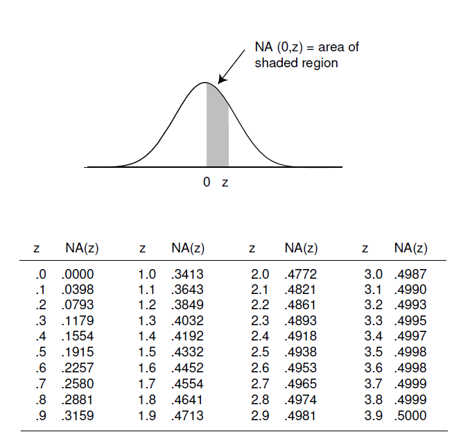
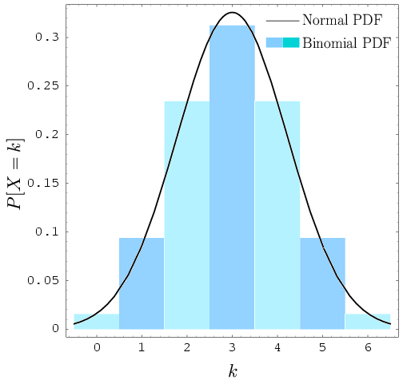

# Central Limit Theorem for Bernoulli Trials
The overview of this **theorem** is that if $S_n$ is the sum of $n$ independent random variables then $S_n$ is *approximated* by the normal distribution.

$$f_{\mu, \sigma} = \frac{1}{\sigma\sqrt{2\pi}}e^{-{(x-\mu)^2}/{2\sigma^2}}$$

However we will only deal with the standardized version. (See Cp6: [[Sum of Variances Theorem]])

$$
\phi(x) = \frac{1}{\sqrt{2\pi}}e^{{-x^2}/{2}}
$$
## Bernoulli Trials
Consider a Bernoulli trials process with probability $p$ for success. 

Let $X_i$ *indicate* the success of the $i$th trial. 
$$
X_i = 
\begin{cases}
1 & \text{success} \\
0 & \text{failure}
\end{cases}
$$

$$
\text{Let } S_n = \sum_{i = 1}^n X_i
$$

Thus $S_n$ counts the number of success in $n$ trials. We know that $$S_n \sim b(n, p, j)$$

We can observe two things here. See that $E(S_n) = np$ and this is almost the point at which the graph spikes. However the interesting part is that as $n$ increases this "spike" tends to float away to the right. 

## Solution: Standardization
See that 
$$E(S_n) = np$$
if we create a new variable $S_n - E(S_n)$ its expected value will ways be near $\mathbf{0}$

Then we take this new variable and divide by $D(X)$
$$
\frac{S_n - E(S_n)}{D(X)} 
$$

Now we have obtained a variable such that it has an expected value of $\mathbf{0}$ and Variance of $\mathbf{1}$

## Applying our solutions to BTP
$$
S_{n}^{*} = \frac{S_n - np}{\sqrt{npq}}
$$

This is know as the *standardized sum* of $S_n$.
It has expected value of $\mathbf{0}$ and Variance of $\mathbf{1}$

See [[Sum of Variances Theorem]] for information. 
## Motivation
Suppose we have a spike plot for possible values of $S_n^*$: 
$$x_0, x_1, \dotso, x_n \text{ where }\: x_i = \frac{i - np}{{\sqrt{npq}}}$$ 

Now before the standardization $x_i$ would represent the sum having a value of $i$ or $S_n = i$. Thus the probability is of $i$ successes in $n$ trials is: $x_i = b(n, p, i)$

This value outputted from the binomial will serve as the height of each spike. 

Plot for $n = 270, p = 0.3$

We notice that the these two **are not** the same. This is because one is a cts dist (normal) and the one is a discrete dist (binomial).

With this we realize that, 
1. The area under the curve of the normal curve is 1
2. The sum of the spikes is 1

We must alter the spikes to match the normal curve.

Suppose we drew a line over the spikes, the area under that curve will nearly be the sum of the spikes times the distance between the spikes. 

Since the sum of spikes is 1, the area under this curve will be 
$\epsilon$: the distance between the spikes. 

See that $\epsilon = \frac{1}{\sqrt{npq}}$
This has something to do with the new deviation of the $S_n^*$.

Or we can view it like *this*:
See that the normal density is **continuous**, that is the area under the curve is $\mathbf{1}$. Since the spike graph is built on the binomial distribution: the sum of the spikes is $\mathbf{1}$. This is why we cannot compare the two graphs. Recall that integration is simply the width times the height. Moreover, what we are doing for the binomial graph is simply summing the heights. If we divide by the height we can obtain the correct height.  

Thus we can multiply each spike by $\frac{1}{\epsilon} = \sqrt{npq}$ to attain the proper height.

Suppose we  fix an $x$ on the $x$-axis and let $n \in \mathbb Z^+$ 
Then, the point $x_j$ that is closest to $x$ is 
$$j = \langle np+x\sqrt{npq} \rangle$$

<!--to be explained soon-->

## **The Central Limit** Theorem
$$
\lim_{n\to\infty} \sqrt{npq}\:b(n, p, \langle np+x\sqrt{npq} \rangle) = \phi(x)
$$

Notice this says that as $n$ gets larger, $\phi(x)$ will be a better approximation. 

### Side Note
Note: $\langle m \rangle$ represents the closets integer to $m$

See that this is the same as rounding: 
$$
\langle m \rangle = \lfloor m+\frac{1}{2} \rfloor
$$

### Approximating Binomial Distributions
Recall that: 
$$
x_j = \frac{j - np}{{\sqrt{npq}}}
$$

Remember that $j$ was an output of $b(n, p, j)$ and $x_j$ was its mapping to the $x$-axis. 

If we solve for $j = np+x\sqrt{npq}$

The Central Limit Theorem says that
$$
\begin{align}
	\sqrt{npq}\:b(n, p, j) &\approx^* \phi(x) \\
	\:b(n, p, j)&\approx\frac{\phi(x)}{\sqrt{npq}}\\
	&\approx\frac{1}{\sqrt{npq}}\phi(\frac{j - np}{\sqrt{npq}})
\end{align}
$$

\* - Remember the mapping relation between $x$ and $j$.

## Example Use of the Approx
Lets estimate the probability of exactly 55 out of 100 coins coming up heads. 

Firstly we note that 
$$
\begin{align}
	E(S_{100}) &= np = 50 \\
	\sqrt{V(X)} &= \sqrt{npq} = 5
\end{align}
$$

We need $S_{55}$.
Lets find out where on the normal distribution this is located. 
$$S_{55} = \frac{55 - 50}{5} = 1$$

Thus $S_{55} \to \phi(1)$ 
$$\phi(1) = \frac{e^{-1/2}}{\sqrt{2\pi}}$$

Then we scale down by $1\sqrt{npq}$ 
$$\frac{e^{-1/2}}{\sqrt{2\pi}} \times \frac{1}{5} = 0.0484$$

The real answer was $0.48\mathbf{5}$. The approximation was very good.

## Approximation over an interval : \[a, b\]
> **Theorem**:
> $$\lim_{n\to\infty} P\biggr(a\leq 
> \frac{S_n - np}{\sqrt{npq}} \leq b\biggr) = \int_a^b \phi(x)\:dx$$

This is just a step up from the last example. See that we can add up the individual approximations and smooth it out with an integral.

Since there is no way to find $\int_a^b \phi(x)\:dx$ by hand using elementary methods we sadly must use a look up table:

There are some slight complications however, 

Notice how if we want the approximation from 3 to 4 on this graph above we must adjust our interval from $2.5$ to $4.5$

Just like that 

$$
\begin{align}
P(i \leq S_n \leq j) &\approx P(\frac{i - \frac{1}{2} - np}{\sqrt{npq}} \leq S^*_n \leq \frac{j +  \frac{1}{2} - np}{\sqrt{npq}})
\\
&\approx NA(\frac{i - \frac{1}{2} - np}{\sqrt{npq}}, \frac{j + \frac{1}{2} - np}{\sqrt{npq}}) \\

\end{align}
$$
Notice that it is counting the probability of being below by $x_i$ standard deviations to $x_j$ deviations above.

Note $x_k$ are $x$ values that are **translated** into 'standardized' world. Their resultant probability density is $\phi(x_k)$  

Side Note:

## Example for Interval-type approximations
Estimate $P(40 \leq X \leq 60)$ where $X$ counts the number of heads on a fair coin.

$$

\begin{align}
&\text{Fair Coin}\\ 
	E(X) &= np = 50 \\
	D(X) &= \sqrt{npq} = 5
\end{align}
$$

Left bound is 40 so $i = 39.5$
Right bound is 60 so $j = 60.5$

We convert to the normal coordinates:
$$
\begin{align}
x_i &= \frac{39.5 - 50}{5} = -2.1\\
j_i &= \frac{60.5 - 50}{5} = +2.1
\end{align}
$$

Thus 

$$
\begin{align}
P(40 \leq X \leq 60) &= \text{NA}(-2.1, +2.1) \\
                     &= 2\text{NA}(2.1) \\
					 &= .9462 \\
\end{align}
$$

The real answer was $.96840$

Notice that $D(X) = 5$. The question was really asking us about the probability of **not** deviating 2 STD from the mean.  