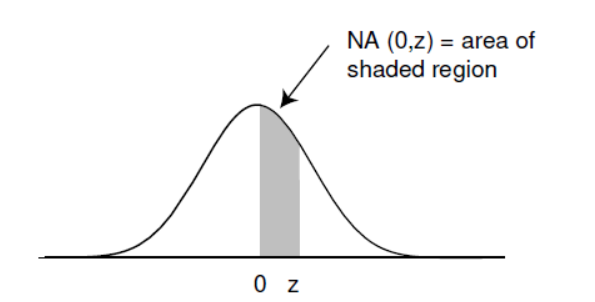

# PS1 - Central Limit Theorem
## 3
![[c9_1p3.png]]
Realize this is a Bernoulli Trials Process
### P(June Passing)
For June to pass we require that she gets $\geq 30$ questions correct.

See that 
$$
\begin{align}
	\mu &= np = {48}\times{\frac{3}{4}} &= 36 \\
	\sigma &= \sqrt{npq} = \sqrt{48\times\frac{3}{4}\frac{1}{4}} = \sqrt{\frac{16 * 3 * 3}{16}} &= 3
\end{align}
$$

Then,
$$
\text{Let }J_n = \sum_{i = 1}^{48} J_i
$$
where $J_i$ is an indicator for each test question
$$
J_n^* = \frac{J_n - np}{\sqrt{npq}} = \frac{J_n - 36}{3}
$$

Notice that 
$$
J_{\geq 30}^* = \int_{a}^{b} \phi(x)\:dx
$$
We must get values for $a$ since $b$ is an endpoint we do not need it.
$$
\begin{align}
	a &= \frac{30 - \frac{1}{2} - 36}{3} = −2.16\overline 6 \\
\end{align}
$$

Thus $x_{30} = −2.16\overline 6$
Now we can confront the NA table.
$$
\begin{align}
	NA(-2.16) &= NA(2.16) \approx NA(2.2) \approx .4861
\end{align}
$$

Since NA($2.2$) is $.4861$ 
$$0.5 + .4861 = .9861$$

We add the $.5$ because:

Same process for April yields: 

$$
\begin{align}
	\mu = np = 24 \\
	\sigma = \sqrt{48\frac{1}{2}\frac{1}{2}} = \sqrt{12}
\end{align}
$$
$$
a = \frac{30 - \frac{1}{2} - 24}{\sqrt{12}} \approx 1.6
$$

Thus $P(X\geq30) = 0.5 - \text{NA}(0, 1.6) \approx 0.0548$

Both are close to the real [Binomial CDF](https://stattrek.com/online-calculator/binomial.aspx)