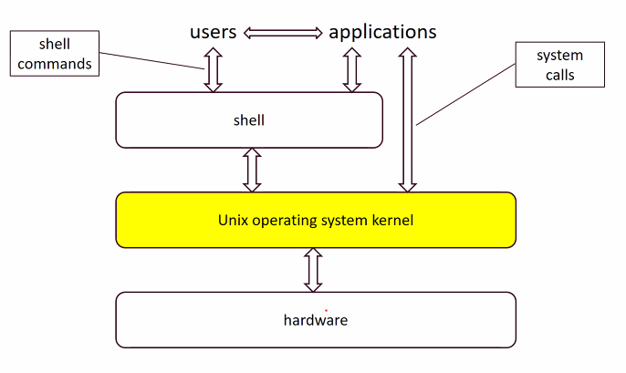

# What is Unix?
Unix is an OS, sits between the hardware and user/apps. It provides high-level abstractions and services.  

Most of the shells (70%) are Unix because its based on C (*fast*). 

Unix & Linux isn't the same. Linux's code base is different. Simply put, Unix is a CMD interface (CLI) while Linux is a GUI based OS.

## Layers of a Unix System


The shell gives a *user* & *apps* connections to the software/hardware. System calls are more advanced and are part of CIS3207.

## The File System
Unix has Files & directories (folder-like)
At the top there is only 1 folder: **root** (think tree)

*Bonus Question*: What is the difference between windows folders & Unix directories? #bonus

Note in a file path the *initial slash* "/" represents the root
Ex: **/** home/Desktop/cis2107

A path can refer to a directory or folder.
A file is a sequence of bytes.

Note: A directory **is** itself a file. 
*Everything* is a File in Unix. See (Chap 2.12)

They are accessed in a uniform way: 
- Consistent API : (read, write, open, close ...)
- consistent naming. 

File Absolute Path: File Path starting from the root ("/")
File Relative Path: path from the working directory
Ex : "./fileA/FileB" or "../FileC/FileD" or "../../FILE.css"

There is a short hand for home, each user has a home directory. You can shorthand this with *~*.


## Some Unix commands
### Notes
- Unix is case case-sensitive
- the prompts are displayed and run by the ***shell***. The shell is an interface between the user and Unix.
- You can create shell scripts yourself by programming them. 
- Two types of major shells
	- Bourne Shells
	- C shells

When you login in the bash shell will run and while you and logged in. 

## Shell Intro
A system program that allows a user to
- run shell functions
- other programs
- shell scripts

### Commands
```unix
% commandName [arg1] ... [argN]
```
The % is the prompt 
There are also options that are triggered by "-" or "--" (GNU Style)

*Options* Example
```unix
gcc -g GDBassign.c blowfish.c -o GDBassign
```

### SHELL SLIDES

The input to shell is keyboard while output is screen. These are the STDIN and STDOUT streams (see CP2.12). Both of them can be redirected from/to a file or other commends.

File redirection:
 - `<` input
 - `>` output
 - `>>` output append

Why is cal 9 1752 missing days?


### Command Grouping
A single command that execs multiple commands one in line 

### `ls`
#### Flags
1. `-a` all files
2. `-A` all files without "." or ".."
3. `-F` appends "/" to dirs and to "`*`" toexecutables 
4. `-lt` sort by time old to new
5. `-ltr` rev of `lt`

![[ls_alrt_ex.png]]

Files with that the d.... in the first row are directories

#### mv
```unix
mv directoryname newdirectoryname
```

### EXT Command List from Slides
1. History [number] - shows the last history that is *number* long
2. exit/logout 
3. shutdown

#bonus 
**Bonus** What is the diff between exit/logout
**Bonus** `who` vs `whoami` vs `logname` vs `users`

### File Permissions
Each file has a level of Permissions, this prevents unauthorized read/write/edit.

The level is shown by 
```unix
ls -l *filename*
```

The 3 groups are:
1. u : user
2. g: group
3. and `o` is for other

The 3 perms are
- `r` is read
- `w` is write
- `x` is exec

for directory `x` gives the list ability

Each digit in the mode parameter represents the permissions  
for a user or a class of users:
- 1st digit is user
- 2nd is group
- 3rd is other

Users of other are users such that they are not the current user or part of any group specified. 

![[perms_unix.png]]
Think of this in binary. The lowest state is 000 while max is 111.
- 1st digit is exec
- 2nd is write
- 3rd is read

Recall the ![[ls_alrt_ex.png]]
See that `-rw-r--r--`
means the user has read & write while group/world has only read 

we can use `chmod` to change perms
Ex:
```unix
chmod 123 example.html
chmod 777 *.cgi
chmod 755 directory
```
The first line means users can exec, groups can write and world can do both. 

Pseudo Command
```js
chmod UGO EWR
```

## File redirection
SRC: GCP - VM
### `>`: output redirection 
![[fileredir.png]]

- `>` : write to (overwrite)
- `>>` : append to 😎

### `<` Input redirection
Suppose a file called `sample.txt` contains
```text
This is text from the file.
```
Redirection:
```unix
C:\temp> java printOut < input.txt
Enter your input:
You typed: This is text from the file.
```
`printOut.java` simply prints what you type into it

