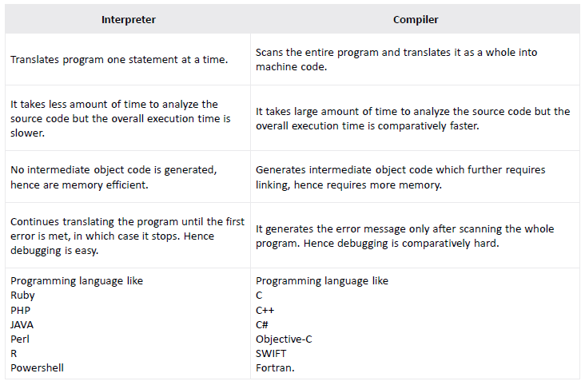

Lectures 1/24/22 & 1/26/22 
# Week 2 -  C?

## Why C?
Often times C is the only language available:
- Low Level embedded systems
	- Many Low Level situations do *not* support "high-level" languages 
	- Many Higher level languages do not have direct control over OS, Hardware & Drivers.
C is usually used to develop systems that demanded performance such as OS, embedded systems, real-time(Systems that must work continuously with minimal delay) & Communications systems(requires data throughput like audio/video).

C requires less maintenance and is closer to the hardware.

## Facts about C
1960s: MIT MULTICS project fails to live up to expectations
- Thompson creates own System language based on BCPL called *B*. First version of Unix written in *B*
- Unix takes hold inside Bell labs
	- needs to be written 
It is called "**C**" because it is derived from an earlier language B #😄 

OOP begins to emerge:
- Stroustrup starts C with *Classes* in 1997(C++)
- Backwards Compatible with C

## Why not C?
Unlike Java, C is Write Once run once. It depends on the operating system and hardware.
Data Structures must be programmed "by hand".
No Support for OOP
Much harder to use than higher level language. $\implies$ longer time to code in C than a higher level language.


### C++ Info
#### Pros
- OOP, Classes & Inheritance
#### Cons
Issues from C persist
- Complex Memory Model with self memory management
#### Java
Jim Gosling at Sun Micro-systems rewrites C++ to Java
- Simpler Obj Model
- Portable, embedded in many systems
	- Portable: Write Once run anywhere as long as it has a JVM

## Languages Based on C
#TestQ
- C-Family: Objective C(Apple's Language), C#(MSFT)
- Swift(Apple's new language)
- Java
- PHP, Python, JavaScript

## C Program Development Environment/Lifecycle
#TestQ 
### Steps Overview 
1. Edit
2. Preprocess
3. Compile
4. Link
5. Load
6. Execute

#### Phase 1: Creating A Program
This step is when you edit the file. You can use a Text-Editor like CS code or the Linux Based Vi/Vim. Any **C** files have the *.c* extension.

#### Phase 2 \& 3: Preprocessing and Compiling a C Program
Preprocessing comes before before Compiling. It triggers special commands, called preprocessor directives, to manipulate the code before compiling. Preprocessing is mainly inspection of the code. For example when \# is found the preprocessor will fetch the code. 
```c
#include <stdio.h>
```

While Compiled, the compiler turns the code into machine code which is **machine dependent**. Intermediate *object code* is generated. A syntax error occurs when the Machine code cannot be recognized because it violates the language rules.

These types of errors are called *compile errors* or *compile-time errors*. 

#### Phase 4: Linking
In most C programs, there will be functions used from external libraries. A *linker* links the object code with the missing external code to produce a **executable image** with no missing pieces.

The command to compile and link a program is called `gcc`. It is using the GNU Compiler.

```unix
gcc [FILENAME]
```
Assuming no user errors this completes P1-4
This will output a file called `a.out` which is an *output* file.

#### Phase 5: Loading
Before something can be ran it needs to be put on the disk. The `loader` will take the file generated from memory and put in on the disk. Additional Components from libs are also loaded.

#### Phase 6: Execution
Finally, the computer's CPU executes the program **one** instruction at a time.   

### Dev Cycle Problems
If there persists an issue we need to repeat steps 1-$p$ where $p$ is the stage you are on. If there is an illegal division like div by 0 we need to start over from Phase 1.

### Machine Languages, Assembly \& High-level Languages
Any computer understands **it's own** machine language defined by its hardware. Theses are $1$s and $0$s. Programming in binary is too *slow*. This is the lowest level of code. 

Next is Assembly, it is in between Machine Language and High-Level. It uses abbreviations to represent *elementary*operations. These will be like `sum`, or `store`. We use *translator programs*called **assemblers** to convert Assembly-code into machine language. 

Assembly was still too slow so we created High-level languages. These are closer to math and English to speed up programming. Translator programs called compilers convert High-lvl Languages into machine code.  

Interpreters were created to execute high-lvl languages directly. They are slower because they process line by line, while a compiler translates the entire code into machine code. 

Interpreters are used in scripting languages. 
Ex. JS/PHP is preprocessed by an Interpreter

## CLASS EXT
See Firmware

### Bonus $Q$s
What is GNU? Why isn't it like Unix.
Machine Code VS Object Code
#### Compiler VS Interpreter
