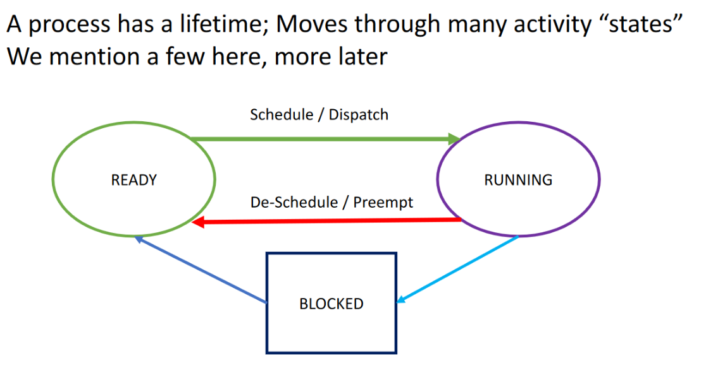
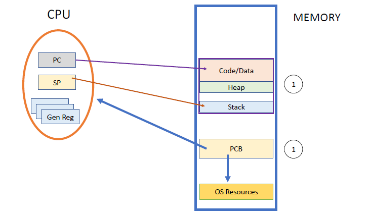

# 08 25 22
The **OS** is an extended machine.
- no longer do devs need to fully understand machine architecture
- provides efficient high level functions

The OS is *software* that runs on top of bare hardware to provide the abstractions developers need to write application software safely.

## The OS as a Resource Manager
The OS has the following responsibility.
- ensure good performance
- low response times
- safe communication between tasks
- meet application requirements
	- resource and time requirements

### Program Behavior
A program alternates between two states. 
1. IO (Input/Output)
2. Computing (CPU Bound)

During an IO phase of a program the CPU is idle. This is an area of potential improvement with *Parallelization*.The OS strives to keep all of its resources utilized by **overlapping independent operations when possible**. (Parallelization)

### Multi-Programming
#### Sequential
Technique that keeps saved programs in memory and switches between them. This style of programming runs a program from start to finish before starting a new one. With respect to a single CPU there is **no** Multiprogramming occurring. 

#### Multiprogramming
This allows programs to run **on the CPU** when other programs are doing IO based tasks. This allows for two or more tasks to exist at the same time by switching to a *ready* task when the current task initiates IO.  

#### TimeSHARE
Given tasks A and B, tasks are alternated over time. Each task gets a block of time and then it gets switched off when their time is up. If a task is not ready to be switched into the CPU context it does not have to. The next task in the *queue* can be started. 

### Policy vs. Mechanism
A mechanism provides "how we do something" while a policy determines the rules for when an action is taken. 

An example of a policy is choosing when to switch off a task in the timeshare while the switching to/from the task is the mechanism.  

> Switching process in the CPU is known as context switching. It is hardware based. 

### Fundamental Abstractions of an OS
A program is static. It sits on the drive until we start the program. A process is a *running* program. 

The OS uses abstractions to create hierarchies of operations and objects where many operations are combined into one at a high level to hide the implementation details. This is done to make the OS easier to use.  

#### Virtualizing the CPU
Each program that runs gets its own process. 

How does a CPU switch context? How is it able to *resume* a process from before? Lets explore CPU state.

The state of a CPU is defined by the values in its registers. With virtualization, each process *gets* a CPU (virtual). The state of a CPU that needs to be resumed is stored in the PCB (Process Control block) which is located in main memory. Each process has its own PCB data structure(s) in memory. 

The PCB will include many things (which will be covered later), one of them is the state of the process: what was it doing and which resources it was using when the process stopped. 

##### Process States

> There are many more states, this image is simplified

**Important**: The PCB is not updated until the process is done its time in the CPU. Trying to sync the PCB whilst the program is running is a waste of memory access and CPU time. 

The OS has system calls that allow us to control processes ourselves. These calls allow for process CRUD operations with even more control options like `priority leveling`. Each process is identified with a PID (process ID), PIDs allow the OS to attach resources to processes. 

