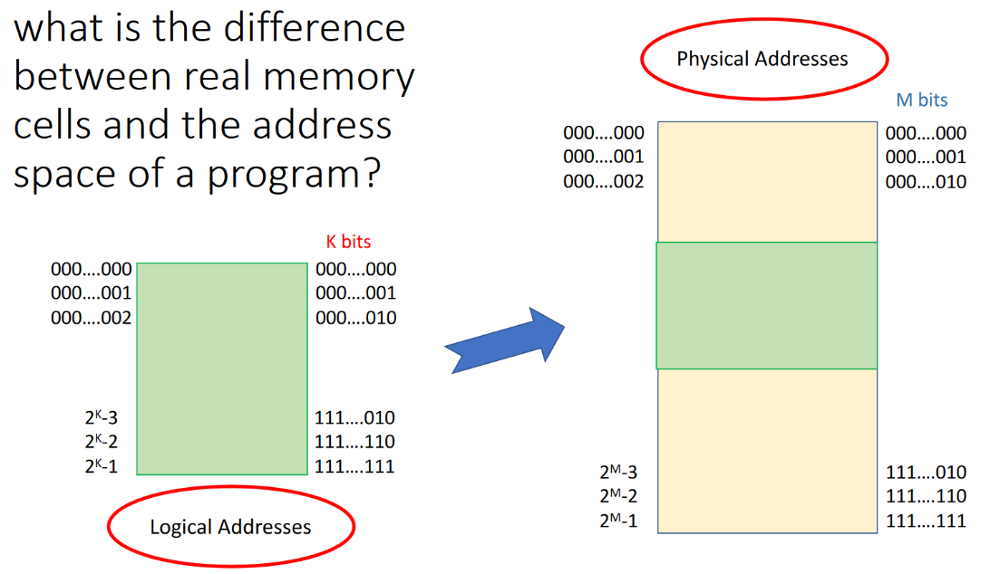

# 8-30-22
## Virtualization: Processes
We firstly define the Process Control Block (PCB) as a virtualization of the CPU. This is because it contains all of the information to get a process running *again* on the CPU. 

### CPU Storage Elements:
- registers
- PC (*Program Counter*)
	- In some machines we can alter the PC
- Cache on some chips but a cache is not always present on all chips.

> **Note**: When you run a set of *concurrent* tasks the output is *non-deterministic*. In other words, you cannot predict the output. 

### What constitutes a `process`?
- PID
- Memory Image
	- Code and Data (static)
	- Stack and Heap (dynamic)
- CPU Context
	- registers
	- PC, SP, PSW
- File Descriptors
	- points to the open files and devices
	- stdin, stdout, stderr

### How a process is created
- OS will allocate memory and create memory image
	- create runtime stack and heap
	- build PCB while the above things are happening
- Opening basic files 
	-  `stdin`, `stdout`, `stderr`
- Initialize CPU State 
	- Program Counter (PC)
		- On initialization, the PC points to the first instruction in the code. 
	- Stack Pointer (SP)
	- Process Status Word (PSW)
	- General Purpose Registers

#### PSW
- internal state of the CPU while executing
- sets of bits allocated to certain functions

> A word that describes fully the condition of a processor at each instant. It indicates the class of operations allowed and the status of all interrupts. 

For example, if the last instruction was an `ADD`, the PSW will maintain bits to state if the result was negative or not. However this is just one of the many bits of the PSW. The PSW holds many flags to control the ALU, Priority Level, and etc. 

## Logical vs. Address Spaces

 - Logical Space - The memory space the program is virtualized with. From the POV of the process, it *owns* the entire address space of the system. 
 - Physical Space - The Actual Memory that the system has. 

Notice that a block of logical (virtual) memory will correspond to a block of physical memory however the address may not be the same. 

Suppose we have a program called `p1.c` and inside of it we declare a `int p`. If we run concurrent instances of `p1.c` and log the value of the address of `p` (`&p`). We will notice that each program will output the same address. This is because the address of `p` is the same relative to the logical space. In reality the address of `p` in both programs can be vastly different. 

Speaking of running concurrent programs, the Process Scheduler, a component of the OS, chooses which programs to run based on a *scheduling policy*. 

