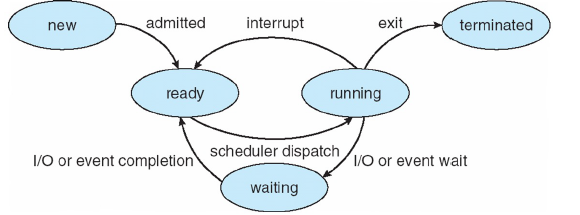
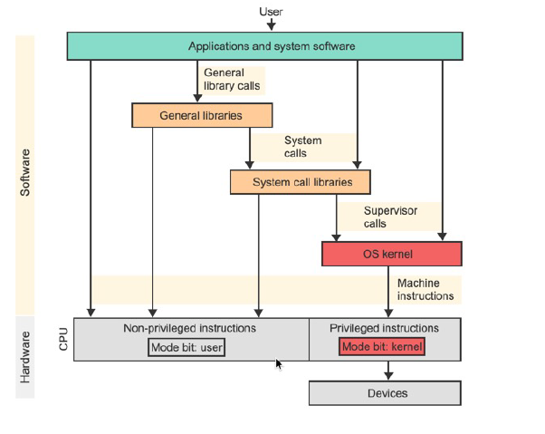
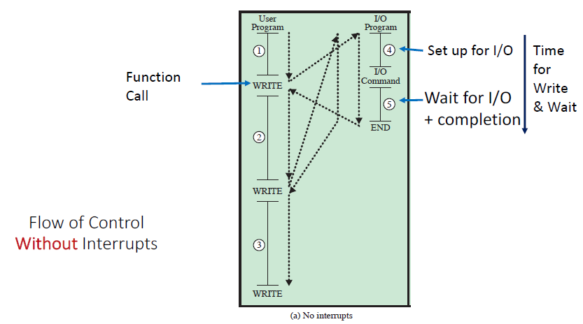
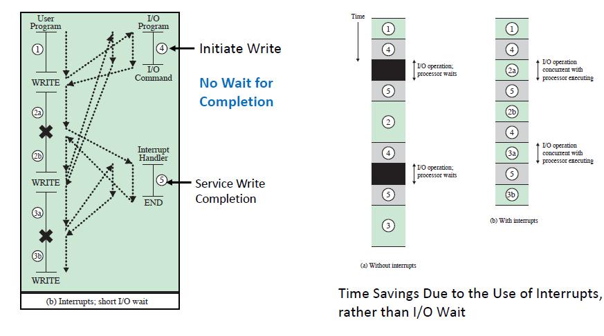

# Lecture 09 01 22
## Process scheduling
**Process scheduling**: Choosing which process(es) to be *running*

Modern OSs are preemptive[^1] multitasking OSs. This means that they run many tasks at the same time but the share of the CPU time each process gets is controlled by the OS kernel process scheduler. The kernel determines the rules regarding CPU and process use.  


## More Process States

## PCB Content
The OS maintains a data structure of all active process.
Information about each process is stored in a PCB:
1. PID
2. Process State
3. Pointers to other related process (child, parent processes)
4. CPU context of this process (saved while the process is suspended)
5. Pointers to memory locations
6. Pointers to open files

## New Questions Arise
+ How to invoke a process?
+ How to control processes?
+ How to expand on processes?

### Library Functions vs API (Accessible Functions)

> Early OSs used libraries of function calls to replace commonly used tasks like low-level tasks or IO code. 

However people wanted more security\*, they wished for code that had levels of access. For example user vs admins. To address this they created modes of operations that had levels of access. An example of a system  modes were `user-mode` and `kernel-mode`. The `user-mode` was limited. Other access systems were rings which serve a similar purpose. 

\* - They wanted the code libraries to not be modify-able. 

Moving beyond libraries, the OS began to take a more central role in managing the machine. Code run on the behalf of the OS is special. 

### What does the OS API provide
The API provided by the OS is a set of `system calls`:
+ A system call is a function call into the OS code that runs with a high privilege level of the CPU
+ Some sensitive operations are only allowed a certain privilege levels. 



### `syscall` vs `supervisor` calls
A supervisor call (SVC) is a processor instruction that directs the processor to pass control of the computer to the operating system while a system call is a function is used when computer program requests a service from the kernel of the operating system it is executed on. A `syscall` can trigger a `supervisor` call.


### API per OS?
**POSIX API** - standard set of syscalls that an OS must implement. 
+ Programs written to the POSIX API can run on any POSIX compliant OS
+ Most Modern OSes are POSIX compliant or have a POSIX library

Program Language libs hide the details of invoking supervisor calls. 
+ Example: the `printf` function calls the `write()` syscall. 
+ User programs need not worry about invoking supervisor calls *directly*

### OS code is **Special**
+ Control / Security / Privacy
	+ OS maintains all resources and makes then available
	+ OS must keep allocated resources and its own resources private
+ Add special hardware instructions and hardware state to make the transition into the OS. This will create a mechanism to enter the OS and use its functions with security by raising the hardware privilege level. 

#### Modes
User applications execute in `USER MODE`
+ In **USER MODE** the **hardware**\* restricts what applications can do
	+ Possible limits placed on the application by the hardware: accessible memory, direct access to devices

\* - see the `kernel-mode` bit in the PSW. 

A TRAP or ‘Supervisor (Service) Call’ is a special hardware instruction. When a syscall has `trap` a predefined trap-handler is entered and hardware raises the privilege level to kernel mode. When a call comes in with a `trap` the current process is stopped and the  `trap-handler` is executed.

Exit from `kernel mode` to `user mode` is done via a `return-from-trap` instruction which gives the control back to the user by going back to user-mode. 


Traps are part of a set of features that permit controlled entry to an OS.
The general category is: **Interrupts**

They are all share the same hardware mechanism
1. Interrupt handler
2. Facility to direct an interrupt to its pre-specified handler
3. Mechanism to save critical CPU state
4. Mechanism to set kernel mode CPU state
5. `return-from-interrupt` mechanism to return to calling program and user mode

## Interrupts
Classes of Interrupts:

**Program**:
1. Generated by some condition that occurs as a result of an instruction execution, such as arithmetic overflow, division by zero, attempt to execute an illegal machine instruction, and reference outside a user's allowed memory space.
2. Timer - allows the OS to perform certain functions on a regular basis
	+ Timer is used in timeshare to know when to switch process in/out 
3. I/O - generated by an IO device to signal completion of operations / send error conditions
	+ "event driven"
4. Hardware failure

### Motivation for Interrupts - Programmed IO
Instead of interrupts as periodically ask if the device if the operation is completed. This is done via its electronic interface of the device which contain registers. These registers contain information about the IO device like bits/flags which allow us to know if our operation has been completed. Notice that asking for status (AKA busy waiting) is quite wasteful. 

```c
//example of busy wait
while(DISK0.done_write != 1){
	sleep(X);
}
```

### Alternative to Programmed IO - Interrupt control


This image displays the concept of "busy waiting". Notice that each *write* requires waiting for its completion. (Arrow only moves to next task once IO is complete)



This images displays the concept of using interrupts. Notice that we do not wait for writes now. When a write completed the user program is informed the write is completed. 

***LECTURE 09 06 22***:

**Notice** the time saved using *interrupts*. 

Using *interrupts* we only complete the IO setup but not actually wait for it complete. While we wait for the operation completion, another process can complete. This *next* process may be interrupted however we are not doing "nothing" while the writes are active. 

Cont: [[Lecture 09-06-22 - Interrupts Cont.]]

[^1]: OS has the power to take the CPU away from a process (deschedule) 