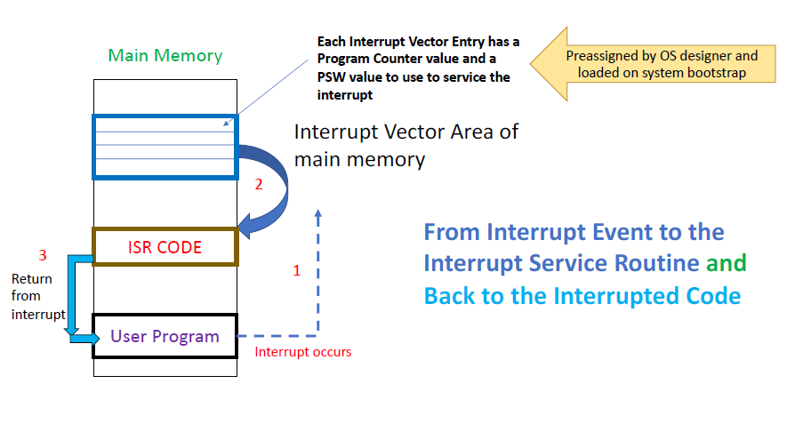
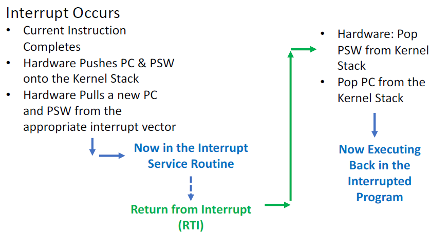
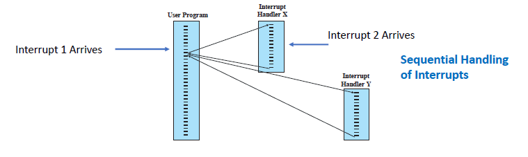
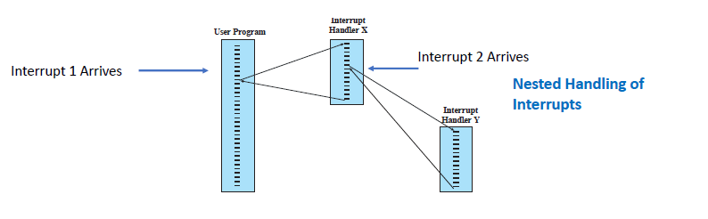
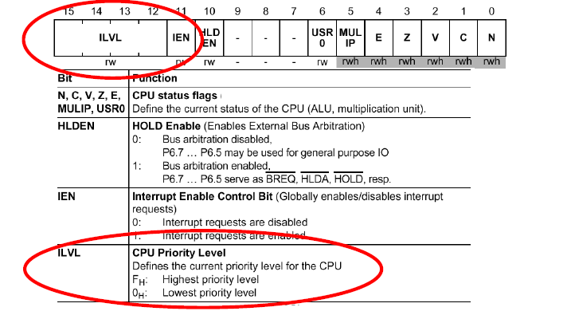
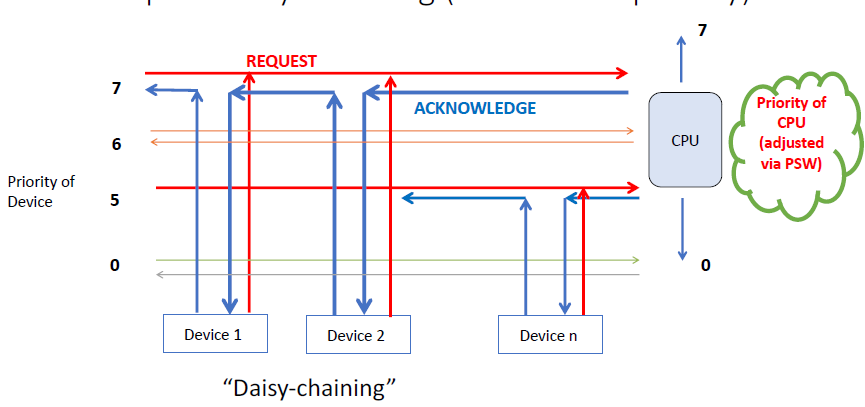

# Lecture 09-06-22 - (Fire Drill Occurred)

Refer to [[Lecture 09-01-22 Process and Intro To Interrupts]] for the discussion about  Programmed IO/Polled IO vs Interrupt Driven IO.
 
> We have learned about interrupts however not how to process them.

## Servicing Interrupts


The interrupt service routine is defined by the manufacturer (device drivers). 
While the CPU is executing some instruction $i$, it sees an interrupt. It **will finish with** $i$ and then handle the interrupt to ensure no instructions are executed twice. 

```text
RTT/RTI - return-from-(trap OR interrupt)
```

**Important**: Instruction $i$ must finish so we can increment the PC to $i+1$ so we do not repeat $i$ when we resume after `RTT/RTI`.

## Sync vs. Async Interrupt
### SYNC
Program interrupts and CPU/memory related hardware failures.

> It is synchronized with the execution of the code. 

Examples: Accessing memory you are not supposed to or trying to executing a sensitive instruction while not in kernel mode (supervisor mode).

> "You commit an action and based on that action a interrupt occurs immediately"

### ASYNC
Generated independent of the code and outside the CPU like device interrupts. 

> Regardless of sync/async each interrupt requires handling. 

### Interrupt Service Vector



Each entry in the interrupt vector has two values:
1. Address of interrupt service routine (*pointer*)
2. A value for the PSW used to service the interrupt when it starts

When the interrupt occurs the **hardware** goes to the interrupt vector and takes the two values and puts them in the CPU. However, before this is done the current CPU context is saved, this is done for the current process to resume later. This context is saved inside the kernel stack, when the interrupt is done, the stack is popped and the program resumes. 

The last instruction in the ISR (see image), is the `RRT/RTI` which puts the old process context on the CPU **and** puts the PSW back in *user mode*. 



### Creation of the Interrupt Vector:
The interrupt vector area is created on boot by the OS scanning devices. For each device, the OS will load a interrupt handler (device driver includes this along with operational code). 

## Multiple Interrupts
> An interrupt occurs while another interrupt is being processed

Approaches:
1. Disable interrupts while we are handling interrupts
	+ This leads to missed interrupts which can have fatal effects on the system (think about a missed disk interrupt)
2. use a priority scheme
	+ process the interrupts of more *important* devices first.
	+ Allow 'nesting' of interrupt servicing.

### Sequential Servicing


Interrupts are serviced are the order they come. 

### Nested Servicing


**Note**: We do not lose anything since we use a *kernel* stack to save data for processes. When a ISR completes we can pop off the stack to restore the last ISR on the CPU and continue. 


## PSW - Processor Status Word 


**NOTE**: Only the kernel has access to the PSW

Bit 11: IEN (interrupt enable)
+ If set to 1, the kernel **will service** interrupts
+ if set to 0, the kernel **will not service** interrupts
+ See how this bit can be useful in the ***SEQUENTIAL SERVICING*** approach above. 


Bits 12-15: ILVL (CPU Priority Level)
- Assume the max is **7**
- displays the level of Priority Level it is willing to accept
- `1111` - No interrupt will be serviced
- `0100` - Priority of 5, 6, 7 will be serviced. 

Arithmetic Bits:
- We can use these after an interrupt to help resume a process as instructions look at these bits to proceed as they store the results of the last instructions.

## Interrupt Priority Servicing


If two devices have the same interrupt level, say 6, how can we choose who to service first or how can we say who is who?. The closest device gets processed. See how the ACK is drawn. The CPU will ask who sent the request. The ACK moves through the devices from closest to farthest ("daisy-chaining"). 