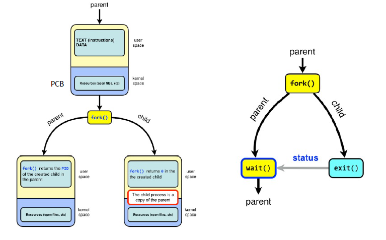

# Lecture 09-13-22
## `wait()` syscall

Recall at the end of the fork we have two ongoing processes that are **identical**:
1. parent
2. child

Here is where the programs are forked:
```c
int pid = fork(); 
```



In the child process, `pid=0` while the parent `pid` is equal to the **child's PID**. We can use this to branch logic based on parent and child. 

Recall our issue of what is printing in what order. We saw that forked calls are *non deterministic*.

The `wait` call pauses the parent **until** the child finishes and exist.

```c
int wc = wait(&exit_status); //arg can be null
//more code ..
```

After the child finishes, `//mode code` is run. We can also wait on based on `pid` with:
```c
pid_t wait(pid_t pid);
```

## Termination
A process can perform voluntary termination with `exit(status)`. Then the exit value is passed with wait: `wait(&status)` which can be read by the parent process. 

**Zombie Processes**:
A Zombie Process is one where a PCB exists but, the process is not executing. This is used for the parent to read the child's exit status via `wait()`.

Once the parent reads status, zombie entries removed from the OS, this is called reaping the child. 

If the parent does not read the status(es) of its children, 
- Results in a Memory leak: Zombie will continue to exist
- These are found by reaper processes
	- When a parent terminates, `init` adopts all zombies and reaps them. This is done for clean up. 

## Process API
+ Create
	+ Creation is handled by `fork()`
	+ Load program into memory (maybe be performed lazily)
	+ Then the runtime stack is allocated
		+ stack is used for local variables, function param, return addresses
		+ initialize stack with args: `argv, argc`
	+ Allocate Heap
		+ used for dynamically allocated data
		+ Ex: `alloc`-family, `free`
	+ IO Setup
		+ Each process by default has three open file descriptors: stdio, stdout, error
	+ **START** the program by jumping to an entry point like `main`
		+ transfers control of the program to the CPU *or* is put on the *ready* queue.
+ Destroy
	+ `kill`
+ Wait
	+ `wait`
	+ `waitpid`
+ Miscellaneous Control 
	+ `pause()`


## `exec()` syscall


There are many versions of the `exec` function. Each has its own behaviors. 

If we fork and exec we notice that the PCB is already set up by the parent which implies the file that were opened by the parent apply to the new code that is running. 

We can apply `wait()` on a `exec()` child (see slides for 9/13/22) and the parent will **wait** for the `exec`-ed program to finish. 

## Using `exec` and its Programming Paradigms
1. Use one source code that includes the code for each process (parent & child)

```c
int main(...){
	//code above
	int pid = fork();
	if(pid == 0){
		child1();
	}
	else{
		int pid1 = fork();
		if(pid1 == 0){
			child2()
		}
	}
	//code below
}
```

2. Writing code for children in separate files: Multi-process Program (*More practical*)

```c
int main(){
	//code above
	
	int pid = fork();
	if(pid == 0){
		exec(child1);
	}
	else{
		int pid1 = fork();
		if(pid1 == 0){
			exec(child2);
		}
	}
	
	//code below
}
```

## How the shell works
+ In a basic OS, the `init` process is created after the hardware is initialized
+ the `init` process spawns a shell such as a bash
	+ this is done because the OS wants to make its operations available to the user.
+ shell reads a command, forks a child and execs the command executable. It will wait for it to finish and then it will read the next command

## CPU Switching


## Virtual Address Space
MMU - Memory Management Unit

Continued Next Lecture: [[Lecture 09-15-22 - Part 1 - Memory Lecture]]
