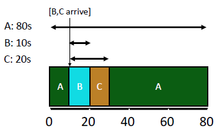
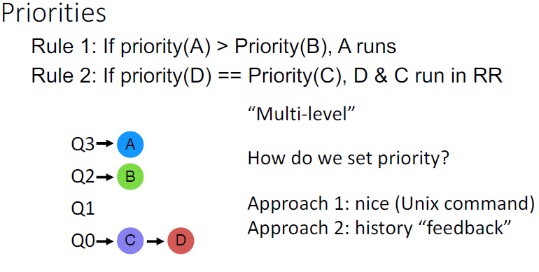
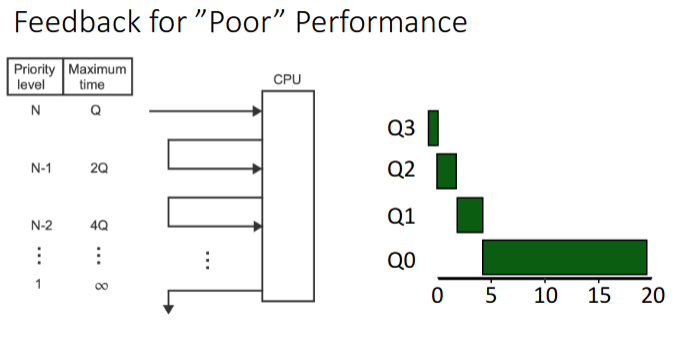

# Lecture 09-20-22 - Scheduling Cont.

The end of [[Lecture 09-15-22 - Part 2 - Intro to Scheduling]] talked about relevant scheduling metrics. 

Metric specifics are located in the [[OSTEP 7]] reading. Any notes here are an **extension** to the notes in there. 

## Summary of Different Scheduling Algorithms
### FIFO - First in First out
> AKA FCFS (First Come first serve)

**Primary Issue**: Turnaround is high. Even worse if a job $J$ arrives first and $J$ takes longer to complete then the subsequent few jobs. It will increase the turnaround time for subsequent jobs. 

### SJF - Shortest Job First
Run the shortest job **first**.

If a larger job $J$ arrives some $\epsilon$ seconds before $K$ , $J$ will again have a profound negative impact on turnaround time. A single job's ability to slowdown the system gives way to ***Preemptive Scheduling***.

### Preemptive Scheduling
Previous algorithms (FIFO and SJF) were non-preemptive. New schedulers will **forcefully** take the CPU from processes. 

#### STCF - Shortest Time-to-Completion First
Run jobs that have the lowest time to **completion** first. 

> The word **completion** is in bold for a reason. 

STCF will decide whom to run anytime a process enters the `ready` queue. 

Primary Issue: `Response Time` is low since many jobs with similar run-time arriving at the same time will force STCF to run them to completion first.

#### Round-Robin Scheduler
Alternates ready processes every fixed-length
time-slice. RR is really great for short jobs. 

The length of the quantum (time-slice) for Round-Robin is highly critical. However, RR does not perform well in the turn around metric because it alternates jobs: one job does not get the CPU for a while and this waits longer to finish. 

## MLFQ - Multi-level Feedback Queue

This is the evolution of the scheduler when we remove the last assumption: "the runtime of each job is known". 

**Goal**: General-purpose scheduling

Most support two job types with distinct metrics:
1. interactive (*response time*)
2. batch (*turnaround time*)

### Approach - Multiple Levels of RR Queues

> The goal of MLFQ is to use history to predict future behavior. 

Each level of queues has a **scheduling priority** which may differ the time slice or process quantum. The next job will be picked up from the **highest** non-empty queue. Processes arriving at a higher level priority than the current priority can preempt lower priority processes. 

Rule 3: A new process is entered at the highest priority level
Rule 4: f job uses whole time slice, demote process (longer time slices at lower priorities)

Rule 4 Graphic:

**Why do higher levels have lower slices?**
Notice we require a interactive job to have a high response time. Since we wait for IO the slices are smaller and less waiting going on. As processes block before Quantum expiration, we consider raising it's priority.

If it keeps going past its quantum we can increase it for its next run. This allows them to "find there level" where they willingly give up the CPU. 

If we have too may interactive jobs[^1], jobs in the lower queues are **unlikely** to run. This is known as **starvation**. The solution is to periodically boost jobs that aren't being scheduled. All modern OSs do this, it is called *boosting*. 

[^1]: Interactive Jobs to not use their total time quantum and thus are never demoted. 