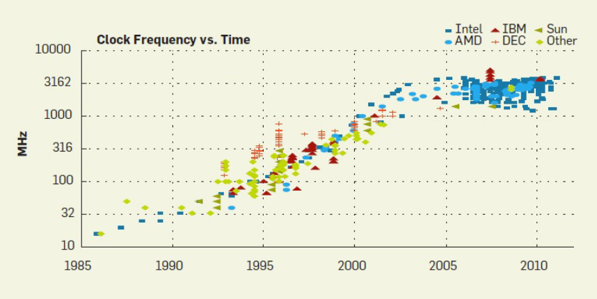
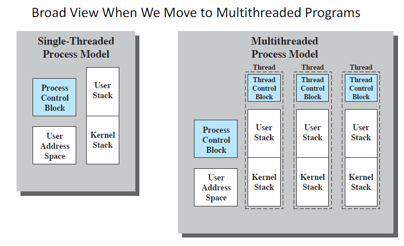
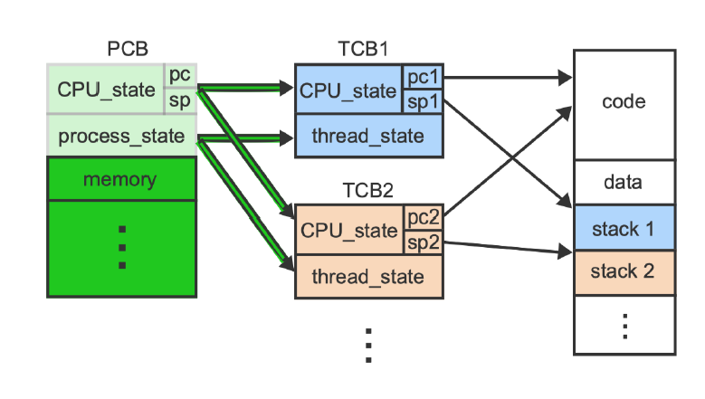
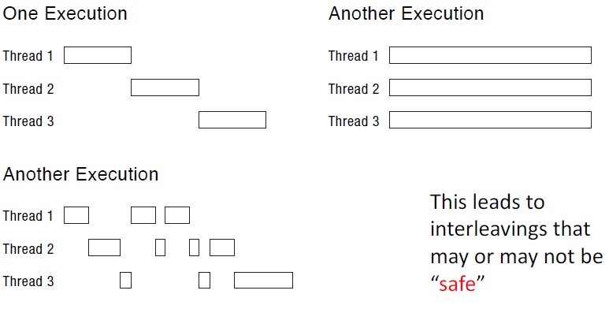

# Lecture 09 22 22 - Concurrency



This chart compares CPU cycles over time. Around 2005 there was a plateau (transistor size issue, heat caused from keeping components too close together).

Rather trying to make the CPU smaller/faster they decided to put more than one CPU per chip. This meant more logical cores and physical cores.

A physical core is the literal CPU while a logical core is a partial CPU with only some of the features of a real CPU yet they can still run threads. 

## Concurrent Programs
> **Goal**: fully utilize many cores

### Option 1
+ Build apps from many communicating processes
	+ communicate via `pipe()`
	+ We will see what a `pipe` is later (file in memory)

Pros:
+ Don't need new abstractions
+ Good for security (timesharing model)

Cons:
+ Cumbersome programming
+ high communication overhead
+ Expensive context switching 
	+ (more processes = more switching)

### Optional 2
New abstraction: **Thread**

Threads are like process but threads share an address space and resources. A single process can have many threads. 

Now we can split up tasks via threads and they can communicate through a shared address space. 

Example of Thread usage:
For a web browser there can be a thread to:
1. play audio
2. receive requested file
3.  update screen
4. $\dotso$

## Concurrent Programming Models
### Producer/Consumer
Multiple producer threads create data that is then handled by consumer threads

### Pipeline
Task is divided into a series of subtasks where each subtask is handled by the threads

### Defer work with background thread
One thread performs non-critical work in the background. 

## Thread Functions
```c
create(thread, func, args); 
//thread starts via func(args) 
exit();
join(thread_id); //wait for other threads to finish
yield(); //volunteer to give up the CPU
```

> `join`: wait for thread termination with `thread_id`

### Thread Creation
```c
#include <pthread.h> //header for these functions

int pthread_create(pthread_t *thread, pthread_attr_t *attr, void *(*start_routine)(void *), void *arg);
```

\*thread, is a reference to a `pthread_t` type object (an unsigned integer that is `typedef` as the data type `pthread_t`)

The second argument, indicated as attr, references a dynamically allocated attribute structure (see /usr/include/bits/pthreadtypes.h)

### Thread Code Life-cycle
Each thread is its own separate, sechedulable sequence of code with states. 

A thread has its own PC, Stack and Kernel Stack. It runs **independent** from the parent. 

A parent will create the thread and save its `thead_id`. Then the parent will wait for it to *join* and save the return value from the thread. The thread will return any type of datatype. It does so via the `pthread_exit(void *retval)`

## Facts
+ OS maintains a collection of processes
+ A process can have a collection of threads
+ Each thread has its own **separate**, **sechedulable** sequence of code.
+ A thread has states:
	1. Running
	2. put to sleep
	3. waiting
	4. Ready
	5. Blocked
	6. $\dotso$ 

A process can create a thread via a system call. The created thread will operate **within** the process context. Since the thread is a single execution sequence that represents a separately scheduling task, the OS can stop/run it at anytime. 
 
### Process Vs. Threads
A process **owns** resources whereas a thread regards to scheduling/execution. A thread cannot own resources but has state instead of resources. 

A thread is a single execution sequence that represents a  separately schedulable task (this task is driven by the Program Counter).

Multithreading is the ability of an OS to support multiple concurrent paths of execution within a single process.

**Important**: Notice that we no longer require a context-switch if we are switching between threads of the *same process*. Thread switching is less costly then process switching. 

<p style="text-align:center;font-weight:600;">Threading Models:</p>





Notice the TCB has CPU state (registers, PSW).

> The location of the TCB depends on the thread implementation

## OS Actions that Affect Threads
In an OS that supports threads, scheduling and dispatching is done on a thread basis.

+ Suspending a process suspends all threads
	+ We took away the resource the process had so the threads cannot run
	+ Same applies to terminating threads

## Threading on the CPU
### Single Core CPU


The switch from Thread $A$ to $C$ is a **context-switch**. 

### Multiple Execution History


This goes to show that not all interleaving combos of threads are *safe*. You must be careful in the way memory is shared as it is **not** in our control. The OS is really in change of choosing which thread to run at any moment in time. 

#### Variability of Execution History
1. Size of Cache / Memory Speed (MHz)
	+ The speed to access an item can change the speed of execution which *may* change history.
2. Frequency of preemption by scheduler
	+ Outside Factors like number of active process and threads. 
3. Number of Physical Processors

> We must control interleaving through explicit synchronization which is covered in the later chapters

