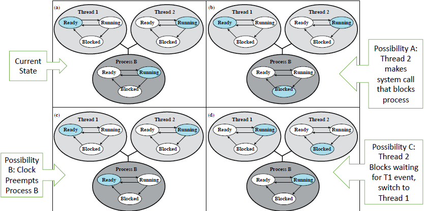
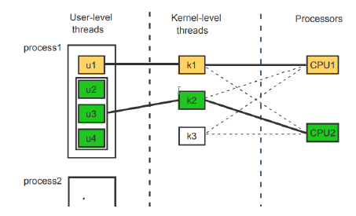

# Lecture 09-27-22 - Concurrency Cont.
## What do `threads` share ⁉
### DOES SHARE:
1. **PID**
2. Address Space
	+ Code
	+ Most data (heap)
3. Open File Descriptors
4. Signals and Signal handlers
5. Current Working Directory
6. UID/GID

### Each thread has its own:
1. T*hread* ID (TID)
2. Sets of registers + PC + SP
3. Stack for local vars and return addresses
4. Signal Mask

## OS Support for Threads
1. User Level Threads
2. Kernel Level Threads
3. Hybrid of (1) and (2)

### User Level Thread
+ Threads can be implemented completely within a user application
+ A *thread library* provides thread CURD operations.
+ Kernel is not aware of threading
+ Process is treated as single threaded for scheduling
+ Thread level context switch is provided by the library
+ The TCB is maintained by the library. 

**Note:** When a *process* is preempted by something like an internal clock that does not mean it is now *blocked*, it may be ready to run. 

Notice in (b) the process is blocked. This is because a thread cannot it self commit IO tasks. It does IO tasks by using a library. Therefore the kernel sets the process's state to blocked when one of its threads calls for IO.  

After the IO is done, $B$ shifts back to complete and thus is *ready* to run on the CPU. This means $B$ is placed back on the ready queue. 

***Note***: A thread *running* does not mean it is executing. Also, a thread is not blocked from an IO request but the parent process will. 

### Kernel Level Thread
+ Threads are implemented within the OS Kernel
+ Kernel provides CRUD methods for threads
+ Thread Switching is done by Kernel too

Notice the overhead with Kernel `TRAP`s. You do not need to switch to kernel mode to swap threads in ULTs. 

## Combined Approach
The kernel supports a small number of KLTs.
Each app can implement any number of ULTs which are mapped to KLTs. 

This means that the application many create $n$ threads which are mapped to $m$ kernel threads. (few ULT per KLT, see image below)

## Pros/Cons
### Pros - ULT
1. no switching overhead (switch to `kernel-mode`)
2. OS agnostic
3. Customize scheduling to an application *if* needed.

### Cons - ULT
1. IO call from *any* thread will block process and block **all** threads
2. With **pure ULT** there is **no** real multiprocessing since a single thread being blocked blocks the process blocking the entire thread space.

### Pros - KLT
1. Schedule many threads from same process on many processors
2. If one thread is blocked in a process we can schedule another thread from same process
3. kernel routines can be multi-threaded (run many ISRs at once!)

### Cons - KLT
1. Time to CRUD threads due to kernel mode switch (user mode -> kernel mode) and management
2. Just overall more resources for the kernel to manage. 