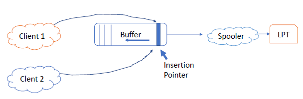
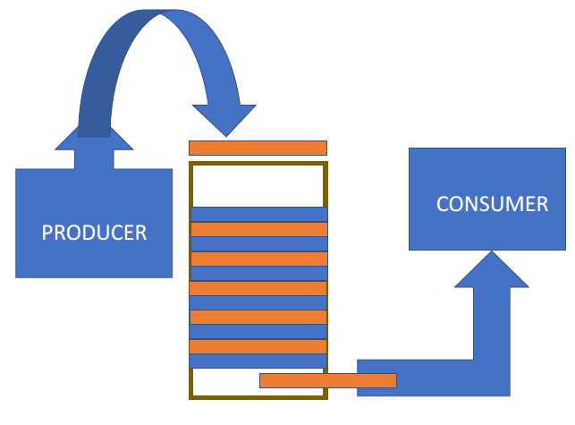

# Lecture 09-29-22 - Concurrency Cont.
A **light weight process** is a thread. However the OS needs some mapping between threads and process to maintain proper execution(PC, SP, resources, $\dotso$  ).

## Issues of Concurrency
+ Interleaving of operations and execution
	+ this is true regardless of the number of processors (even 1 CPU)

### Difficulties
1. Sharing of Global Resources
2. Hard to manage all the resources optimally
	+ suspended threads may be holding (lock or CV) a resources other processes/threads need
3. Hard to locate programming issues since results are not deterministic

### Vocab
1. Atomic Operations
2. Critical Section 
	+	code that accesses shared data
3.	Deadlock
	+ situation where two or more threads cannot process as they are waiting for some other thread to complete their tasks
4. Livelock
	+ like dead like but threads change states in response to other threads without doing any useful work	
5.	mutual exclusion 
	+ *excluding* access to shared data when a critical section piece is executing.
6. race condition
7. starvation
	+ Situation where a runnable process is overlooked indefinitely by the scheduler	

## Interprocess communication
### Storage Buffer


A spooler is a process that takes data from the buffer and gives it to a device (simple uses it). See that this has **major** concurrency issues like being preempted when it is about to write (may overwrite other program). 

## Critical Sections
Need to find a way to prohibit two or more threads from running their **critical section** at the same time. 

Potential: **Mutual Exclusion** - only one thread is allowed to execute their critical section at a time.

### Synchronization
Synchronization is **required** for safe intertask communication.
+ Mutual Exclusion
	+ ensure that critical section of statements that access shared memory are not executed at the same time
+ Condition Synchronization
	+ Concerned with ensuring that a process delays until a given condition is true

**A Concurrent Program has State**.
At a point in time, the state of a program is determined by the value of its variables. 

A Concurrent Program moves from an initial state $S_i$ by executing statements where a statement is 1 or more atomic (indivisible) operation $a_i$ . 

$$
S_{k} \underbrace{\to}_{a_k} S_{k+1}
$$

What we want to do with Synchronization is to control the histories of atomic states such that the critical section of a program seems **atomic**. 

## Atomic Actions
- Fine-Grained Atomic Actions: Machine instructions

If we have an assignment like:
```c
y = 0;
z = 0;
	
x = y + z; //statement 1
y=1; z=2;  //statement 2
```

Then $x$ has the possibly of being one of $0, 1, 2, 3$.

## Using locks to enforce mutual exclusion
![[pthread_mutex.png]]

The lock variable `m` lets threads know that a variable is in use so that they cannot (should not) change it.

### Producer & Consumer


We need maintain data consistency here. To do this we require mechanisms to ensure correct execution of cooperating processes. 

## Signaling (synchronization issue)

Suppose a task $i$ can only continue its work after $j$ has done some work. When task $j$ is done, it needs to let thread $i$ that is is **done**. We can use boolean flags for this. 


The race condition leading to a **deadlock** should be clear here. 

Here is the issue:

Suppose at the green arrow $P_i$ is preempted. $P_j$ then "unblocks" $P_i$ via the boolean flag. However there is nothing to "unblock" since `block(Pi)` has not been called. The action $a_j$ is performed but once control returns $P_i$ , it blocks itself. 