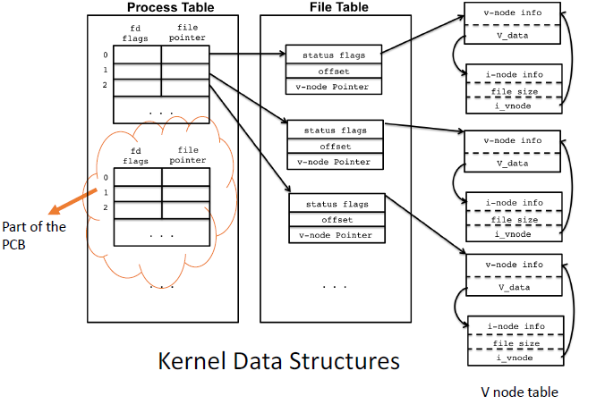
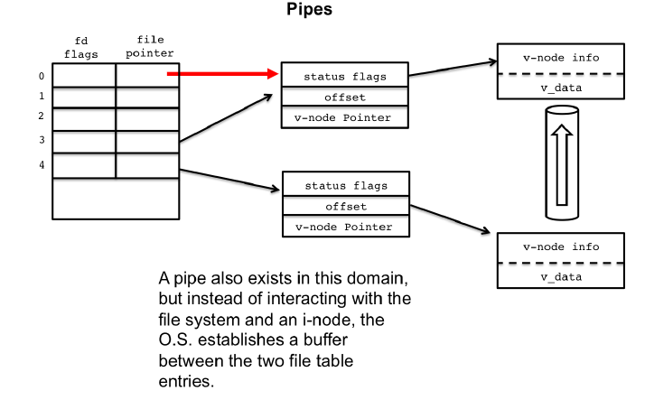

# Lecture 10 4 22 - Shell Lab
## How Shells are implemented

```c
while (1) {
	char *cmd = getcmd();
	int retval = fork();
	if (retval == 0) {
		// This is the child process
		// Setup the child’s process environment here
		// e.g., where is standard I/O, how to handle signals?
	exec(cmd);
		// exec does not return if it succeeds
	printf(“ERROR: Could not execute %s\n”, cmd);
	exit(1);
	} 
	else {
		// This is the parent process; Wait for child to finish
		int pid = retval;
		wait(pid);
		}
	}
```

It is a lot more complicated than this however this gives us an idea on how `fork` and `exec` will work together. 

## Redirection
A Shell is required to launch new processes, take input from various sources and send output to various sources. 

## Pipes
Process may need to communicate.

One solution is to open a file $F$ and have a program write to it and have some other process read from it. $F$ will need to be deleted which will be slow in addition to reading/writing to files. 

We can use pipes however for this which passes data through memory. 
```bash
shell> cmd1 | cmd2
```

There are system calls that provide this functionality.

## File Descriptors
The kernel uses three three data structures to represent an open file[^1]. The relation among them determines the effect one process has no another process WRT file sharing. 

+ Process Table Entry:
	+ Every process has an entry in the process table (its PCB.)
	+ Each process table entry includes a table of open file descriptors.
		+ Each File Descriptor has:
			+ Flags
			+ Pointer to File Table Entry (see below)
+ File Table Entry
	+ Kernel maintains a file table for **all** open files. 
		+ Contains
			+ File Status Flags
			+ Current File Offset
			+ Pointer to the v-node entry for the file (see below)
+ V-node Structure
	+ contains information about the type of file and pointers to functions that operate on the file. 
	+ This information about the file is read from disk and kept in memory to keep it fast to access
	+ v-node also contains i-node
	+ Linux has no v-node, a generic i-node is used.  



## File Sharing via `Fork()`
When a process is `forked`, the process table entry is duplicated. Notice that the file table is not duplicated since the process table just *points* to it. 

Suppose Program $X$ uses STDIN for input to the program. But we want to take input from `MYDATA.TXT`.

Since `STDIN` is entry 0 in the PCB file table, we require the 0th entry to point to `MYDATA.TXT` instead. 

```c
file_descip = open("./MYDATA.TXT");

dup2(file_descip, 0);
//or
close(0); dup(file_descip);
```

## Pipes
A Unix pipe has two file descriptors:
1. read descriptor
2. write descriptor

Data is read in the same sequence it was written 




### Pipe syscall
```c
int pipe(int fds[2]);
```

A call to `pipe()` returns $-1$ on failure and $0$ otherwise. 

There are some `errno` associated with `pipe()`


**`fds[2]`** is an array of file descriptors where `fds[0]` is the reading[^2] end while `fds[1]` is the write end. 

## Substituting I/O via `pipe()`
If a parent just wants to send data while a child only reads, we can close the relevant file descriptors on each side (parent/child).

This is done with `close()`:
```c
pid_t childpid = fork();
if(childpid == 0){
	close(fd[0]); //close input side
	//run code
}
else{
	close(fd[1]) //close down reading side of the pipe
}
```

Once everything is set up we can send data[^3] via
```c
write(fd[1], str, strlen(str) + 1);
```

## `dup()` and `dup2()`
+ duplicates an original open file descriptor. The new descriptor references the process file table entry for the next available nonnegative file descriptor.
+ returns the `int` of new fd on success
+ Note: The old descriptor[^4] is **not closed**
+ both return -1 on failure

### Inheriting file descriptors
Consider this pseudo-code
```c
int fd[2];
pipe(fd);

pid_t childpid = fork();
if(childpid == 0){
	close(0);
	dup(fd[0]);
	execlp("sort", "sort", NULL);
}
//...
```

Given that we closed `STDIN`[^5], `dup(fd[0])` will replace fd:0.

**IMPORTANT**
Programs ran with some flavor of `exec` **WILL** inherit the standard streams from the parent. Therefore it **will** inherit the pipe as the standard input. 

### `dup2()` - Improvement on `dup()`
```c
int dup2( int oldfd, int newfd );
```

`dup2` is the **atomic** `dup` with a built in `close()` of the old fd. The last code can be replace with:

```c
dup2(0, fd[0]);
execlp("sort", "sort", NULL);
```

[^1]: The standard file descriptors (`stdin`, ...) also contain these entries shown below 
[^2]: Reading is done bytewise
[^3]: We can start to treat the file descriptors as regular files. 
[^4]: The one with the lower number
[^5]: The file descriptor for `STDIN` is **0**.
