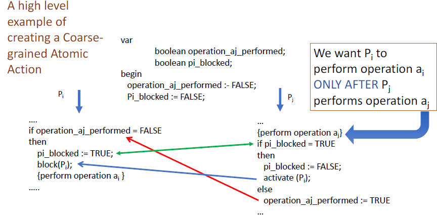
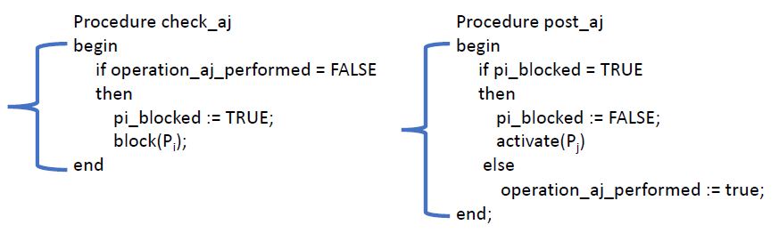
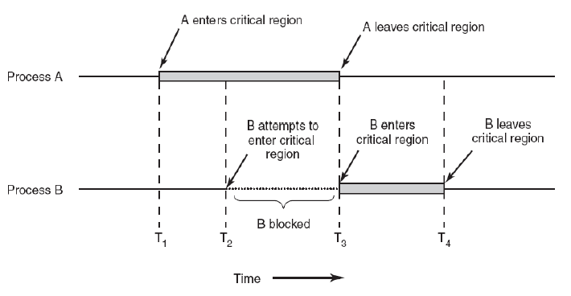
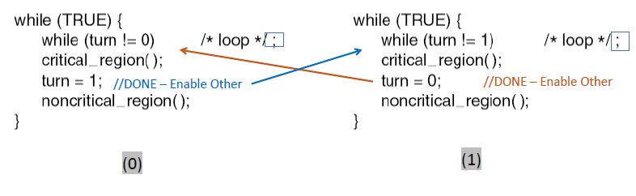
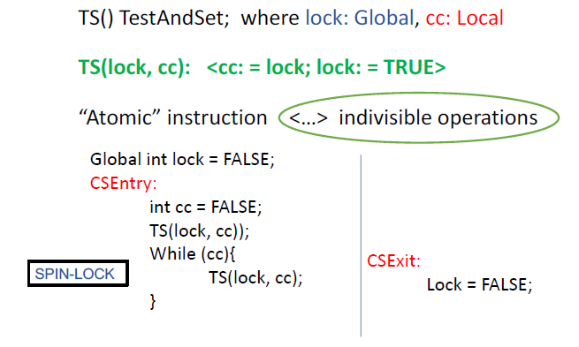

# Lecture 10 06 22 - Concurrency Cont

Recall how the signaling solution failed for the produce/consumer archetype.

> Signaling was when we used boolean variables to block process whether it is the producer or the consumer



The basis of the problem is the fact that we take a decision based on the state of the variable but do not act on it **immediately**. To solve this, we must make critical sections of code ***atomic***. 

We will attempt to make these functionally atomic:



Process/Thread view



## Synchronization Approaches
1. Busy Waiting
2. Hardware support for process sync
3. Synchronization Primitives & Concurrent programming constructs

### Busy Waiting
A form of Synchronization in which a process repeatedly checks a condition until it becomes `true`.

```c
while(some process is in a critical section X){
	//sit and wait
}
```

Might be OK in a multi-processor system but **not** uni-processor.

### Strict Alternation or Hand-off Synchronization
A special case for the critical section problem.



## Vocab
- CSEntry - Protocol to enter critical section (CS)
- CSExit


## CS Protocols
### Lock via simple variables

```c
bool lock = 0;
```

Sample thread $T$ :
```c
while(1){
	aquire(lock);
	//run critical section here
	release(lock);
	//run noncritical code here
}
```

We can pair with busy wait:
```c
void acquire(bool* lock){
	
	//while someone else is using the lock
	while(*lock);
	// (I)
	*lock = true;
}

void release(bool *lock){
	*lock = false; 
}
```

This wont work still due to race condition.

Consider $T_1, T_2$ working at the same time. While $T_1$ attempts to `aqquire()` the lock, it is preempted at $(\mathbf{I})$ , when $T_2$ goes to `aqquire` it will see that the lock is `false` and it will be able to acquire it. Now both $T_1$ and $T_2$ will be in the critical section. 

## Synchronization Hardware
We need to make the `acquire` a single instruction where it will `test` the value of the lock and also set it.

Otherwise we can:
- Disable interrupt (no more preempt, no more servicing any other devices, inefficient). Note that on a multi-processor system turning off interrupts only effects *one* CPU.

## Building A lock
### Goals
1. Mutual exclusion
2. Fairness
3. Low overhead for acquiring, releasing, and waiting for lock

Note that locks are needed for both user and kernel space programs and we need support from hardware & OS to implement locks. 

### Solution: Hardware atomic instructions
Here is an example of an atomic instruction: test-and-set
- update variable and return old value all in one hardware instruction

```c
//this is just c code but in reality 
//machine instructions make up this function
//making this action un-interruptible
int TestAndSet(int *old_ptr, int new){
	int old = *old_ptr;
	*old_ptr = new;
	return old;
}
```

### The Test & Set ‘Function’
We can use the TS function to set the lock and copy its value to see if we can go into the critical section.



- Spin-lock : Lock that is busy waiting

Suppose $T1$ gets preempted at `TS(lock, cc);`. Since it has to finish the instruction, it **will** set the lock to **true** before the thread is switched out. Now of $T2$ uses `TS(lock, cc2)` it will see **false**.

`Test-and-set` *works* however using spin locks is not ideal for performance. 