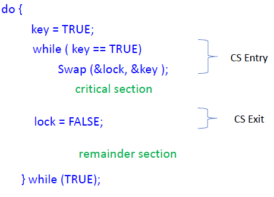
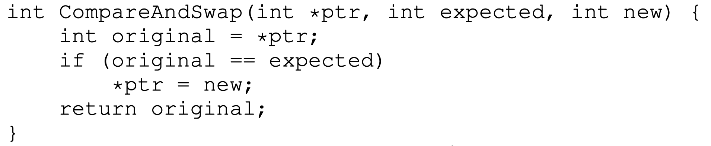

# Lecture 10 11 22 
Topics:
+ Test_and_set, compare_and_swap
+ Spin-lock
+ Blocking alternatives
+ Revisiting the consumer-producer problem
+ Condition variables

Atomic Actions:
- Fine Grain Atomic Actions - Machine Instructions
- Course Grain Atomic Actions - Group of Fine Grain Atomic Actions that we **do not** want interrupted. We want this group of actions to mimic fine-grained behavior.

## `TestAndSet`
If the `TestAndSet` returns 1 it implies that some other function is holding the lock, this means the caller will *busy-wait*.

**`TestAndSet`** C translation:
```c
int Test_and_set(int *old_ptr, int new){ 
	int old = *old_ptr; //store old value 
	*old_ptr = new; //load new value into old 
	return old; 
}
```

Test and set is really just trying to lock the mutex and seeing if you were successful. 


Using this spin lock:
```c
//lock1 is some global variable
do{
	lock(lock_t *lock1);  //ACQUIRE LOCK
	//run critical section
	unlock(lock_t *lock); //RELEASE LOCK
	//remainder section
} while(TRUE);
```

> The actual machine level instruction will lock the memory bus so the *other* CPUs cannot access the memory location we are trying to check.  

## `Swap` Instruction
`Swap` at a high level:

```c
void Swap(bool *a, bool *b){
	bool temp = *a;
	*a = *b;
	*b = temp;
}
```

Critical Section Solution using Swap:
- Boolean variable lock initialized to FALSE; Each process has a local Boolean variable key

This process is self explanatory. If the lock is ever "`false`" (unlocked) we swap with key which will unlock the mutex for cs entry. To give up mutex we can set the lock to false since it is literally a flag. 

<!--```c
do {
	key = TRUE;
	while(key == TRUE){
		Swap(&lock, &key);
		//run critical section
		lock = FALSE;
	}
} while(TRUE);
-->



## Spin Locks


Notice that original is only updated *if* the lock is unlocked. 

Use:
```c
void lock(lock_t *lock){
	while(CompareAndSwap(&lock->flag, 0, 1) == 1);
}
```

**Why is this better than `TestAndSet`?**
If unlocked, then lock; if locked save memory writing as we don't have to do a redundant update. See that since `CompareAndSwap` is a spin-lock protocol, saving that extra time not writing a redundant $1$ to memory is important. 

## Scheduler and Locks/Unlocks

> Scheduler is unaware of Locks/Unlocks


Notice that $B$ is busy waiting since it needs the lock that $A$ has. While $A$ gets its work done, $B$ just busy waits. $B$ is wasting CPU time. This issue is exacerbated with extra threads on the Scheduler. 

An alternative to spin-lock is sleeping. Instead of spinning to acquire a lock, a thread can just `yield()`[^1].

```c
void lock(){
	while(TestAndSet(&flag, 1) == 1)
		yield();
}

void unlock(){
	flag = 0;
}
```


## Spinlock vs Sleeping Mutex
+ Most userspace lock implementations are of the sleeping or blocking mutex kind
	+ This us done so CPU time is not wasted spinning
+ Locks inside the OS are always spinlocks
	+ Internally in the OS, the OS does not yield to anyone

What happens when the OS acquires a spinlock?
+ It must disable interrupts (on that processor core) while the lock is held. Why? 
	+ An interrupt handler could request the same lock, and spin for it forever.
+ never sleep with a acquired spinlock

## How should locks be used?
+ Lock should be acquired before accessing any critical variable
+ All shared kernel data structures must also be accessed only after locking
+ Coarse-grained vs. fine-grained locking: one big lock for all shared data vs. separate locks
	+ This is asking for the amount of control we want with locks. 
	+ Fine-grained allows for more parallelism
	+ Multiple fine-grained locks may be harder to manage

## Consumer / Producer Problem
> Example: in a multi-threaded web server, one thread accepts requests from the network and puts them in a buffer. Worker threads get requests from this buffer and processes them. - OSTEP 30,31

Setup: 
1. One or more producer threads
2. One or more consumer threads
3. a shared buffer of bounded size
	+ A fixed size buffer is shared among processes/threads

Critical Conditions (points of synchronization)
1. Full Buffer
	+ Producer has to sleep[^2] and not produce
2. Empty Buffer
	+ Consumer should sleep[^2] if buffer empty 

### Solution A - Spin Lock
Spinlock solutions use Busy-Waiting for
synchronization
+ Waste CPU resource
+ No Bounded Wait
+ With busy wait, there is no *queue*. There is no sense of a queue of processes to give the lock to. 
+ Deadlock or Priority Inversion [also 3 process case]
	+ High priority and Low priority processes share a CS
		+ Hi blocks on I/O; Low runs and enters a CS controlled with a spinlock
		+ Hi awakens and needs to enter the same CS; busy-waits on the spinlock
		+ Low can’t execute and release CS since it is low priority

With MLFQ, the low process will never run when compared to the high priority process resulting in a deadlock as the low priority process will *never* release the lock since it will never be scheduled.

### Solution B - Sleep and Wakeup
+ `Sleep()` puts caller to sleep a queue to be awakened later
+ `Wakeup(x)` awakens the blocked process $x$ 


The `count == 1` exists because the only time we hit $1$ is from `count=0`, which is when the consumer sleeps.

This solution introduces an race condition when preempted on the second red circle. The `wakeup` will be *missed*.


## Condition Variables (CV) - waiting and signaling

> A Condition Variable is a Synchronization Object that lets a thread efficiently wait for a change to shared state protected by a lock.

These help to complete tasks where T1 is waiting on T2 to finish. We need a way to safely block a thread while waiting for a shared resource. 

A CV is a queue that a thread can be placed on while waiting on some *condition* to change. 

Operations:
1. `wait` - atomically release lock and relinquish processor until signaled
2. `signal` - awaken a waiter (if any)
3. `broadcast` - wake up all waiters (if any)

[^1]: System call to put the thread back to ready state. 
[^2]: sleep, **not** busy-wait